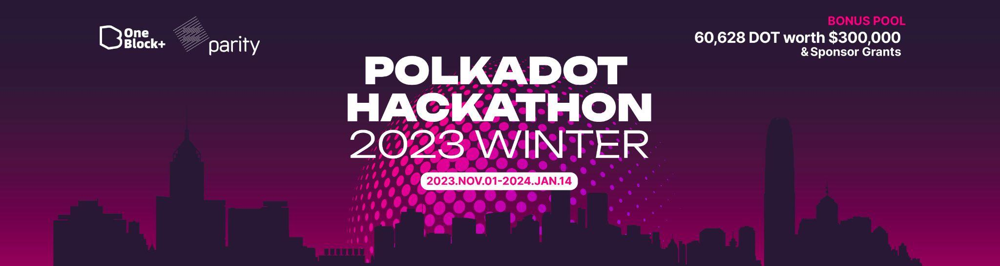
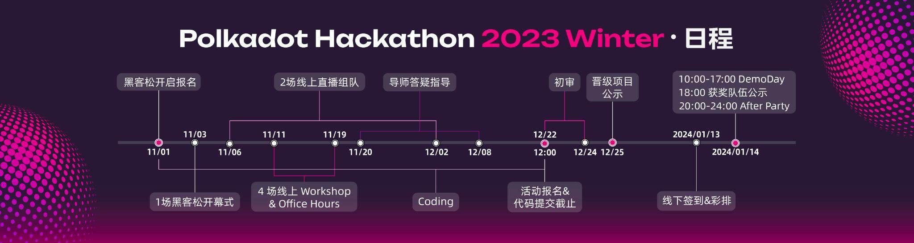
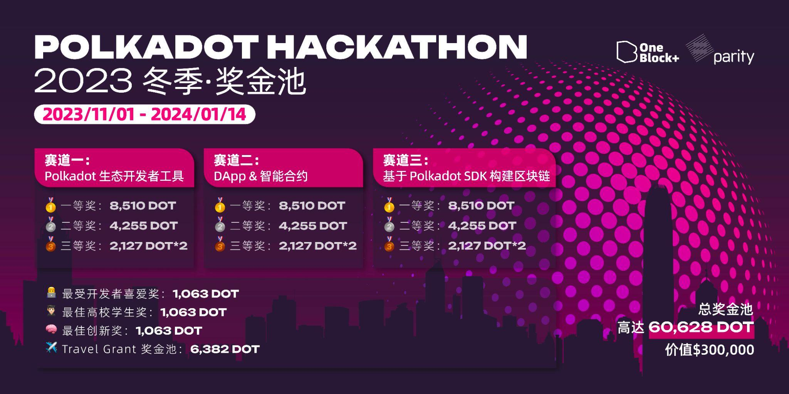

# hackathon-2023-winter
由Oneblock和Parity联合举办的2023年冬季黑客松将于2023年11月1日到2024年1月14日，总奖金超过30万美金。



## 时间点

- 活动报名开启：2023年 11月 1日
- 线上 Coding 初赛：2023年 11月 1日 - 2023年 12月 22日
- 黑客松开幕式：2023年 11月 3日
- 2场线上直播组队：2023年 11月 6日 - 2023年 11月 17日
- 4场线上 Workshop & Office Hour：2023年 11月 11日 - 2023年 11月 19日
- 导师答疑指导：2023年 11月 20日 - 2023年 12月 8日
- 活动报名截止&代码提交截止：2023年 12月 22日 上午 11:59
- 初选审核：2023年 12月 22日 - 2023年 12月 24日
- 晋级战队公示：2023年 12月 25日
- 线下签到&彩排：2024年 1月 13日
- DemoDay：2024年 1月 14日 10:00 - 12:00， 14:00 - 17:00
- 获奖队伍公示：2024年 1月 14日 18:00
- After Party：2024年 1月 14日 20:00 - 24:00





## 线下Demo地点

香港

## 奖项设置
按照项目分成三个不同的赛道，每个赛道由一二等奖，各一个。三等奖各二个。其余4个奖项分别为：最佳高校学生奖、最受开发者喜爱奖、最佳创新奖、Travel Grant奖金池。一共16个奖项。

16个奖项共申请国库30万美金等额的DOT共60,628。每个奖项的金额如下
- 一等奖: 8510 DOT 约四万美金 (每个赛道各一个)
- 二等奖: 4255 DOT 约二万美金 (每个赛道各一个)
- 三等奖: 2127 DOT 约一万美金 (每个赛道各二个)
- 最佳高校学生奖: 1063 DOT 约五千美金 （共一个）
- 最受开发者喜爱奖: 1063 DOT 约五千美金 （共一个）
- 最佳创新奖: 1063 DOT 约五千美金 （共一个）
- Travel Grant奖金池: 6382 DOT 约三万美金 （共一个）
（打卡每场活动+进入决赛来现场的战队共同瓜分该奖金池）



## 赛道详细

三个赛道分别是:
- Polkadot 生态开发者工具
- Dapp产品和智能合约
- 基于 Polkadot SDK 构建区块链

[这里有赛道详情](./docs/categories.md)

**项目可以选择多个赛道参赛，初审评审会根据项目实现的功能确定是否可以参与到单个赛道的角逐**

## Bounty奖项列表
1 Acala

赏金奖励：价值$5000 美元的 ACA

第一名 最高$2,500美元的$ACA

第二名 最高$1,500美元的$ACA

第三名 最高$1,000美元的$ACA 

参与奖 Acala Swag

2 Bifrost

赏金奖励： $1,000

3 Cumulus Encrypted Storage System (CESS)

一等奖: 1500美金 $CESS

二等奖: 500美金 $CESS

4 Gear Foundation

赏金奖励: $3,000，
每个项目 $1,000 (共三个项目)

5 MoonBeam

赏金奖励：$1,000

6 Tanssi

赏金奖励：$1,500

第一名: $1,000

第二名: $500

[Bounty 详细说明](https://dorahacks.io/hackathon/polkadot-hackathon-2023-winter/bounty-&-bounty-bonus)

## 评分维度

最终初选截止日前提交代码，把相关代码放在 `src` 目录里，并在本栏列出在黑客松期间已完成的开发工作/功能点。我们将对这些目录/档案作重点技术评审。

### 初审 50%:（技术维度）

初审时，参赛作品从下面三个维度进行评分:

- 完成度 (20%): 项目实现完备，不止是概念，Demo / POC 展示完整；项目技术架构、算法实现优雅程度、具备自动单元测试；
- 技术难度 (20%): 解决的问题有一定技术门槛，技术层面具有一定突破。着重：链 runtime / 智能合约开发，其他：前/后端开发；
- 规范性 (10%): 项目在规定的时间提交且内容规范。

### 决赛 50%:（商业维度)

决赛时，从下面三个维度评分:

- 商业价值 (20%): 能解决问题，创新性，能放在你所知的行业场景中使用，以及当前项目发展的进度；立意新颖，具备突破性，打破常规思维。
- 创新性 (20%): 立意新颖，具备突破性，打破常规思维。
- 用户体验 (10%): 包括提交的方案对潜在用户来说的直观性和可理解程度。

**最终每队分数： 技术评审 (50%) + 商业评审 (50%)**

### 备注

- 建议团队保持代码的更新，和提交。提交历史记录清晰的项目更有利与评审了解项目的实际开发工作。
- 全新的项目可以直接从黑客松的 github 开始开发项目，成熟团队写清楚黑客松期间要增加的功能，并在11月1日后拉出新branch比如（hackathon-2023-winter）来提交代码。注明branch名称，方便评审了解其工作。
- 参赛团队须通过现场路演汇报的形式，全方位阐述作品实现过程及最终作品。
- 参赛队伍提交的所有参赛资料的知识产权归参赛队伍所有，参赛资料仅用于本次大赛评奖与宣发。
- 初审的结果用来选择参加最终Demo的团队
- 技术得分会结合 最终Demo 和问题答辩做调整，最终Demo 的内容和实现的代码功能应该一致

- **本次活动的最终解释权归 OneBlock 及 Parity 官方所有。**

## 注册及提交流程指南

### 1. 填写谷歌表单

参赛者可以通过以下链接提交报名完善信息，无论您是团队还是个人参赛，每个参赛队员都需要填写此表。

🚩谷歌表单：https://forms.gle/DX359M661hg17tPN9

### 2. 加入微信群/Discord 群

对于中国注册者请添加微信（ID：yikuailianxi）加入「Polkadot Hackathon 2023冬季参赛群」。 入群后，请将您的群昵称修改为“姓名-XX项目”或“姓名-个人”（如果您尚未组队）。

对于英语注册者，请加入我们的 Discord（https://discord.com/invite/fE8deY4UbP) 并选择“2023 Winter Polkadot Hackathon Hacker”频道。 请在Discord里将您的用户名修改为“姓名-xx项目”或“姓名-个人”（如果您尚未组建团队）。


### 3. 创建你的 2023 冬季波卡黑客松大赛项目

1. 报名注册完成后，可以立即开始项目创建，fork 本代码仓库，到你们团队成员 repo 里: https://github.com/parity-asia/hackathon-2023-winter

2. 先在 `projects` 内生成一个目录，以你们项目名称命名，里面先放个空档案，或 readme 简单介绍项目。提交一个 PR 进来。目的是预留一个目录作为你们项目空间。
**注意我们会把目录改名，在项目名称前加个编号。请 pull 下来。**

3. 之后，所有参赛项目相关代码都放在你们的项目名称里的目录里进行。可以这种形式存放：

    ```
    projects
      L 00-项目模板/           // 项目目录名称
        L src/
          L substrate/       // substrate 相关代码
          L ui/              // 前端相关代码
          L 。。。            // 其他档案
        L docs/              // 存放文档。视频和PPT等大文件不要直接上传，放链接地址即可
        L README.md
    ```

4. 2023年12月22日上午11:59前，提交最终 PR 进来本 repo，项目只可修改他们目录里的档案。

### 4. 导师带队·Optional（11月20日-12月8日）

如果项目需要在技术，产品，商务等得到导师的指导。
前提：
1.Github 项目有了比较完整的代码，文档。
2.提前准备好项目开发，推广等问题，问题必须和黑客松相关。
3.每个项目会安排一个技术和VC。


### 5. 提交初审材料


1. 项目代码必须在 Github 提交 PR 到本 repo ([**parity-asia** 组织](https://github.com/parity-asia) 下的)。在注册的第一周，项目应该复制这个代码存储库并创建一个项目目录。在 README 文件中，列出计划在黑客马拉松期间完成的代码功能(不超过 1000 字)，并向 Parity Github 提交 pull request (PR);

2. 每个项目必须提交至少一件参赛作品，所有项目必须提交英文版本的作品。

3. 参赛作品的内容包括但不限于：

**基本信息**：项目名称、立项日期

**项目概况**：项目背景/起源/需要解决问题/项目介绍/项目演示/技术架构/项目 Logo /项目初审版本/团队信息/所属赛道

**黑客松期间计划完成的代码项目**：区块链端、Web 端、用户注册页面等

4. Demo 视频及过大的 PPT 不要上传 Github，可以把链接地址加到 readme。或者将 Demo 视频上传到 YouTube，PPT 链接上传到 Google drive，GitHub 只提交 YouTube 链接和 Google drive 链接。

5. 列出在 2023 年 12 月 22 日上午 11:59 截止日期前，该项目在黑客松期间最终完成的功能。将相关代码放在 “src” 目录中，并在此部分列出已完成的开发工作/特性。我们将重点关注这些目录/文件，并作出技术评估。

6. 如果你想参考一些资料，可以[点击链接查看](https://github.com/parity-asia/hackathon-2023-summer)。

7. 12月 25日晚，本次 repo 将给出初步名单，并选出参赛队伍进入 DemoDay

### 6.  初审演示·Optional（12月23日-24日）

团队在提交代码后，可以申请10分钟的在线Demo，描述项目，回答导师在技术初审的技术问题。
如果团队认为文档清晰，代码易懂，测试完善，也可以不参加。
初审演示也会影响到初审结果，增加/减少出线机会都可能。

### 7. 提交最终Demo材料 （12月25日后）
对于进入到最终Demo的团队，需要做下列的准备
1. 确定是否参加线下的Demo，参加的人员名单。办理香港通行证
2. 选择赛道和Bounty
3. 发送Demo视频和PPT到Oneblock邮箱

## 导师团队指导参赛项目

比赛过程中，主办方会组织每个参赛战队的线上讨论会议。会议结束后，Parity 工程师与投资机构研究员将作为导师进入战队群并提供指导，参赛团队根据自身项目进展和技术架构提出遇到的开发难题及需求，导师将会为战队提供实质性建议，帮助战队顺利孵化参赛作品！

**如要匹配导师，请尽早提交项目计划，然后联络我们有此需求**。导师资源有限，我们按项目详细度匹配，不保证每队提有导师需求的团队都获得匹配。

## Workshop 及 Office Hour 时间表

- 开幕式：2023年11月3日
  1. 2023夏季黑客松赛事参与细则 - Tracy  (Oneblock)
  2. 2023夏季黑客松赛事规则详解 - 周俊 (Parity 工程师)

- **Workshop #1：超越创新：探索新的区块链⼯具和技术实践**

  2023年11月11日 20:00 - 21:30 UTC +8
  1. 探索AA（账户抽象）在Polkadot中的潜力 - Suvi Dong (Parity 工程师)
  2. 解锁Polkadot和XCM（跨链消息传递）的未来 - Kaichao(Parity 工程师)
  3. 区块链领域还可以做哪些项目？zk ML（零知识机器学习）是答案吗？Jimmy (Substrate 贡献者)

- **Workshop #2**

  2023年11月12日 20:00 - 21:30 UTC +8
  1. 在 Acala EVM+ 上构建 DApp - Shunji Zhan，Acala 工程师
  2. 全链流动性质押开发者堆栈 - Tyrone Pan，Bifrost 产品经理
  3. Moonbeam 的预编译合约训练营活动 - Wuzhong，Moonbeam 开发者关系工程师

## 联络

对黑客松有任何疑问，可以下方法联系我们:

* [Github 讨论区](https://github.com/parity-asia/hackathon-2023-winter/discussions)

* email: hackathon.asia@parity.io

* wechat: yikuailianxi

* [黑客松比赛 Discord](https://discord.gg/invite/fE8deY4UbP)

## 其他

- [技术资源](./docs/technical-resources.md)

### 合法合规性

本次黑客松为符合国内法规，我们不会触碰以下任何有关题目

- 和发币 (Initial Coin Offering) 相关。
- 和数字资产交易相关
- 任何币价的讨论 (Decentralized Exchange 主题可讨论技术，不涉及币价)
- 和博彩相关和有博彩成分的游戏
