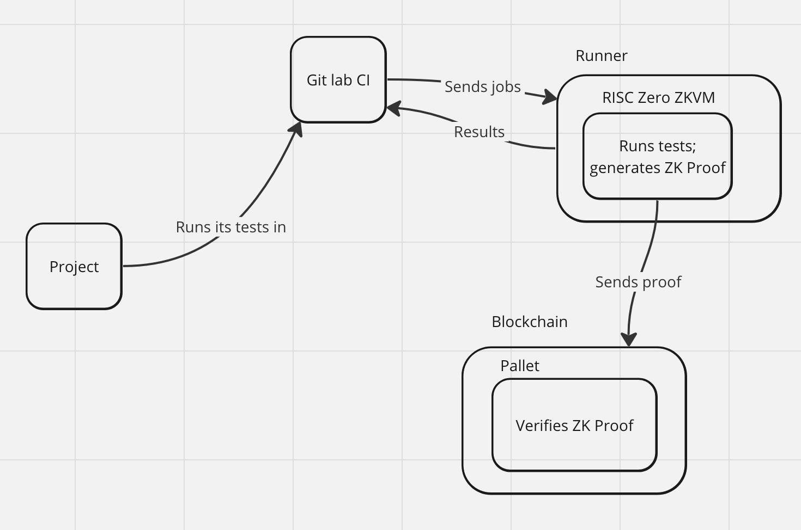

## Basic information

project name: Bilinearity

Project establishment date 11/2023

## Overall introduction to the project
- Project background/original reasons/problems to be solved (If there are other attachments, they can be placed in the `docs` directory. Submit in English).
  - We aim to explore applications of the Bullshark and Narwhal consensus mechanisms to Substrate blockchains. These are notable consensus mechanisms due to their impressive theoretical performance of around 100k TPS and offloading of consensus work. If time permits, we would also explore applying this as a sub-consensus mechanism for parachains, which would improve finality lag for parachain teams. 
- Project Introduction
  - Attempt implementation of Bullshark and Narwhal consensus mechanisms in Substrate. 
- Technology Architecture
  

## Things planned to be accomplished during the hackathon

**Blockchain side**

- `client-narwhal`
   - [ ] Adapt from existing sc-transaction-pool crate
   - [ ] Add `Core`(rounds support), `Certificate`s, and `Header`s
   - [ ] Optional: Organize logic under Primary and Worker
- `client-bullshark`
   - [ ] Add Dag receipt and ordering functionality
- `pallet-bullshark`
   - [ ] Add consensus and finality state
   - [ ] Runtime apis for communication from client

**Client**
- Transaction Client
   - [ ] Add transaction sign and submission example, with certificates

## Things accomplished during the hackathon (submitted before preliminary review at 11:59 am on December 22, 2023)

## Team information

Justin Frevert
  - Role: Substrate Developer
  - Github: `justinfrevert`

Vivek Pandya
  - Role: Substrate Developer
  - Github: `vivekvpandya`