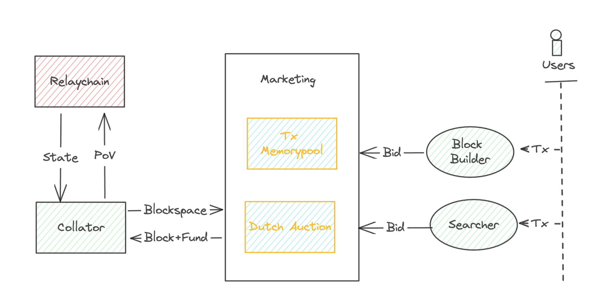

# SpaceTrader

## Project

SpaceTrader - Revolutionizing Polkadot's Resource Allocation with SpaceTrader.

## Introduction

As one of the most exciting updates in Polkadot 2.0, Gavin Wood introduces agile coretime in [[RFC1]](https://github.com/polkadot-fellows/RFCs/blob/main/text/0001-agile-coretime.md). This update aims to revolutionize resource allocation on Polkadot. Our project, SpaceTrader, is designed to optimize resource allocation on Polkadot by establishing a decentralized and trustless secondary market for blockspace trading.

## Issue statement

The parachain slot is expensive and serves as a significant barrier for projects to enter the Polkadot ecosystem. To address this, we propose abstracting the resource ordering process as a public service. This service allows block builders or searchers to submit user intent to the market, specifying their blockspace requirements and bids. To minimize costs for both users and parachains/parathreads, we introduce a Dutch auction mechanism.

Currently, parachain blocks are built and attested by parachain collators. These collators are incentivized to sign and build blocks by observing the relay chain state. However, it can be problematic if we rely on collators for marketing purposes, as they may receive extra rewards beyond block rewards. To ensure the consensus security of the blockchain, it is important to guarantee that collators are only incentivized by block-building rewards.

## Solution

To address this issue, we propose splitting the block-building and validation logic. In this approach, collators only need to validate blocks that are built by dedicated block builders and searchers. These builders and searchers extract value from the secondary marketing, thereby ensuring that the incentive structure remains aligned with the consensus security of the blockchain.

The coretime order can be a Bulk order or an Instantaneous order, depending on the demand. Especially when the TPS remains high for an extended period. However, Instantaneous orders offer the most flexibility, allowing collators to maximize blockspace usage, which ultimately benefits users.

Instead of sending their transaction to the public memory pool, the user sends their transaction or intent to a third-party block builder or searcher. These entities will pack user transactions into a bundle and submit to the bundle pool. If the block builder win the space  in auction and the bundle being validated, it will be packed as a block and send to Collator. The block builder balance their profit by taking user transaction fees and their bid to the auction into account. Essentially, they pay funds to bid for blockspace and include user transactions in it.

The winning bid in the auction determines which block will be sent to the collator for validation. If the validation is successful, the collator will build a Proof of Validation (PoV) based on the latest relay chain state they observed and the received block data. If the validation fails, the funds used for the bid will be partially slashed. This mechanism is implemented to protect the network from spamming by malicious bidders.

## Current progress

- [x] Test parachain environment setup based on zombienet
- [x] Bundle pool including RPC interfaces used to submit and manage bundle for block builder
- [x] Space order abstract layer that represent an relaychain space order
- [x] An simple Order auction module based on Dutch Auction mechanism
- [ ] Validate bundle with Runtime blockchain Interfaces
- [ ] Validate space order through read relaychain state

## Roadmap

**2023 Q4** - Protocol and SDK development

**2024 Q1** - Frontend & Marketplace online

**2024 Q2** - Release & GTM
