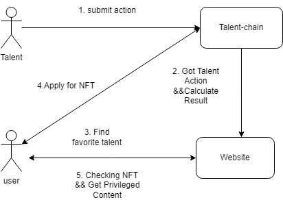

## Basic information

project name: Talent-Chain

Project establishment date: 11/2023

## Overall introduction to the project

### Problem statement
Some people are very talented but unknown, and some people are incompetent but deceive many people by bragging.
This project hopes to allow talents to demonstrate their talents to potential users through a decentralized approach 
and obtain corresponding benefits. Users can use the data on the chain to discover their true talents and talents 
that suit them, so as to obtain guidance or help.

### What is Talent-Chain?

Talent-Chain aimed at revolutionizing the way talents display their expertise in the world of finance and professional commentary. Our project addresses the issue of decentralized talent showcasing, providing a platform for individuals to submit,for examble, their predictions on securities, cryptocurrencies, and professional insights to the blockchain. Through this platform, users can become fans of specific talents, acquire NFTs issued by these talents, and subsequently receive rewards released by the talents through the NFTs, thereby gaining control over valuable content.
Project Brief:
Our project seeks to create a decentralized ecosystem where talents can showcase their expertise and insights in the fields of securities, cryptocurrencies, and professional commentary. By leveraging blockchain technology, talents will have the opportunity to submit their predictions and insights directly to the chain, allowing users to engage with and support their favorite talents. Through this engagement, users can obtain NFTs issued by the talents, which can then be used to access rewards and exclusive content released by the talents.
This project aims to empower talents by providing them with a direct channel to display their expertise, while also offering users the opportunity to engage with and benefit from the valuable insights provided by these talents. Through the use of NFTs and blockchain technology, we aim to create a transparent and rewarding ecosystem that benefits both talents and their supporters.
We are excited to embark on this journey and look forward to creating a platform that revolutionizes the way talents are showcased and rewarded in the decentralized landscape of finance and professional commentary.

### Demo

TBD

### Architecture

- Talent substrate chain
    - Open/End diff kind of campaign for talent show     
    - Talent submit the Action to pallet
    - Offchian workder get result from specified URL
    - Issue NFT for talent
- Content Website.
    - Talent publishes restricted access content on the website
    - Users access content through permissioned NFTs 

### Logo

TBD

## Tasks Planned for the Hackathon

- Complete the code for the substrate chain part, and the website will be completed by recruiting personnel in the second phase.

## Things accomplished during the hackathon (submitted before preliminary review at 11:59 am on December 22, 2023)

TBD

## Team information

- Jerry Yu, Blockchain Engineer, [Github](https://github.com/jerry-yu).
- Alex Li, Project Manager, [Github](https://github.com/alexli2311).
