# 目录

- [目录](#目录)
- [基本资料](#基本资料)
  - [背景](#背景)
  - [Mimir项目介绍](#mimir项目介绍)
    - [产品Logo](#产品logo)
    - [产品介绍](#产品介绍)
    - [账户管理](#账户管理)
      - [插件账户](#插件账户)
      - [多签账户](#多签账户)
        - [不可变多签账户](#不可变多签账户)
        - [可变多签账户](#可变多签账户)
        - [嵌套多签账户](#嵌套多签账户)
    - [交易管理](#交易管理)
      - [基础交易管理功能](#基础交易管理功能)
        - [同意执行交易](#同意执行交易)
        - [取消交易](#取消交易)
      - [嵌套多签的交易管理功能](#嵌套多签的交易管理功能)
        - [全交易节点状态查询](#全交易节点状态查询)
        - [交易下沉](#交易下沉)
        - [复杂情况的交易取消](#复杂情况的交易取消)
    - [接入Apps](#接入apps)
        - [多签账户注入](#多签账户注入)
        - [Mimir接管apps交易组装和进度追踪](#mimir接管apps交易组装和进度追踪)
    - [资产管理](#资产管理)
    - [竞品对比](#竞品对比)
- [本次黑客松计划完成事项](#本次黑客松计划完成事项)
- [本次黑客松已完成事项](#本次黑客松已完成事项)
- [未来计划](#未来计划)
  - [正式上线](#正式上线)
  - [功能更新](#功能更新)
    - [近期计划](#近期计划)
    - [中期计划](#中期计划)
- [团队成员](#团队成员)

# 基本资料

项目名称：Mimir

项目立项时间：2023-10

github地址：https://github.com/mimir-labs/mimir-wallet

demo视频：https://youtu.be/amm_Vk0vzP4

产品地址：https://dev.mimir.global

技术文档：[mimir技术模型文档](./docs/mimir技术模型文档.md)

## 背景

> 名词解释： EOA账户，即普通单签账户

在以太坊生态中，多签已成为常见的需求，而且成为了ETH最重要的账户抽象赛道的最重要的应用。以太坊最大的多签钱包Safe中管理了大约**1%**的ETH资产($3B)，其他的如Social Recovery、Seedless Login也已经有大量项目参与开发与规则制定。

而Substrate中早已经有了相关的功能模块，如Multisig Pallet、Recovery、Proxy等都可以实现、或者通过功能组合实现强大的各类AA（账户抽象）功能，且波卡中的Multisig控制了**5%**的DOT资产，多签需求是以太坊的**5倍**，这表明波卡生态的用户有着更加旺盛的需求。

但是在当前波卡生态中，非EOA钱包面临着两个问题：

1. ### 账户**创建与管理的问题**

**问题一：波卡在技术层面，提供了账户抽象的Multisig，Proxy组件代码，但没有做对应的产品化**

例如：

1. multisig pallet中没有「多签地址」的概念，需提供所有的signatories然后在链上计算出「多签地址」
2. Substrate中没有原生的可变多签的概念，需要结合Multisig和Proxy模块自己设计账户间代理关系间接实现
3. Substrate使用Rust实现，抽象程度高，对开发者有更高的要求

**问题二：波卡支持的账户种类丰富，没有产品提供统一的管理入口**

目前，波卡的账户种类可以粗略分类以下几类：

- 普通单签账户/插件钱包账户
- 不可变多签
- 可变多签
- 代理账户
- 衍生账户
- ...

不同场景下用户的账户使用需求不同，但是目前对这些不同种类的账户，没有产品提供统一的管理。

**问题三：现有波卡多签产品支持的多签账户种类受限，账户层级简单。没有产品支持嵌套多签账户，即多签账户的成员是另一个多签。**

SAFE作为以太坊绝对的头部多签应用，SAFE中嵌套多签账户数量虽然只占总多签账户数量的**3%**，这3%的账户控制了21%的SAFE中的ETH资产（~300K ETH，约占SAFE总托管资产的**20%**），这些用户包括：**Gnosis, BanklessDAO, Lido DAO, 1inch,** **Tornado** **Cash, Badger Finance, Frax Finance, MakerDAO**等头部知名DAO项目。这种账户类型可以完美匹配企业或者DAO内部风控管理流程，可以很好的满足大资金的安全管理需求。

并且根据数据进一步分析：

- 普通多签的平均管理资产：**6.6 eth**
- 嵌套多签中又分为真正的资产托管多签和辅助操作多签，资产托管类嵌套多签占比约为19%，在资产托管类嵌套多签中，平均账户托管ETH为 **423 ETH**

嵌套多签的平均账户托管的ETH数量约为普通多签的 **64** 倍

我们得出结论，如果有产品可以丰富Polkadot生态内嵌套多签账户的操作种类，就可以对Polkadot生态的繁荣有很大的促进作用。因此，Mimir在支持不可变多签和可变多签的基础上，还支持任意结构的单签、不可变多签和可变多签的任意嵌套组合，支持用户按照自己的意愿灵活管理账户，以适配复杂机构和DAO的资金托管和操作需求。

> 数据来源：Dune
>
> 嵌套多签账号数量：https://dune.com/queries/3285505
>
> 普通多签管理的ETH数量VS嵌套多签管理的ETH数量：https://dune.com/queries/3285508
>
> 使用嵌套多签的头部项目：https://dune.com/queries/3285510

1. ### **应用的问题**

**问题一：用户在使用非EOA类型账户时需要组装复杂的交易。**

波卡生态中暂无一款产品能够提供全面的交易组织工具，帮助用户组装各类复杂的非EOA账户交易，如嵌套多签，多签+代理等交易，这些交易用户自行组装需要填写繁多的参数。

同时，如果其他成员想要协助处理这些交易，目前也暂无好用的工具可以方便地进行审批相关的操作。

**问题二：在波卡生态中非EOA的账户无法直接与应用交互。**

在以太坊生态中，DAO和DeFi赛道非常依赖大体量资金多签账户的参与，就连NFT也正在有越来越多的多签账户参与。 例如以太坊龙头NFT项目cryptoPunk有约15%的nft都托管在多签钱包中。

在波卡中，Staking和OpenGov都是重资产账户最热衷参与的赛道，但是目前确没有任何一款多签产品可以接入上述apps. 导致大部分多签账户都处于沉睡状态。

在Mimir中，用户可以流畅地对钱包内的资产进行使用和管理，提高资金参与度，后续可以通过应用访问SDK，让用户可以使用多签账户很方便地参与到Staking, OpenGov中。

## Mimir项目介绍

### 产品Logo

https://drive.google.com/file/d/1bE5gw1R6KTglS_rGwXwwnvc8SnDk1-rB/view?usp=sharing

### 产品介绍

Mimir是波卡生态中All-in-one的账户与资产管理工具

### 账户管理

Mimir综合各类别的账户体系，在当前的Mimir中，用户可以使用以下类型的账户体系：

#### 插件账户

用户可以通过授权插件，通过Mimir访问插件中的钱包

#### 多签账户

由多个地址共同控制的钱包，具有更高的安全性，Mimir除了支持Polkadot原生的不可变多签账户之外，对另外两种类型的多签-可变多签和嵌套多签也做了深度的支持

##### 不可变多签账户

不可变多签账户通过Multisig模块，链下计算出多签地址，为用户提供更简单的操作流程。其缺点在于成员地址、数量和阈值不可变。

##### 可变多签账户

可变多签是Mimir通过组合Proxy和Multisig模块，实现了类似以太坊Safe的多签可以变更成员的功能的多签账户，其与不可变多签的对比如下图所示。

|            | 可修改成员 | 可修改阈值 | 可删除 | 可同成员重复创建 | 创建时需要发起交易 |
| ---------- | ---------- | ---------- | ------ | ---------------- | ------------------ |
| 可变多签   | √          | √          | √      | √                | √                  |
| 不可变多签 | ×          | ×          | ×      | ×                | ×                  |

##### 嵌套多签账户

支持多签账户包含了多签作为其成员，用户可以任意选择可变多签，不可变多签或者单签账户作为多签账号的成员，并按任意层级进行嵌套的账号架构。

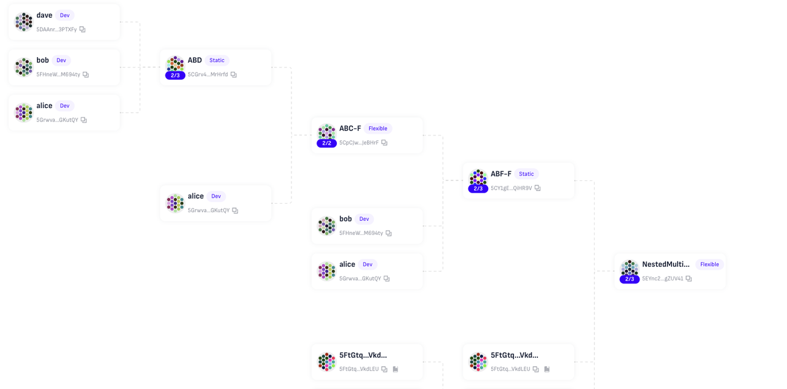

将来Mimir也会适配Proxy，混合Proxy和Multisig架构的账户，并且通过zkLogin的方式支持社交登陆。

### 交易管理

#### 基础交易管理功能

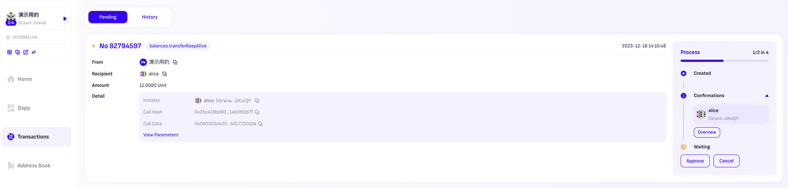

##### 同意执行交易

Mimir会筛选出所有可以执行同意操作的本地单签，用户无需进行账户切换，可选择任意符合规则的本地的单签账户进行Approve操作。

##### 取消交易

若作为交易的发起人希望取消交易，则可以直接在Pending交易界面中点击Cancel按钮以取消交易。

#### 嵌套多签的交易管理功能

嵌套多签的交易会增加状态的复杂度，以这样一笔嵌套多签交易为例，Mimir提供了以下更加细致的交易管理功能。

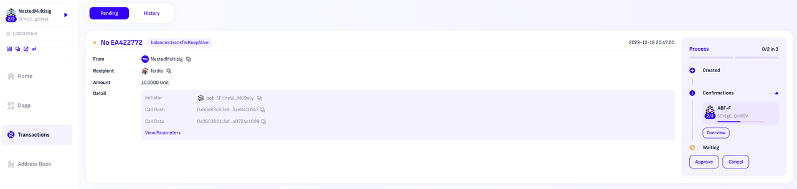

##### 全交易节点状态查询

点击上图的Overview之后，用户可以查看所有账户节点当前的审批情况，以及时对相应的账号持有人进行通知

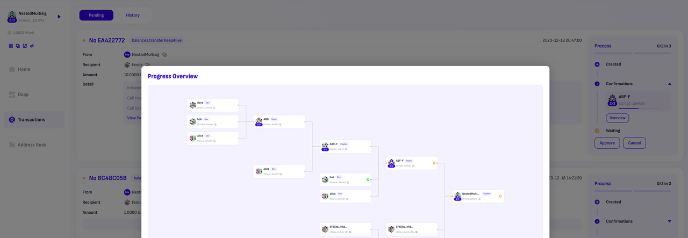

##### 交易下沉

对于该笔交易，用户可以在子多签中看到同样一笔的交易显示，并可同样以该多签的身份进行同意/取消的操作

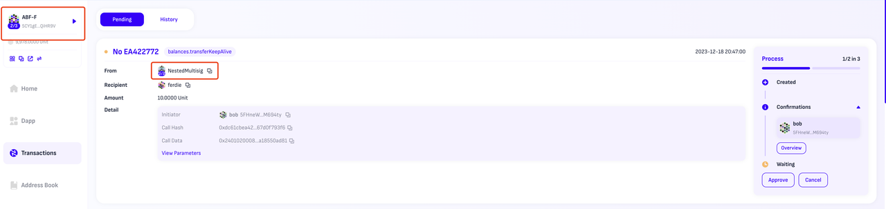

##### 复杂情况的交易取消

由于子多签的交易上链后的取消交易，也为一笔多签交易，在Mimir中，在最顶层的多签账号中，可以看到与该笔交易相关联的所有子多签账号的取消交易，方便用户了解当前所有交易的交易状态。

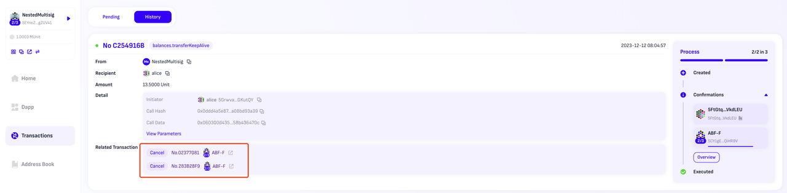

### 接入Apps

##### 多签账户注入

目前Mimir已经以Polkadot.js作为尝试，初步实现了相关功能，用户通过Mimir-Dapp-General进入Polkadot.js后，即可看到所有通过Mimir创建的多签账户，并以多签账户身份进行应用的操作。

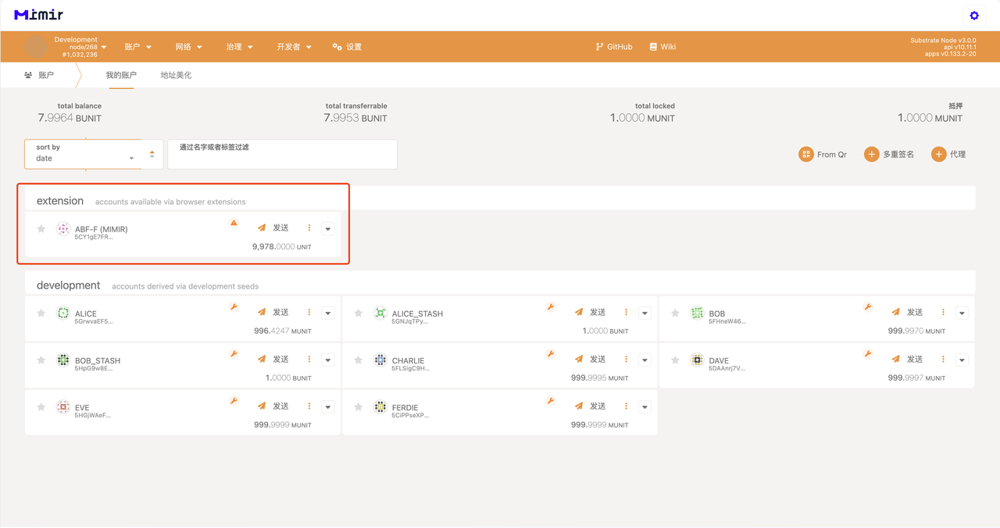

##### Mimir接管apps交易组装和进度追踪

多签账户在Mimir中通过应用发起的交易，将会在Mimir的Pending Transaction中进行显示，用户后续无需继续操作应用，而是可以在Mimir中完成对交易后续流程的处理。

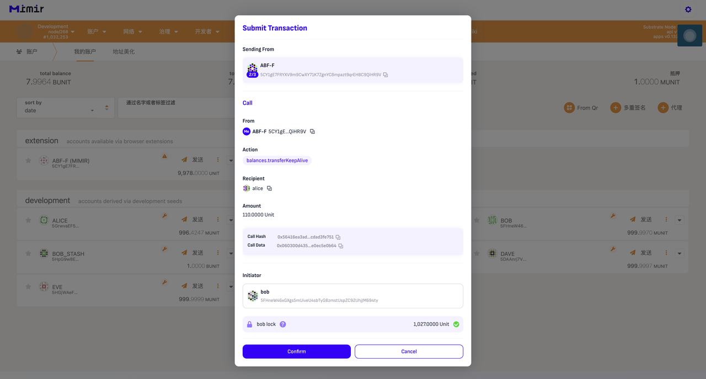

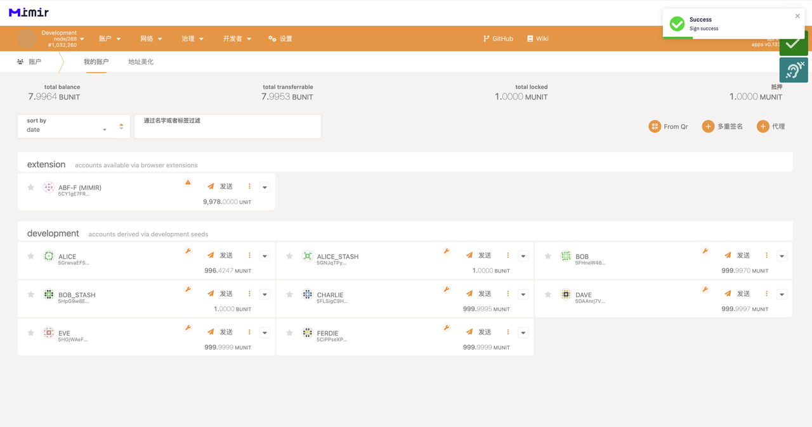

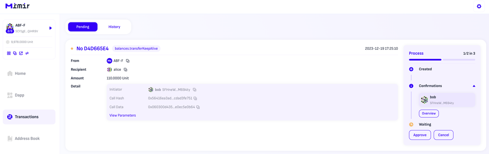

### 资产管理

用户可以查看当前选择的账户各类资产余额，并进行快捷操作

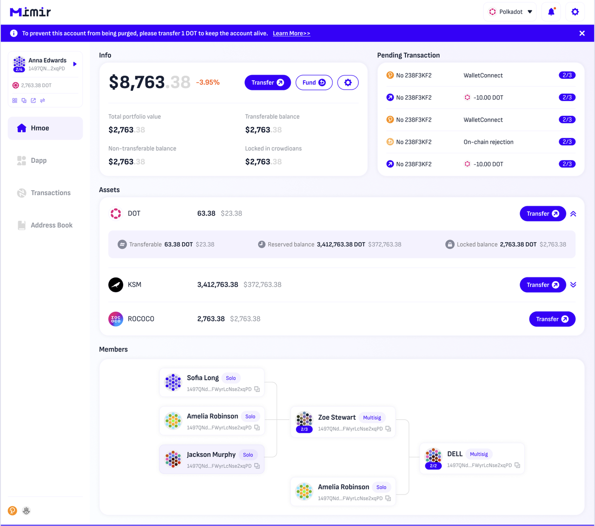

### 竞品对比

|                       | 支持不可变多签 | 单签账户操作 | 支持可变成员多签 | 多签账户自动拉取同步 | 支持任意层级嵌套多签 | 交易穿透层级处理 | 支持多签登陆三方应用 |
| --------------------- | -------------- | ------------ | ---------------- | -------------------- | -------------------- | ---------------- | -------------------- |
| Mimir                 | ✅              | ✅            | ✅（一步创建）    | ✅                    | ✅                    | ✅                | ✅                    |
| MultiX                | ✅              | ❌            | ❌                | ❌                    | ❌                    | ❌                | ❌                    |
| Polkasafe             | ✅              | ❌            | ✅（多步创建）    | ❌（目前不可用）      | ❌                    | ❌                | ❌                    |
| Subscan multisig tool | ✅              | ❌            | ❌                | ❌                    | ❌                    | ❌                | ❌                    |

# 本次黑客松计划完成事项

夏季黑客松中Mimir实现了基础的账户框架搭建，功能上只包括不可变成员多签的交易发起以及交易流程管理部分。此次参与冬季黑客松，新增了可变多签账户、嵌套多签账户的账户创建与管理，并为复杂账户的交易操作和进度追踪提供了较为全面的解决方案，并且接入了波卡的apps。解决了更多的实际应用问题，产品与技术难度和深度也较上次黑客松增加了不少，具体如下展开：

1. ## Mimir支持可变成员和阈值的多签账户

波卡原生的Multisig Pallet创建的账号多签成员和阈值都不可修改，这在使用的过程中会导致极大的不便，当多签账户内有很多资产并且正在进行Staking等状态时，如果需要修改成员，则需要把所有资产全部迁出到一个新的账号里，再重新进行Staking，极大提高了多签账户的使用负担。

同时可变多签也能支持删除账号，支持同阈值同成员创建多个不同多签，让用户对账号的管理能力更强。

**可变多签账户实现**：

组合了Proxy和Multisig Pallet，通过EOA账号创建一个Pure Proxy并将其代理权限给到对应不可变多签，后续在需要变成成员和阈值时将代理权限给到新的不可变多签，实现了成员和阈值可变的效果。

**配套功能：**

1. 账户体系修改，同步兼容以后可能出现的其他账户类别
2. 可变多签账号创建
3. 可变多签账号修改/删除
4. 可变多签交易管理

| 概要                                                | 功能详情                           | UI/UX适配 | 完成度 |
| --------------------------------------------------- | ---------------------------------- | --------- | ------ |
| 账户创建与管理                                      | 创建可变多签并设置成员及阈值       | ✅         | 100%   |
| 增加、减少多签成员以及修改阈值                      | ✅                                  | 100%      |        |
| 账户状态检查，例如existential deposit等条件满足情况 | ✅                                  | 100%      |        |
| 交易管理                                            | 可变多签的交易组装、发起和进度管理 | ✅         | 100%   |
| 可变多签的交易取消以及状态更新                      | ✅                                  | 100%      |        |

1. ## **Mimir支持任意级别的嵌套多签账户**

任意层级的多签账户嵌套是Multisig Pallet中已经支持的功能，且在以太坊生态中，Safe也能够支持组装和使用嵌套的多签账户，但是波卡生态中暂无其他产品在多签应用中能够支持，Mimir是波卡生态中首个实现了任意级别的嵌套多签完整交互的应用项目，并且相比于Safe，使用更加轻便。

本次黑客松的实现功能包含以下：

**账户****抽象层****：**

1. 可变成员嵌套多签的创建、成员修改、阈值修改
2. 任意级别的嵌套任意种类多签账户创建

**资产管理层：**

1. 审批节点全链路状态查看
2. 全审批节点审批处理
3. 全局交易取消以及部分交易取消流程
4. 交易下沉至任意级别的子多签账号
5. 交易卡片将会关联取消交易以及Unlock交易整合显示以及相互跳转

| 概要                                                 | 功能详情               | UI/UX适配 | 完成度 |
| ---------------------------------------------------- | ---------------------- | --------- | ------ |
| 账户管理                                             | 创建任意级别的多签账户 | ✅         | 100%   |
| 图片显示账户架构                                     | ✅                      | 100%      |        |
| 任意修改嵌套账户的成员及阈值                         | ✅                      | 100%      |        |
| 交易组装、操作与进度管理                             | 创建多层嵌套多签交易   | ✅         | 100%   |
| 嵌套多签交易的账户穿透显示                           | ✅                      | 100%      |        |
| 嵌套多签交易的账户穿透操作与进度同步                 | ✅                      | 100%      |        |
| 嵌套多签交易在简单情况下的取消操作                   | ✅                      | 100%      |        |
| 嵌套多签交易中断后的资金Unlock追踪与操作             | ✅                      | 100%      |        |
| 嵌套多签交易的总进度管理                             | ✅                      | 100%      |        |
| 嵌套多签交易在复杂情况下的取消及和原始操作的关联管理 | ✅                      | 100%      |        |

1. ## Mimir接入三方应用， 支持多签操作

多签账户或者其他账户类别由于没有公私钥对，所以无法使用通常的插件钱包，而一般应用都是以支持插件钱包为主。在以太坊生态中有Wallet Connect这样的协议能够支持，也有Safe做了SDK让应用可以直接接入Safe的合约账号，能够极大方便这些账号使用以太坊生态的各类应用，参与生态建设。

而在波卡生态中，目前还**没有**多签产品支持三方应用操作。而波卡生态中多签中的资产占比达到5%，这些资产参与到生态中比如Staking或者Governance时都会面临操作不便的困难。

**三方应用内嵌：**

在Mimir中，我们已经接入了Polkadot.js，初步实现了应用的接入，用户可以在Mimir内嵌的Polkadot.js中做交易的组装，然后在Mimir中进行管理（进行Approve、Cancel等操作）。

**配套功能：**

1. 将三方页面作为接入Mimir
2. 多签账户注入三方app并且实现app内的多签交易组装及状态追踪
3. 与三方app的交互在mimir transaction中做统一进度管理

| 概要                                        | 功能详情                              | UI/UX适配 | 完成度 |
| ------------------------------------------- | ------------------------------------- | --------- | ------ |
| Polkadot.js接入                             | 将Polkadot.js 接入到mimir内           | ✅         | 100%   |
| 交易组装                                    | 将mimir多签账户注入到polkadotjs app中 | ✅         | 100%   |
| 在polkadotjs app产生的交易由mimir创建和管理 | ✅                                     | 100%      |        |
| mimir-sdk                                   | 根据适配polkadotjs app实现了第一版    |           | 50%    |

1. ## 用户交互优化

在上一版黑客松里，仍然有许多用户的交互需求没有能够被满足，在当前黑客松版本中已经完成了大部分用户基础功能的设置和使用。

**主要包含以下的功能点：**

1. 用户可以自主选择RPC节点
2. Profile页面美化，增加交易历史，资产情况以及图形化多签成员展示
3. 增加Fund功能，用户可以快速从本地其他账户为当前选择账户补充资产
4. Address页面美化，提高主要交互按钮的显示层级，以提高用户交互便捷度
5. Transaction中新增对于多签成员修改以及交易取消的显示适配

| 概要                                                         | 功能详情                           | UI/UX适配 | 完成度 |
| ------------------------------------------------------------ | ---------------------------------- | --------- | ------ |
| RPC                                                          | 支持Rococo本地RPC节点              | ✅         | 100%   |
| 用户可手动选择RPC节点                                        | ✅                                  | 100%      |        |
| 新版产品页                                                   | 新增Fund功能快速为多签账户发送资产 | ✅         | 100%   |
| Profile页面美化，增加交易历史记录以及资产显示                | ✅                                  | 100%      |        |
| 可图形化展示多签账户架构                                     | ✅                                  | 100%      |        |
| 用户可以在所有有新地址出现的地方快速将地址添加入Address Book | ✅                                  | 100%      |        |
| Transaction新增对于多签成员修改以及交易取消的显示适配        | ✅                                  | 100%      |        |
| Address页面美化，提高主要交互按钮的显示层级，以提高用户交互便捷度 | ✅                                  | 100%      |        |
| 批量交易                                                     | 实现多签账户的批量交易入口         | ⏳         | 70%    |

# 本次黑客松已完成事项

详见以上**本次黑客松计划完成事项**的进度部分

# 未来计划

## 正式上线

Demo完成后，我们就会开始着手接入Rococo网络，并开始在社区中启动宣传和测试，接受来自用户们的反馈进行迭代更新。

## 功能更新

### 近期计划

黑客松结束后，Mimir将会着力开发应用接入的SDK，初步计划首先接入Subsquare，以及Acala和Bifrost的Apps以实现跨链转账功能。

### 中期计划

Mimir将会继续围绕两条主线进行

1. Mimir会支持更多类型的非EOA账号，如Proxy，社交登陆账号
2. Mimir会支持更多的应用功能，如Social Recovery，Batch Transaction等
3. 接入更多波卡及平行链app

# 团队成员

| Role                  | Name    | Wechat              | Github                        |
| --------------------- | ------- | ------------------- | ----------------------------- |
| Product Manager       | Tiny    | ineedmeat           |                               |
| Full-Stack Engnieer   | Jarvan  | zzcadmin            | https://github.com/jarvandev  |
| UI                    | Wilson  | wlbforsure          |                               |
