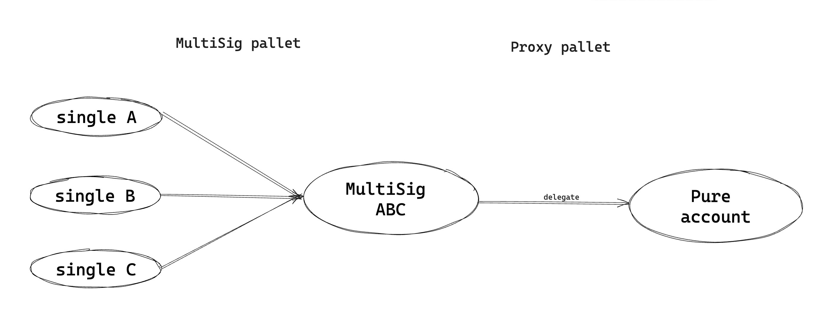
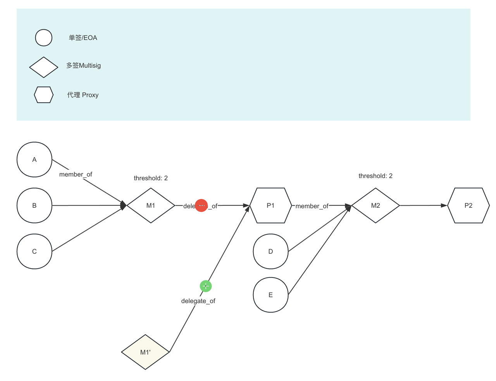
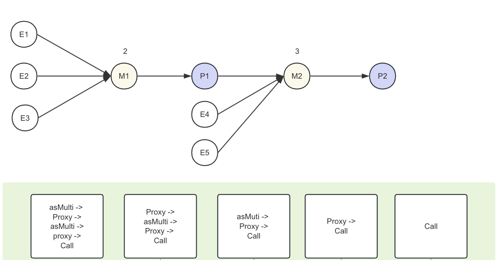
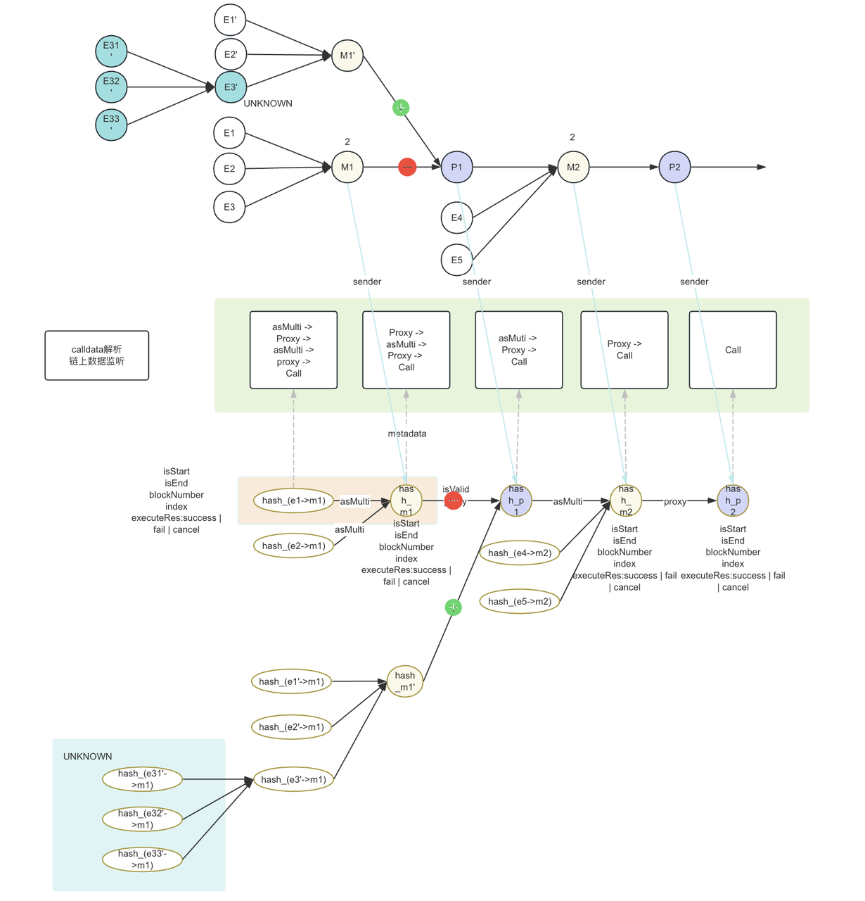

## Overview

Mimir作为波卡生态第一个支持任意嵌套结构的多签产品，对于账户模型以及交易模型的处理需要尽可能通用化，对于市面上的产品进行广泛调研后，Mimir的账户和交易采用**图模型**进行建模。

## 技术建模目的

为了：

**账户层面上**

- 同时支持波卡生态中的两种类型多签账户：
  - 不可变成员多签：通过multisig pallet实现
  - 可变成员多签：通过multisig + proxy pallet组合实现
- 支持不可变多签和可变多签账户的任意嵌套组合，例如：一个组织中各个部门共同管理某个账户的需求
- 支持多签账户云同步，即如果自己拥有的地址是某个多签账户的成员，则会被自动同步该多钱账户的使用权

**交易层面上**

- 支持任意账户结构下的交易发起，并且保证支持：
  - 正确显示交易的metadata
  - 交易状态正确显示
  - 交易进度提示
  - approve和cancel的对进度的正确影响
  - 交易结束之后对lock资金的正确解锁

## 账户模型

### 基础账户类型

#### 不可变成员多签

在multisig pallet中，每一次调用approve或者cancel方法，都会要求参数传入所有的成员及阈值，在执行多签逻辑时在链上计算出对应的多签地址，Substrate中代码如下：

```Rust
let id = Self::multi_account_id(&signatories, threshold);
```

因此链下会备份用户的多签地址、成员地址和与阈值。

#### 可变成员多签

可变成员与阈值的多签，需要结合multisig和proxy两个pallet的逻辑。如图为可变成员多签的实现原理：



如图，由某单签账户先创造一个pure account(根据proxy中规定的算法产生的地址)，然后再把对pure account的代理权移交给某个多签账户ABC，从而间接实现单签账户A,B,C控制pure account的效果。因不可变多签ABC账户可以随时把pure account的代理权移交给其他账户，从而间接达到修改成员和阈值的效果。

### 任意层次嵌套的账户建模

如图所示，如果允许任何单签、可变多签、不可变多签进一步组合成新的可变多签或不可变多签，实现任意层级/无限多层级的账户构造，产品中把它叫**做任意层次嵌套的账户构造，**即允许用户按照自己的意图灵活构造出符合自己要求的账户结构。



这里以图建模的方式，把账户和账户之间的关系采用‘点边建模’方式，利用图计算的优势快速计算两个或多个账户之间的层级关系。这样的建模也可以极大提高交易构造的效率，将会在交易建模中展开。

## 交易模型

任意层次的账户对应的交易构造及其进度管理是模型最难的部分。首先，交易建模的目的是：

1. 和账户模型同步，例如账户关系发生变动时，交易关系也要随之发生改变
2. 交易之间关系表达准确
3. 交易状态显示正确（成功/失败，成功百分比等）

在实际交易组装中，多层级的账户关系组成的CALL metadata是嵌套的且有规律的，如图：



也就是说，如果拿到了一笔交易的calldata原文，可以反向解析出这个多签账户的类型以及层级构成，calldata的特性是解耦账户结构和交易结构的关键。

根据calldata的这一特性，可以在业务中进一步把嵌套calldata也建模成图模型，使用每一层的child calldata之间的关系来管理不同的多签交易构造及整体进度，如图：



这里把child calldata hash之间进行点边关系建模，每个child calldata hash对应的sender和账户模型的点（即账户或地址）进行关联，通过对chilld calldata hash的状态管理进而管理整体多签交易的进度。