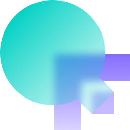

## Basic information

project name: OpenQF

Project establishment date: 11/2023

## Overall introduction to the project

### Problem statement

Under Polkadot OpenGov model, ecosystem builders submit treasury funding proposals, and the community vote with their
balances. There are problems in this model:

- Whales play too important roles.
- Voters who have great contributions to the ecosystem but with less balance will have low or no influence to the vote.
- The vote result is Yes/No which means proposers can only get all the requested fund or 0.
- The cost to a voter is token lock. Relatively speaking, it's too low that voters may not take it very seriously.
- Voters maybe irrational to vote on a treasury proposal, and the community are becoming conservative that we may miss
  some constructive contributions.

### What is OpenQF?

OpenQF is a child project of [OpenSquare](https://github.com/opensquare-network). It aims to introduce a quadratic
funding model to the current polkadot governance mechanism. Generally speaking, more fund from more donators a
project received in a donation round, the more fund will be matched from a public fund pool to this project.

The most important innovation OpenQF will bring is a donation matching augmentation algorithm based on on-chain
activities and off-chain real world information bindings. History on chain activities and information will be indexed
for calculating an address' contribution to the polkadot ecosystem. Off-chain information will be used to prove
donators are real world person. The final goal will be if a project receive more donations from more real world person
who have more contributions to the polkadot ecosystem, this project receive more fund from a public fund pool.

### Demo

Following link is a demo environment with mock data, and we disabled some buttons like project submission and donation.

https://qf-demo.opensquare.io

### Architecture

- On-chain data scan layer. On this layer we have several packages which scan history blocks and extract related
  business data which will be used for address matching power calculation. These packages include:
    - Account scan. It scans blocks data and extract address first debut data.
    - Role scan. It scans blocks data and extract history councilor and validator data.
    - Governance scan. It scans blocks data and extract active OpenGov voter data.
    - Treasury scan. It scans blocks data and extract treasury related data.
    - Contributor scan. It scans balances transfer data and save the community donations.
- Quadratic funding data processing jobs and data server.
    - It calculates contributors' matching power.
    - Projects' matched fund from public matching pool is calculated.
    - Funding round management, project info submission and maintenance.
    - Serve various data including round, project, donations and address matching power information, etc.
- Fronted pages. It interacts with the server and provide whole UIs to facilitate the whole workflow in a quadratic
  funding round.

### Logo

More logs can be found [here](https://drive.google.com/drive/folders/1nA6PTJJYfnpvB8wu9cgQaHopMRM4bqQg?usp=drive_link).

## Tasks Planned for the Hackathon

- Scan polkadot history blocks and extract related business data which will be used for final public pool matching
  calculation.
- Build a server to do pool matching calculation and serve business data.
- Build fronted pages which will show

Fronted pages:

- Quadratic funding round list page.
- A funding round detail page. We can see the round detail, projects and the final matching result on this page.
- A project submission page where we can submit project to one round. This will be disabled in demo phase.
- Project detail page where we can see a project detail and the donations.
- User page on which we can see an address' matching power, donation history.

## Things accomplished during the hackathon (submitted before preliminary review at 11:59 am on December 22, 2023)

- Polkadot chain data scan scripts
    - Account scan: scan blocks and extract address debut data. We can know the time when an address first appear.
    - Governance scan: scan blocks and extract OpenGov data. We can know whether an address is an active voter.
    - Role scan: scan blocks and extract validator and councilor data. We can know whether an address was once a
      councilor or validator.
    - Treasury scan: scan blocks and extract treasury related data. We can know whether an address is a tip finder,
      beneficiary or bounty curator.
    - Contributor scan: scan blocks and extract community donation info to projects.
- QF server
    - A restful server
        - to serve quadratic funding business related data.
        - to accept new project application data(disabled in demo environment).
        - to support github account link to polkadot address.
    - API instances are maintained to support on-chain data query.
    - Scripts to populate mock data.
    - Scripts to calculate contributors' matching power.
    - Scripts to calculate final matched fund from public pool.
- Fronted pages
    - Home page or fund round list page. Check [here](https://qf-demo.opensquare.io/).
    - Fund round detail page on which we can see round detail and projects.
      Check [here](https://qf-demo.opensquare.io/rounds/1).
    - Project detail page on which we can see project detail, contributors, discussions, fund matching info. And we can
      also do donation on this page, but disabled in demo environment.
      Check [here](https://qf-demo.opensquare.io/rounds/1/projects/5) for an example.
    - Profile page on which we can see matching power details of an address, and we can link a github account to an
      address if a user login in with this address.
      Check [here](https://qf-demo.opensquare.io/users/12sNU8BXivMj1xQmcd4T39ugCyHjmhir8jkPqfAw5ZDESrx4) for an example.
    - New project page on which we can submit a new project for review. The submit button is disabled in demo.
      Check [here](https://qf-demo.opensquare.io/apply).

## Team information

- Yongfeng Li, Full Stack Engineer, [Github](https://github.com/wliyongfeng).
- Chaojun Huange, Full Stack Engineer, [Github](https://github.com/hyifeng).
- Jiehao Hu, Fronted Engineer, [Github](https://github.com/2nthony).
- Yihan Fan, Designer, [Github](https://github.com/Popoulosss).
