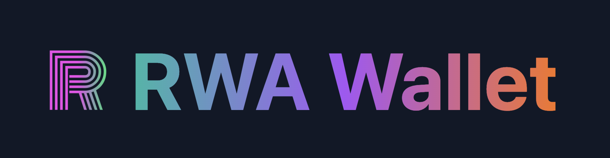

## 基本资料

项目名称：CreatorX

项目立项日期 (哪年哪月)：2023/10

## Background

First, we create the RWA-Wallet.com, it's a wallet platform.
We make a browser extension that can make your twitter account into a NFT also attended the Polkadot Summer Hackathon.

Then Friend.tech comes out, then we realize that we can create a new module on Web only, that's why we start the `CreatorX` module after 2023/10.

The browser extension will be use after we gain 100k user on the web platform.
Now we focus on building the `Web only` feature of the `CreatorX`.

## Introduction

We build a blockchain base of X.com, all the new tweets require user to pay gas and ERC20 tokens to post. User can log in via an X.com account and our system use the MPC wallet tech to create a new wallet for the user under the hood. So users do not need to import any private key on our platform but still have a wallet to interact with blockchain.

## Links && only demo

* [Website](https://RWA-Wallet.com), only the landing page, do not have function yet
* [Pitch Deck TBD](#)
* [Video Demo TBD](#)

## Github Repo

https://github.com/HelloRWA/CreatorX

## Tech we used

Our project is build with Hackathon, that we do a lot of new tech research and integrated them as much as possable(What ever it is usefull or not, we just try them!)

* Vue3
* Nuxt3
* Solidity
* Hardhat
* Viem
* CCIP
* Programmable Wallets
* Moonbeam EVM
* JWT MPC Wallet

## Logo

## 黑客松期间计划完成的事项

* [ ] 创建帖子 (`createSpot`)
* [ ] 帖子列表 (`listSpot`)
* [ ] 购买帖子 (`buySpot`)
* [ ] 发布带有随机红包的帖子 (`issueRandomLottery`)
* [ ] 分享到 X.com (`shareToX`)
* [ ] 推荐奖励功能 (`refToEarn`)

## 本次黑客松已完成事项

TBD

## 团队成员

| Role | Name | Wechat | Github |
| --- | --- | --- | --- |
| Founder, Full Stack Dev | Stark | wx:Web3Hacker | https://github.com/HelloRWA  |
