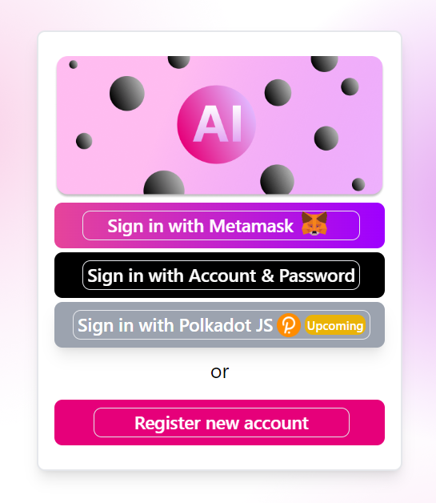
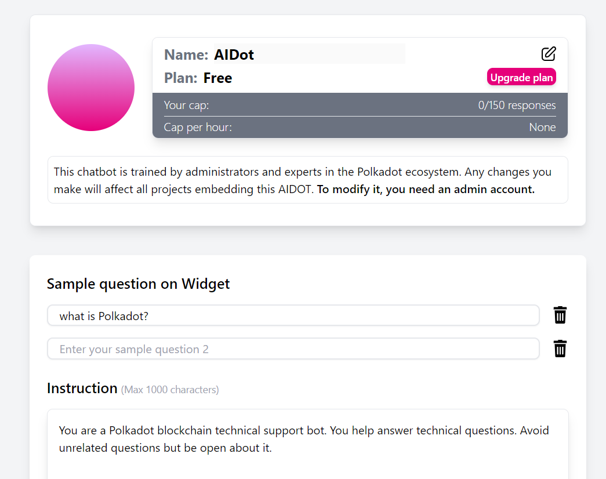
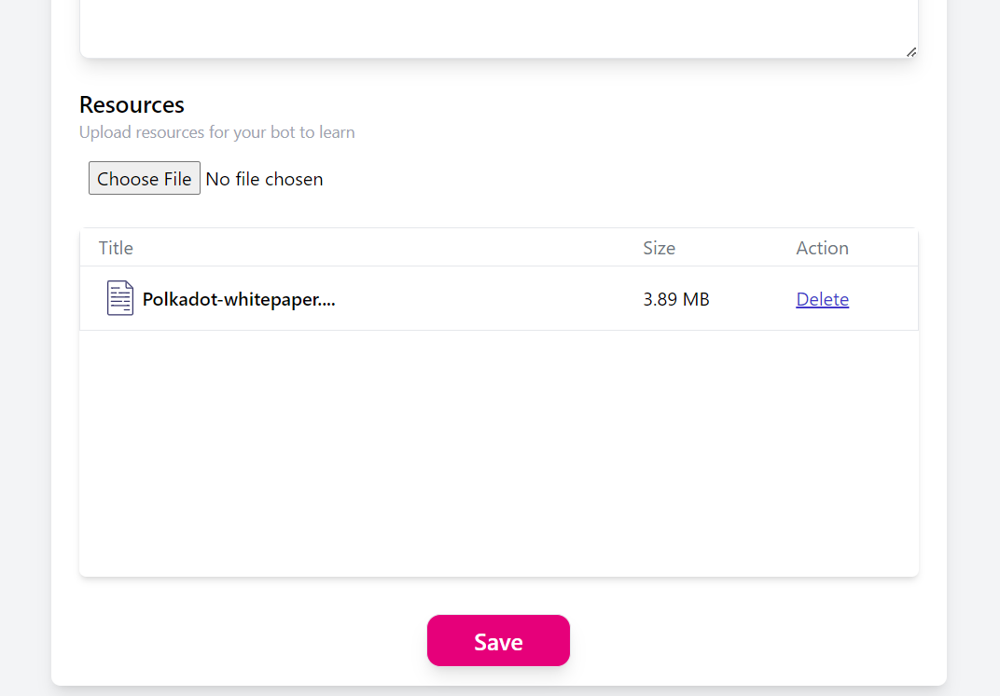
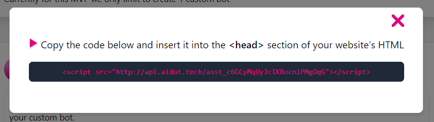
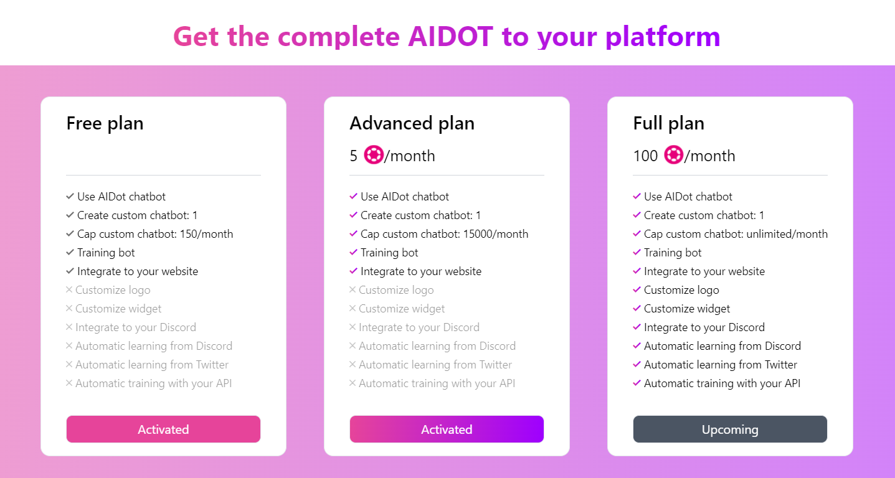

.

## Basic Information

Project Name: AIDot

Project Initiation Date (Year and Month): December 2023

## Overall Introduction to the Project

### Project Background/Reason/Problem to be Solved (if there are other attachments, they can be placed in the `docs` directory. Submit in English).

#### Project Introduction

AIDot is an AI chatbot seamlessly integrated with all Polkadot ecosystem resources, designed to assist with any questions about Polkadot. Its user-friendly interface can be installed as a chat widget on all Polkadot/Parachain documentation websites, enhancing the learning experience of users.

#### Problems Identified in the Polkadot Ecosystem:

* Complexity of Information: Polkadot technologies can be complex and challenging for users to understand.
* Accessibility of Information: Users might find it difficult to locate specific information about Polkadot and its associated Parachains.
* User Support: Providing timely and accurate support to users with questions about Polkadot can be resource-intensive.

#### Solutions Implemented with AIDot:

* AI-Powered Chatbot Integration: AIDot, as an AI chatbot, addresses the complexity of information by offering real-time, easy-to-understand answers to user queries.
* Seamless Integration with Documentations: By embedding AIDot as a chat widget on Polkadot and Parachain documentation websites, it ensures that users have immediate access to assistance while they are navigating through the information.
* User-Friendly Interface: This enhances user engagement and makes it easier for a broader audience to interact with and learn about the Polkadot ecosystem, thereby solving the problem of accessibility.

## Project Demo

### Demo

* [Website](http://www.aidot.tech).
* [Try it out](http://www.aidot.tech).
* Video: https://drive.google.com/drive/folders/1JY_79f3TPV5Yq0_vA7LUJflgQ-xOLp68
* Powerpoint: https://drive.google.com/drive/folders/1JY_79f3TPV5Yq0_vA7LUJflgQ-xOLp68
* [Control Panel to customize AI](http://www.aidot.tech/control) (Login with test account: `username: dummy123  password: dummy123` or your Moonbeam/AcalaEVM address).
  * Login:
    
  * Train bot:
    
    
  * Integrate bot:
    
  * Buy plan:
    
* [Simple website that integrates AIDot chat bot](http://www.aidot.tech/test) + [its source code](https://github.com/parity-asia/hackathon-2023-winter/blob/main/projects/19-AIDot/src/frontend/src/routes/test/test.html).

### Build source

* Front-end: [Link](./docs/setup.md).
* Back-end: [Link](./docs/setup.md).

### How to embed AIDot to other websites

### Technical Architecture

AIDot is split into **four main components**:

* **The AI**: The powerhouse of AIDot. It is trained with preloaded Polkadot datasets, but projects can easily load additional data to train their custom AI however they want at ease through AIDot Control Panel.
* **The Server Infrastructure**: The bridge between applications and AIDot. AIDot's server provides simple-to-use APIs that applications can utilize to have more access in managing/using AIDot.
* **Embeddable Chat Widget**: Embeddable Chat Widget that can be integrated into any website or application with just a simple script. 
* **User-friendly AI Control Panel**: An user-friendly control panel for users to create, modify and manage their AIDot chat bots.

Integrating/Training AIDot for any Polkadot parachain website involves these simple operations:

* Preparation of training data that can be easily loaded into the custom AI.
* Integrating a chat widget UI, which can be easily embedded into every website.
* For further customizations and specific uses, AIDot provides APIs to seemlessly interact with users' custom chat bots.

## Items Completed During the Hackathon

**Server/AI Side**

* An AI chat bot that can handle Polkadot questions well.
* Ability to create multiple custom chat bots.
* Ability to load additional resources to train chat bots how users like.
* An RPC server that exports APIs for applications to integrate.
* Generate code embed for developers to easily integrate AIDot chat bot into their website through a simple html tag.
* $DOT subscription-based model for AIDot usage.
* Login/Purchase plan with AcalaEVM Testnet, Moonbeam Testnet.

**Client Side**

* Chat Widget UI that is embeddable into any front-end.
* AI Control Panel to create, train, modify, and manage AIDot chat bots.
* Account management.
* Connect with AI through RPC APIs.
* $DOT subscription-based model for AIDot usage.
* Login/Purchase plan with AcalaEVM Testnet, Moonbeam Testnet.

## Items Planned to be Completed *After* the Hackathon

* Pull and combine resources from multiple LLMs.
* Integrate decentralized oracles into AIDot as data sources. 
* Optimize AIDot for even higher accuracy and performance.
* Enable bot to call custom APIs.

## Team Member Information

Our team consists of three people:

* Minh Phu:
  * Github: [@nguyenphuminh](https://github.com/nguyenphuminh)
  * Role: Core infrastructure developer, blockchain infrastructure developer, AI researcher.
* Quan Phu:
  * Github: [@ginfdev](https://github.com/ginfdev)
  * Role: Core client-side developer, blockchain engineer.
* Duc Minh:
  * Github: [@itsfcl](https://github.com/itsfcl)
  * Role: AI researcher, blockchain engineer, security engineer.
