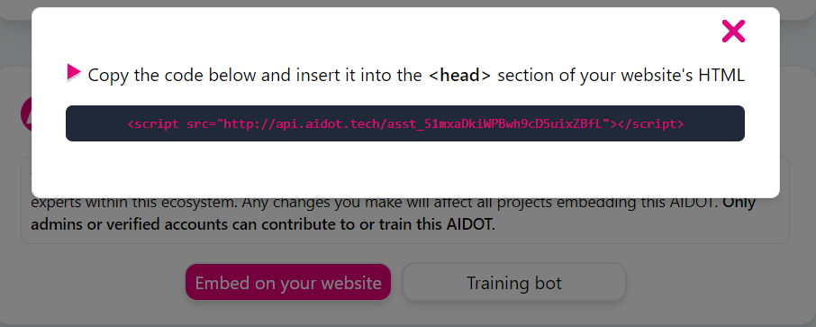

## How to set up

This is a step-by-step tutorial on how to set up AIDot locally on your computer

### The server (which contains the core AI)

1. Install dependencies
	```
	npm install
	```

2. Compile source
	```
	npx tsc
	```

3. Get your API key
	If you already have an OpenAI API key or already know how to get an OpenAI API key, skip this step.

	Log in to OpenAI and hop over to [platform.openai.com/api-keys](https://platform.openai.com/api-keys).

	You should be able to see something like this:
	

	Click "Create new secret key" and you will have your API key.

4. Configure your API key in AIDot
	Open your console.

	If you are on Linux, type:
	```sh
	OPENAI_API_KEY=Enter your API key here
	```

	If you are on Windows, type:
	```bat
	set OPENAI_API_KEY=Enter your API key here
	```

5. Run AIDot
	```
	node .
	```

And you are good to go!

### The front-end

1. Install dependencies
	```
	npm install
	```

2. Serve front-end in localhost
	```
	npx run dev
	```

### Configure the test file

To test the AIDot bot in the `Try it out` page locally, you will have to change the link to your bot in `./src/routes/test/+page.svelte` and `./src/routes/test/test.html`.

Here is a quick tutorial:

1. Get 1 line of code/link to bot by clicking `Embed on your website`:
	
2. Replace the bot URL in `head` tag of both `+page.svelte` and `test.html` in `src/frontend/src/routes/test/` with your bot's URL.

### Load more initial resources to train AI

The easiest way to do this is to log in to our control panel in the AIDot front-end and upload your resources.

Alternatively, you can load more resources to train the bot by specifying the file paths in `aidot.config.js`.

You can also train the bot by using the `modifyChatBot` API (and potentially `getChatBotInfo`) from our server. [Check the API docs here](./rpc.md). But the difference is that this loading from `aidot.config.js` will apply on every new bot created.

### The admin account

By default, the server is initiated with an admin account. You can configure the username and password in `aidot.config.js`.

### More configurations

You can configure the AIDot backend in `aidot.config.js`:

```js
export const config = {
	// These are files that are pre-loaded for every bot created
    resourceFiles: [
        // "./resources/Polkadot-whitepaper.pdf",
        "./resources/basic.md",
        "./resources/general.md",
        "./resources/learn.md",
        "./resources/build.md",
        "./resources/maintain.md",
        "./resources/acala.md",
        "./resources/gear.md"
    ],
	// Configure the RPC server
    rpcOptions: {
		// The port that the RPC server listen on
        RPC_PORT: 20297
    },
	// Configure the Acala and Moonbeam RPCs
    acalaRpcUrl: "https://eth-rpc-tc9.aca-staging.network",
    mbeamRpcUrl: "https://moonbase-alpha.public.blastapi.io",
	// Where to store the server's database
    dbPath: "./db",
	// Where to temporarily store users' uploaded files
    dataPath: "./data",
	// Admin account configuration
    adminUsername: "parity",
    adminPassword: "parity",
	// Link to front-end
    webUrl: "http://localhost:5173",
	// Address to receive subscription payments
    receiverAddress: "0x029B93211e7793759534452BDB1A74b58De22C9c",
    // Enable/disable debugging mode, will log out useful error messages if turned on
	debugMode: false
}
```

### APIs

To interact with an AIDot server and use its APIs, [check the documentations about our RPC APIs](./rpc.md).
