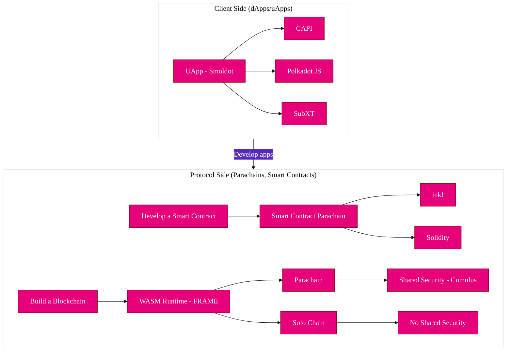

import Tabs from "@theme/Tabs"; import TabItem from "@theme/TabItem";

As with any blockchain, building decentralized applications (dApps) is a huge part of how a
developer can build on Polkadot. Within the ecosystem, you also hear the term "Unstoppable App", or
uApp. While the naming isn't too important, what is important is building resilient applications
using decentralized technology.

As an application developer, you can compose your front-end apps in a few different ways. Because
Polkadot and its parachains are all built using Substraste; you can often use the same SDK to
communicate with Polkadot, a parachain, or any other Substrate-based chain.

:::note Substrate-based chains use an SS58 encoding for their address formats.

Please see the [SS58 registry](https://github.com/paritytech/ss58-registry/) to see which
[chain corresponds to a given prefix](https://github.com/paritytech/ss58-registry/blob/main/ss58-registry.json),
and which prefixes are available.

:::

## SDKS & Libraries

If one aims to develop a **dApp** (Decentralized App) or **uApp** (Unstoppable App), the Polkadot
ecosystem contains various SDKs to tap into the relay chain and parachains. There are several
languages already supported -
[see the tooling page for a detailed overview of different SDKs and libraries that are available.](./build-tools-index.md)

## Frameworks & Toolkits

For front-end applications, several options exist for interfacing with Substrate-based chains
(parachains, relay chains, etc.) and smart contracts. These often will interact with the RPC of a
Substrate node:

<!-- prettier-ignore -->
<Tabs groupId="clients" values={[ {label: 'Polkadot.js', value: 'pjs'}, {label: 'Subxt', value: 'subxt'}, {label: 'React Hooks for ink!', value: 'useink'}, {label: 'ink!athon Boilerplate', value: 'inkathon'}, { label: 'Polkadot Cloud', value: 'pcloud'} ]}>

<TabItem value="pjs"> Promise and RxJS APIs around Polkadot and Substrate-based chains via RPC
calls. It is dynamically generated based on what the Substrate runtime provides regarding metadata.
Full documentation & examples
available&nbsp;<a href="https://polkadot.js.org/docs" target="_blank">here</a>. </TabItem>

<TabItem value="subxt"> Query and submit extrinsics (transactions) to a Substrate node via RPC using
Rust. Also referred to as Rust Parity. Full documentation & examples
available&nbsp;<a href="https://github.com/paritytech/subxt" target="_blank">here</a>. </TabItem>

<TabItem value="useink"> React hooks library for ink! smart contracts that abstract the
functionality of polkadot.js. Full documentation & examples
available&nbsp;<a href="https://use.ink" target="_blank">here</a>. </TabItem>

<TabItem value="inkathon">ink!athon is a starter kit for full-stack dApp development with ink! smart
contracts and a React-based frontend in one place. With convenient helper scripts and a
pre-configured project setup, you can quickly scaffold any dApp. Live example & full documentation
available&nbsp;<a href="https://inkathon.xyz" target="_blank">here</a>. </TabItem>

<TabItem value="pcloud">Polkadot Cloud hosts a library of assets, ranging from data sources,
graphical elements, to fully functional components, for app developers to plug and play into their
codebases. &nbsp;<a href="https://polkadot.cloud/" target="_blank">Learn more here</a>. </TabItem>

</Tabs>


---
id: build-data
title: Explorer, Data, & Indexing Tools
sidebar_label: Explorer, Data, & Indexing Tools
description: An overview about building with data analytics
keywords: [data, index, query, explorer, dashboard]
slug: ../build-data
---

The tools that accentuate and aggregate the data within blockchains are integral for a multi-chain
future. Parachains will need robust and secure ways to index and aggregate data, such as a data
aggregation layer.

## Indexing and Querying

### Subsquid

[Subsquid](https://subsquid.io/) is an open-source framework for building tailored GraphQL APIs to
query Substrate chain state and history.

Subsquid replaces direct gRPC node access with performant Squid archive gateways, allowing quick
synchronization of the API with the historical on-chain data.

Subsquid-powered APIs support filtering, pagination, union types, interfaces and full-text search
out-of-the-box, and can be further extended with custom GraphQL resolvers.

### SubQuery

[SubQuery](https://subquery.network/) is a fast, flexible, and reliable open-source data indexer
that provides you with custom APIs for your Substrate/Polkadot project. We build the best,
fully-featured indexer, so you don’t have to, with:

- automatic support for any Substrate network
- support for all Polkadot smart contract frameworks (FrontierEVM, Acala EVM+, and Wasm)
- automated historical state tracking to enable faster partial re-indexing
- a lightweight and portable design that doesn't require centralised archives
- full support for GraphQL filtering, pagination, interfaces, subscriptions, and aggregations
- a future decentralized network acts as chain-agnostic data aggregation, indexing, and querying
  layer between blockchains and applications that will not require centralised services.

To start building, head to the [SubQuery documentation](https://academy.subquery.network/) where
you'll find quick start guides and walkthrough developer tutorials.

### Dolpha Analytics

[Dolpha Analytics](https://dolpha.com/) is an on-chain data analytics and insights platform for the
Polkadot and Kusama ecosystems. Dolpha empowers casual and power users to get a pulse on the
ecosystems, perform due diligence, surface signals, and make informed data-driven decisions.

### Web3Go

[Web3GO](https://web3go.xyz/) is a Polkadot-based open data analytics platform that provides
infrastructure and tooling to help users visualize, curate, share, and analyze on-chain data.

### The Graph

[The Graph](https://thegraph.com/en/) is a layer-1 indexing tool and querying layer for the
decentralized web, who announced an integration plan to bring
[indexing and querying to Polkadot](https://medium.com/polkadot-network/the-graph-bringing-indexing-and-querying-to-polkadot-6b433e381fe8).

The Graph allows developers to build and publish open APIs, called subgraphs. Applications can query
subgraphs using [GraphQL](https://graphql.org/).

### Covalent

[Covalent](https://www.covalenthq.com/) offers a unified API to understand the data on a blockchain,
and is currently live on the [Moonbeam](https://moonbeam.network/) network, bringing visibility to
billions of blockchain data points to Polkadot via their unified API. The approach to deploy on
Moonbeam simplifies the development of Polkadot-based blockchain applications as compared to
implementing a full parachain or parathread.

Covalent captures the entire history of blockchains and offers a way to zoom into data points
recorded in smart contracts that are often not accessible.

### BigQuery by Google Cloud

[BigQuery](https://cloud.google.com/bigquery) makes Polkadot blockchain data available for Google
Cloud users. Check this
[announcement](https://cloud.google.com/blog/products/data-analytics/data-for-11-more-blockchains-in-bigquery-public-datasets)
for details on how to access the data.

### Polkadot-based Explorers

As you can imagine, blockchain explorers also offer data analytics through an interface where users
can examine common data points.

Some block explorers in the Polkadot ecosystem are listed on the
[tools page](build-tools-index.md##block-explorers).


---
id: build-guide
title: Polkadot Developer Portal
sidebar_label: Polkadot Developer Portal
description: Start building with Polkadot/Kusama.
keywords: [build, how to build, develop, parachain, smart contract]
slug: ../build-guide
---

import Tabs from "@theme/Tabs"; import TabItem from "@theme/TabItem"; import DocCardList from
'@theme/DocCardList';

<DocCardList />

{{ polkadot: Polkadot :polkadot }}{{ kusama: Kusama :kusama }} is a blockchain protocol with two
goals: providing **shared security** among all connected parachains and allowing all connected
chains to **interoperate** by using [XCM](../learn/learn-xcm.md). With the advent of
[PDKs](../build/build-parachains.md#parachain-development-kit) like
[Substrate](https://substrate.io/) and [Cumulus](https://github.com/paritytech/cumulus), the time it
takes to develop and launch a new chain has dropped significantly. While before, it would take years
to launch a new chain, now it may only take weeks or even days, depending on your goals.

This guide will walk you through the steps you can take today to get started building your vision
with {{ polkadot: Polkadot :polkadot }}{{ kusama: Kusama :kusama }}. It will explain the difference
between a [parachain](../learn/learn-parachains.md) and a smart contract in deciding which best fits
your architectural needs.

This build guide provides three different tracks:

1.  [Protocol Development - Blockchain & Parachain Development](#building-parachains)
2.  [Developing Smart Contracts](#developing-smart-contracts)
3.  [Developing a dApp](#developing-a-dappuapp)

:::tip Keep reading to find out more, or visit each respective track

Keep in mind that these tracks are merely suggestive, and there are many ways to utilize
{{ polkadot: Polkadot :polkadot }}{{ kusama: Kusama :kusama }}, Substrate, and their various
developmental components. For more inspiration, look at the
[open source projects](./build-open-source.md) featured here in the wiki!

:::

## Development Ecosystem Overview



Before diving into the various paths, one can take in developing on
{{ polkadot: Polkadot :polkadot }}, it's important to realize and know key terms that make up the
following sections. Even before considering what kind of application you want to build, it's prudent
to understand what {{ polkadot: Polkadot :polkadot }} _is_ and how {{ kusama: Kusama :kusama }}
relates to it, and what each developmental component can do for you within the Polkadot ecosystem.

Before diving into any one of these tracks, it is encouraged to read about
{{ polkadot: Polkadot :polkadot }}{{ kusama: Kusama :kusama }} and its networks in order to gain
context about the application you could make.

## Building Parachains

{{ polkadot: Polkadot :polkadot }}{{ kusama: Kusama :kusama }} is canonically referred to as the
Relay Chain. It is also considered a _layer zero_ protocol, as it enables the interoperability and
shared security of multiple [parachains](../learn/learn-parachains.md), which are _layer one_
protocols. Parachains connect to a relay chain using the
[Parachains Protocol](../learn/learn-parachains-protocol.md).


:::info

Throughout this document, you will encounter the term **runtime** or **STF (State Transition
Function)**. Both refer to the same concept, as they define how a particular system, i.e., a
blockchain, should deal with state changes externally and internally. Both of these terms are used
extensively in {{ polkadot: Polkadot :polkadot }}{{ kusama: Kusama :kusama }}, and by association,
Substrate contexts.

:::

Parachains open possibilities to construct complex **runtime**, or **STF** (state transition
function) the logic that would be too expensive to execute with smart contracts. However, unlike
smart contracts, parachains lack a mandatory gas metering system entirely and could potentially be
vulnerable to bugs that cause infinite loops (something that is prevented by design in smart
contracts). This vulnerability is mitigated by the
[weight system](https://docs.substrate.io/build/tx-weights-fees/) that is implemented in Substrate
-- although it places more of a burden on the developer of the parachain to perform properly
benchmarks.

:::info What is a parathread?

Parathreads, or "on-demand parachains," are like parachains and enable the developer to have
lower-level control of the logic of their application. The main difference between the two is
economical since parathreads will be much less expensive to secure than a parachain and is a
"pay-as-you-go" model. The lower costs of parathreads are because parathreads will only produce a
block when needed, unlike parachains, which have secured a slot to produce a block at every block of
the Relay Chain. When building a parathread, you will use the same tools (like PDKs) and get all the
benefits of building a parachain without the cost drawback.

:::

### Constructing FRAME Runtimes with Substrate

Polkadot is built using the [Substrate](https://substrate.io/) framework.
[Substrate](https://substrate.io/) is a highly configurable and dynamic framework for building
blockchains. At a lower level, Substrate provides a set of tools and libraries ranging from
[block production, finality gadgets to peer-to-peer networking](https://docs.substrate.io/reference/rust-api/).
Both Polkadot and Kusama, as well as most parachains, are built using Substrate.

In essence, Substrate can break down a blockchain's development process by providing crucial
building blocks of functionality, removing the need for re-engineering complex mechanisms that
usually involved when developing a blockchain.

Substrate can be used as a basis for a parachain to connect to a relay chain like Polkadot or
Kusama, or even as a basis to form a conventional layer one solo chain.

Currently, the most streamlined way of utilizing Substrate is
[FRAME](https://docs.substrate.io/learn/runtime-development/#frame), which conveniently allows for a
runtime/STF to be generated from a set of modules (called
[pallets](https://docs.substrate.io/reference/frame-pallets/)).
[Runtimes](https://docs.substrate.io/learn/architecture/#runtime) in Substrate are built using
[WebAssembly](../learn/learn-wasm.md) (Wasm), and represent the state transition function for a
network. FRAME allows for a collection of business logic-oriented modules, called
[pallets](https://docs.substrate.io/reference/frame-pallets/), to construct a runtime/STF and define
how exactly the blockchain is supposed to behave. Ranging from
[identity](https://paritytech.github.io/substrate/master/pallet_identity/index.html) to
[smart contracts](https://paritytech.github.io/substrate/master/pallet_contracts/index.html),
pallets can be quite extensive in providing on-chain functionality.

Even though FRAME is heavily used, it is not the only way to create a valid runtime/STF using
Substrate. Substrate can be used to create new paradigms and abstractions that build on the concept
of web3.

:::note

Although most parachains utilize FRAME and Substrate to build runtime/STFs for connecting to the
relay chain, it is not contingent. Building a parachain using other tools is possible, as long as
they follow the [Parachains Protocol](../learn/learn-parachains-protocol.md).

As a general rule of thumb, Substrate provides the means for this to become possible through
comparably minimal effort.

:::

#### Building Parachains with Cumulus

Diving further into building parachains, [Cumulus](https://github.com/paritytech/cumulus) is another
set of tools that aid in building a parachain-ready blockchain for Polkadot or Kusama. Cumulus
utilizes FRAME and Substrate to create an easy way to build your first parachain. It ensures the
chain follows the Parachain Protocol.

:::info

_Cumulus clouds are shaped like dots; together, they form an intricate, beautiful and functional
system._

:::

For most developers, the best place to start is to get familiar with Substrate independently,
followed by FRAME, with Cumulus as the final step to understanding the entire parachain building
process. This way, one can view how various paradigms are applied and decide on integrating or
utilizing Substrate for their particular use case.

Please see the [parachain development guide](build-parachains.md) for how to get started on building
a parachain or parathread.

#### Parachains Benefits

Parachains contain their own runtime/STF logic and benefit from the shared security and the
cross-consensus messaging provided by the {{ polkadot: Polkadot :polkadot }} relay chain. Parachains
permit high flexibility and customization but require more effort to create and maintain over time.
A production-grade parachain is typically more involved to create due to the complexity involved in
blockchain networks' technical and economic aspects.

Parachains grant the creators more space to build the monetary system and other chain aspects from
the ground up. They will allow for a more concise and efficient execution of complex logic than a
smart contract platform could offer. Parachains also provide more flexibility in the form of
governance and can perform complete upgrades in a less controversial way than the current process of
hard forks.

Some examples of features you can have on a parachain or parathread:

- Custom fee structure (for example, pay a flat transaction fee or pay per byte).
- Shared security and finalization via the relay chain (Polkadot or Kusama).
- Custom monetary policy for the native token and local economy.
- Treasury to be funded through transitions in your state function.
- A governance mechanism that could manage a DAO that is responsible for allocating your on-chain
  treasury.

### Building a Pallet

While parachains are highly customizable, they are often complex to develop. If you wish to get
familiar with FRAME and Substrate, a good place to start is by building a pallet in a development
environment. A pallet is a fully customizable module that allows you to implement layer one logic
with relatively minimal development time on a fundamental level while still allowing the possibility
of building advanced functionality into your custom chain.

To learn how to build a pallet, follow the
[Substrate documentation](https://docs.substrate.io/tutorials/build-application-logic/).

## Developing Smart Contracts

Smart contracts are another option that enables an often simpler developer experience. Below is a
quick comparison of how building a smart contract compares to building a parachain:

|                         | Parachains | Smart Contracts |
| ----------------------- | ---------- | --------------- |
| Speed of Development    | -          | +               |
| Ease of Deployment      | -          | +               |
| Complexity of logic     | +          | -               |
| Maintenance overhead    | -          | +               |
| Level of customization  | +          | -               |
| Strict resource control | -          | +               |
| Native chain features   | +          | -               |
| Scalability             | +          | -               |

:::info What's the difference between a smart contract and a pallet?

If you recall, a parachain comprises a runtime/STF usually built on Substrate. These runtime/STFs
often utilize FRAME, which is subsequently made of pallets. Pallets are part of a Substrate
runtime/STF, whereas smart contracts are a product of a pallet (see:
[pallet_contracts](https://paritytech.github.io/substrate/master/pallet_contracts/index.html)).
Pallets require more engineering and thought, as they can directly affect the chain's state.

:::

### ink! and EVM-based Smart Contracts

At a high level, a _smart contract_ is simply some code that exists at an address on a chain and is
callable by external actors. Whether it's
[EVM-based](https://docs.substrate.io/tutorials/integrate-with-tools/evm-integration/), or written
using [ink!](https://use.ink/), smart contracts sandboxed, executable programs that live on-chain.

:::note

The Polkadot relay chain does not support smart contracts. However, several parachains do. See the
[smart contracts guide](build-smart-contracts.md#smart-contract-environments-are-still-maturing) for
more information about the environments provided.

:::

A popular choice for smart contracts is [ink!](https://use.ink/). Other parachains that offer
EVM-based contracts written in Solidity alongside ink!
[are also available](./build-smart-contracts#parachains).

Because smart contracts exist on a single chain at a time, they can have smooth interoperability
with other smart contracts on the same chain. However, they will always be constrained and limited
by the inherent characteristics of their host chain.

As a developer, you will need to consider the storage and complexity of your smart contract to
ensure that gas usage stays within reasonable bounds. Consider using the listed options on the
[decentralized storage](build-storage.md) page to keep the data and submit only the content address
on the chain.

:::info Building a smart contract

Please see the [smart contracts guide](build-smart-contracts.md) for how to get started on building
a smart contract.

:::

## Developing a dApp/uApp

If one aims to develop a **dApp** (Decentralized App) or **uApp** (Unstoppable App), the Polkadot
ecosystem contains various SDKs to tap into the relay chain and parachains.

For front-end applications, several options exist for interfacing with Substrate-based chains
(parachains, relay chains, etc.) and smart contracts. These often will interact with the RPC of a
Substrate node.

[Please visit the full documentation for developing dApps and other general client-side development resources.](build-dapp)

For a complete list of tools, please take a look here:
[Tools, APIs, and Languages](build-open-source.md)


---
id: build-hackathon
title: Hackathons
sidebar_label: Hackathons
description: Join or host a Hackathon.
keywords: [hackathon, build, event, host, resources]
slug: ../build-hackathon
---

## Join a Hackathon

Web3 Foundation regularly supports developer focused events! Be the first to know by signing up for
the {{ polkadot: [Polkadot newsletter](https://info.polkadot.network/subscribe). :polkadot }}
{{ kusama: [Kusama newsletter](https://kusama.network/newsletter/). :kusama }}

## Host a Hackathon

As one of our objectives in the Web3 Foundation is promoting the
[Web3 technology stack](https://wiki.polkadot.network/docs/build-open-source), we would like to
support any individual or team who wants to organize a hackathon that gets more developers to
understand {{ polkadot: Polkadot :polkadot }}{{ kusama: Kusama :kusama }} and Substrate in your city
or online.

We are not only providing technical resources for you, but we can have someone from our team give a
hands-on workshop/presentation about the technology to help participants get started hacking on it
more quickly.

### Why you should host a hackathon?

- Connect with the Web3 Foundation team and larger community
- Support Web 3.0 education, opportunities, and more
- Learn the bleeding-edge technology
- Make lasting impact and gain connections in the community

## How do hackathons differ from workshops?

Hackathons (AKA Buildathons) are aimed at participants who want to deliver their prototype and
demonstrate their ideas to reality in a short period (few hours - one day), or online in a few
weeks. Workshops are more for getting developers familiar with the tooling and understanding more
about what are the resources currently available and how they can make use of it.

## How can you run a hackathon in your city?

Get in touch with the W3F team by [email](mailto:community@web3.foundation) or ask us via our
[Matrix](https://matrix.to/#/#w3f:matrix.org) chat.

## How we can help

- Provide technical resources/materials
- Help sourcing funding for facilitation and prizes.
- Finding a venue
- Marketing the event
- Ensure the hackathon runs smoothly

## Project & Event Theme Ideas

- NFTs
- Bonded tokens
- New governance pallets with different styles of voting & democracy
- Upgrade the TCR pallet
- IPFS integrations
- Decentralized identity solutions
- Oracle pallets
- Implement Generalized State Channel/Plasma Chain
- Decentralized Exchanges
- Tools for monitoring validator performance
- dApps across different parachains

### Previous Hackathons

Here are a few examples of hackathons W3F has facilitated and supported:

- [Polkadot Buildathon: India](https://polkadot-buildathon.devfolio.co/) - This India-focused
  hackathon was a 9-week online event.

- [Encode Hackathon](https://medium.com/encode-club/encode-hack-club-announcing-polkadot-c7cc6cc12920) -
  an externally facilitated event with a mix of learning challenges and prize pools for dApps as
  well as stand-alone blockchain project submissions.

- [Hello World! by Polkadot](https://gitcoin.co/hackathon/polkadot/onboard) - A collaborative
  hackathon celebrating the integration of Polkadot and Kusama into the Gitcoin platform. Has many
  sets of smaller challenges that will reward in either DOT or KSM.

- [Hackusama](https://hackusama.devpost.com/) - A 7-week online hackathon for developers to "Build a
  Blockchain" and submit your wildest tools, visualizations, and ideas to the "Open Hack" category.

## Resources

- [Substrate Docs](https://docs.substrate.io/) - many introductory learning material lives here,
  that can be a feature of you hackathon or suggested prerequisite for those joining to use.

## Support / Contact

If you have any questions regarding organizing a hackathon, please free feel to contact us by
[email](mailto:events@web3.foundation) or ask us via
[Element](https://riot.im/app/#/room/#polkadot-watercooler:matrix.org) chat.


---
id: build-hrmp-channels
title: Opening HRMP Channels
sidebar_label: Opening HRMP Channels
description: Steps on how to open HRMP channels between parachains.
keywords: [HRMP, parachain, statemint, proposal, asset hub, statemine]
slug: ../build-hrmp-channels
---

[HRMP](../learn/learn-xcm.md#xcmp-lite-hrmp) has the same interface and functionality as
[XCMP](../learn/learn-xcm.md#xcmp-cross-chain-message-passing) but is much more demanding on
resources since it passes all messages via the Relay Chain. When XCMP is implemented on Polkadot,
HRMP is planned to be deprecated and phased out in favor of it.

## Opening HRMP channel: parachain to parachain

To open a channel from one parachain to another that are not system chains on Polkadot, the
governance of each parachain needs to declare its intent to open a channel on the Relay Chain, and
the second chain needs to accept and do the same.

In order to do this, the calls to be dispatched from both chains are:

1. `hrmp > hrmpInitOpenChannel(recipient, proposedMaxCapacity, proposedMaxMessageSize)`: this call
   initiates opening a channel from a parachain to a given recipient with given channel

2. `hrmp > hrmpAcceptOpenChannel(sender)`: accepting the channel open request from the given sender.

Each parachain is to use its own governance process to execute this. The call will be executed on
the Relay Chain.

## Opening HRMP Channels with System Parachains

Opening an HRMP channel with a system parachain requires a referendum. Like all other governance
proposals, proposers should follow best practices like opening a discussion on
[Polkassembly](https://polkadot.polkassembly.io/) or [Subsquare](https://polkadot.subsquare.io/) and
then submitting the proposal on-chain.

Proposals should generally be a `batch_all` call containing:

1. A `force_transfer` of the channel deposit from the Treasury to the System parachain's sovereign
   account. Remember that a bi-direction channel is _two_ channels so will need double the amount.
1. A `force_open_hrmp_channel` from your chain to the system chain.
1. A `force_open_hrmp_channel` from the system chain to your chain.

:::caution

Please ensure that you use the new `force_open_hrmp_channel` directly on the Relay Chain, rather
than the old two-phase channel request/accept method.

:::

## Publication on Polkassembly for discussion and feedback

The [discussions section of Polkassembly](https://polkadot.polkassembly.io/discussions) is the best
place to share the reasoning behind your proposal: make sure to log in with the proposer address (if
possible) before publishing yours, and if you can do this also make sure the address has an on-chain
identity.

### Example: Opening an HRMP Channel with the AssetHub

The following highlights the steps required to submit a proposal for opening an HRMP channel with
the AssetHub. Your submission should contain the following sections to be considered complete for
the community to review and ultimately vote on:

1.  A request on what the proposal aims to do (opening an HRMP channel with the AssetHub);
2.  The use cases this channel will support for your chain;
3.  Technical details of the proposal, including proposal parameters and technical details of this
    call (On Kusama, most proposals were designed as a batchAll calls):

    - A `forceTransfer` of 20 DOT from the Treasury to AssetHub sovereign account.
    - A `forceOpenhrmpchannel` from AssetHub (1,000) to ParaID.
    - A `forceOpenhrmpChannel` from ParaID to AssetHub (1,000).

    Please note that if governance decides to reduce the HRMP channel deposit on Polkadot to 0 DOT,
    the first transaction should not be necessary (these guidelines will be updated accordingly).

4.  The XCM message to the Asset Hub, which can be decoded on the network;
5.  The call data to verify on
    [Polkadot JS Apps Decode](https://polkadot.js.org/apps/?rpc=wss%3A%2F%2Frpc.polkadot.io#/extrinsics/decode)
    tab;
6.  The preimage hash to include in the proposal's submission. Note that if the proposer is planning
    to
    [submit a referendum on the Whitelisted Caller Track](../learn/learn-guides-polkadot-opengov.md#submitting-a-referendum-on-the-whitelisted-caller-track),
    the preimage hash needs to be submitted to and whitelisted by the
    [Technical Fellowship](../learn/learn-polkadot-opengov.md#the-technical-fellowship).

Below is an example of how teams followed this process on Kusama, as a way to:

- Proposal to open HRMP channel between Bifrost and the Asset Hub: the motion can be found
  [here](https://kusama.polkassembly.io/motion/418).

## Preimage submission on democracy tab (Polkadot JS Apps)

Once the community has given enough feedback (we expect these proposal to be non controversial)
please submit the image on the discussion post in the
[Democracy](https://polkadot.js.org/apps/?rpc=wss%3A%2F%2Frpc.polkadot.io#/democracy) tab on
Polkadot JS Apps, by using the "Submit Preimage" button:


On the pop up window, compose the preimage in the discussion post: making sure the proposal hash is
the same as in the post.

## Vote by the community

After the community voting period, there will be an enactment period. In general, on Kusama these
have been defined in shorter terms than the voting periods. Again, it is very important you
encourage the community to vote on this, highlighting the benefits for your chain, use cases enabled
with this submission, among other things. After the enactment period is over, both chains will
authorize the channel.


---
id: build-index
title: Builder's Guides
sidebar_label: Builder's Guides
description: Reference point for the Polkadot builder guides.
keywords: [build, index, tools, resources]
slug: ../build-index
---

Welcome to the builder's section of the {{ polkadot: Polkadot Wiki. :polkadot }}
{{ kusama: Kusama Guide. :kusama }}

Here, you will discover many development tools and resources in the
{{ polkadot: Polkadot :polkadot }}{{ kusama: Kusama :kusama }} ecosystem. We are always adding new
tools and frameworks as we learn about them, so if you are working on something that should be
included, please reach out to us on
{{ polkadot: [Element](https://matrix.to/#/#polkadot-watercooler:matrix.org). :polkadot }}
{{ kusama: [Element](https://matrix.to/#/#kusama-watercooler:matrix.org). :kusama }} This section of
the wiki is divided into the following parts:

## Development Guide

- [Starter's Guide](build-guide.md) - High-level overview on choosing a parachain, parathread, or
  smart contract for your project and how to get started.
- [Parachain Development](build-parachains.md) - Tools for building parachains and parathreads.
- [Smart Contracts](build-smart-contracts.md) - Tools to deploy contracts to a
  {{ polkadot: Polkadot :polkadot }}{{ kusama: Kusama :kusama }} parachain.

## Tools & Resources

- [Tools](build-tools-index.md) - Maintained list of tools.
- [Subkey](https://docs.substrate.io/reference/command-line-tools/subkey/) - Command line utility
  for generating and inspecting key pairs.
- [JS tools](https://github.com/polkadot-js/tools) - TypeScript tools for offline signing of
  transactions, RPC calls, and more.
- [Examples](build-open-source.md) - Example projects sourced from the community -- see what others
  are building.

### Grants

- [Grants](../general/grants.md) - Information regarding grants and funding sources available in the
  {{ polkadot: Polkadot :polkadot }}{{ kusama: Kusama :kusama }} ecosystem.

### PCPs

Polkadot Contracts Proposals (PCPs) are standards for smart contracts in the Polkadot ecosystem.

- [PCP GitHub Repository](https://github.com/w3f/PCPs) - Read, create, or discuss standards and
  proposals.

### Hackathon

- [Resources For Running a Hackathon](build-hackathon.md)


---
id: build-integrate-assets
title: Assets on Polkadot
sidebar_label: Integrating Assets
description: Tools that you can use to integrating assets.
keywords: [assets, integration, api, operations]
slug: ../build-integrate-assets
---

The {{ polkadot: Polkadot :polkadot }}{{ kusama: Kusama :kusama }} Relay Chain does not natively
support assets beyond {{ polkadot: DOT :polkadot }}{{ kusama: KSM :kusama }}. This functionality
exists in parachains. On both Polkadot and Kusama, this parachain is called Asset Hub.

The Asset Hub provides a first-class interface for creating, managing, and using fungible and
non-fungible assets. The fungible interface is similar to Ethereum's ERC-20 standard. However, the
data structures and stateful operations are encoded directly into the chain's runtime, making
operations fast and fee-efficient.

Beyond merely supporting assets, integrating an Asset Hub into your systems has several benefits for
infrastructure providers and users:

- Support for on-chain assets.
- Significantly lower transaction fees (about 1/10) than the Relay Chain.
- Significantly lower deposits (1/10) than the Relay Chain. This includes the existential deposit
  and deposits for proxy/multisig operations.
- Ability to pay transaction fees in certain assets. As in, accounts would **not** need DOT to exist
  on-chain or pay fees.

The Asset Hub will use DOT as its native currency. Users can transfer DOT from the Relay Chain into
the Asset Hub and use it natively. The Relay Chain will also accept DOT transfers from the Asset Hub
back to the Relay Chain for staking, governance, or any other activity.

Using the Asset Hub for DOT/KSM balance transfers will be much more efficient than the Relay Chain
and is highly recommended. Until domain-specific parachains are built, the Relay Chain will still
need to be used for staking and governance.

## Assets Basics

See the
[Assets pallet](https://github.com/paritytech/polkadot-sdk/tree/master/substrate/frame/assets) for
the most up-to-date info and reference documentation.

Assets are stored as a map from an ID to information about the asset, including a management team,
total supply, total number of accounts, its sufficiency for account existence, and more.
Additionally, the asset owner can register metadata like the name, symbol, and number of decimals
for representation.

Some assets, as determined by on-chain governance, are regarded as “sufficient”. Sufficiency means
that the asset balance is enough to create the account on-chain, with no need for the DOT/KSM
existential deposit. Likewise, you cannot send a non-sufficient asset to an account that does not
exist. Sufficient assets can be used to pay transaction fees (i.e. there is no need to hold DOT/KSM
on the account).

Assets do have a minimum balance (set by the creator), and if an account drops below that balance,
the dust is lost.

### Asset Operations

The Assets pallet has its interface for dealing with assets. See the [Integration](#integration)
section below for how to fetch information and construct transactions.

The main functions you will probably interact with are `transfer` and `transfer_keep_alive`. These
functions transfer some `amount` (balance) of an `AssetId` (a `u32`, not a contract address) to
another account.

The Assets pallet also provides an `approve_transfer`, `cancel_approval`, and `transfer_approved`
interface for non-custodial operations.

Asset transfers will result in an `assets.transferred` event. The same instructions for
[monitoring events and **not** transactions](build-protocol-info.md#events) applies to asset
transfers.

Note that you can use the same addresses (except
[pure proxies](../learn/learn-proxies-pure.md#anonymous-proxy-pure-proxy)!) on the Asset Hub that
you use on the Relay Chain. The SS58 encodings are the same; only the chain information (genesis
hash, etc.) will change on transaction construction.

## Integration

The Asset Hub will come with the same tooling suite that Parity Technologies provides for the Relay
Chain, namely [API Sidecar](https://github.com/paritytech/substrate-api-sidecar) and
[TxWrapper Polkadot](https://github.com/paritytech/txwrapper-core/tree/main/packages/txwrapper-polkadot),
as well as the [Asset Transfer API](https://github.com/paritytech/asset-transfer-api). If you have a
technical question or issue about how to use one of the integration tools, please file a GitHub
issue so a developer can help.

### Parachain Node

Using the Asset Hub will require running a parachain node to sync the chain. This is very similar to
running a {{ polkadot: Polkadot :polkadot }}{{ kusama: Kusama :kusama }} node, with the addition of
some extra flags. You can follow
[these guidelines](https://github.com/paritytech/polkadot-sdk/tree/master/cumulus#asset-hub-) to set
up an Asset Hub node.

### Asset Transfer API

Asset-transfer-api is a library focused on simplifying the construction of asset transfers for
Substrate-based chains that involve system parachains like Asset Hub (Polkadot and Kusama). It
exposes a reduced set of methods that facilitate users to send transfers to other (para) chains or
locally. You can refer to
[this table](https://github.com/paritytech/asset-transfer-api/tree/main#current-cross-chain-support)
for the current cross-chain support and [here](https://paritytech.github.io/asset-transfer-api/) for
the complete documentation, including installation guide and usage examples.

### Sidecar

API Sidecar is a REST service for Relay Chain and parachain nodes. It comes with endpoints to query
information about assets and asset balances on the Asset Hub.

- Asset lookups always use the `AssetId` to refer to an asset class. On-chain metadata is subject to
  change and thus unsuitable as a canonical index.
- Please refer to [docs](https://paritytech.github.io/substrate-api-sidecar/dist/) for full usage
  information. Details on options like how to make a historical query are not included here.

Here are the available public instances:

- [Sidecar connected to Polkadot Asset Hub](https://polkadot-asset-hub-public-sidecar.parity-chains.parity.io)
  and
- [Sidecar connected to Kusama Asset Hub](https://kusama-asset-hub-public-sidecar.parity-chains.parity.io)

The purpose of these instances is to allow anyone to check and get a quick overview of the info that
the asset-related endpoints provide.

:::caution

These instances should only be used for ad-hoc checks or tests and not for production, heavy testing
or any other critical purpose.

:::

### Tx Wrapper Polkadot

TxWrapper Polkadot is a library designed to facilitate transaction construction and signing in
offline environments. It comes with asset-specific functions to use on the Asset Hub. When
constructing parachain transactions, you can use `txwrapper-polkadot` exactly as on the Relay Chain,
but construct transactions with the appropriate parachain metadata like genesis hash, spec version,
and type registry.

### XCM Transfer Monitoring

#### Monitoring of XCM deposits

Thanks to XCM and a growing number of parachains,
{{ polkadot: DOT :polkadot }}{{ kusama: KSM :kusama }} can exist across several blockchains, which
means the providers need to monitor cross-chain transfers on top of local transfers and
corresponding `balances.transfer` events.

Currently {{ polkadot: DOT :polkadot }}{{ kusama: KSM :kusama }} can be sent and received in the
Relay Chain either with a [Teleport](https://wiki.polkadot.network/docs/learn-teleport) from
[system parachains](https://wiki.polkadot.network/docs/learn-system-chains) or with a
[Reserve Backed Transfer](https://wiki.polkadot.network/docs/learn-xcm-pallet#transfer-reserve-vs-teleport)
from any other parachain. In both cases, the event emitted when processing the transfer is the
`balances.deposit` event. Hence, providers should listen to these events, pointing to an address in
their system. For this, the service provider must query every new block created, loop through the
events array, filter for any `balances.deposit` event, and apply the appropriate business logic.

#### Tracking back XCM information

What has been mentioned earlier should be sufficient to confirm that
{{ polkadot: DOT :polkadot }}{{ kusama: KSM :kusama }} has arrived in a given account via XCM.
However, in some cases, it may be interesting to identify the cross-chain message that emitted the
relevant `balances.deposit` event. This can be done as follows:

1. Query the Relay Chain `at` the block the `balances.deposit` event was emitted.
2. Filter for a `messageQueue(Processed)` event, also emitted during block initialization. This
   event has a parameter `Id`. The value of `Id` identifies the cross-chain message received in the
   Relay Chain. It can be used to track back the message in the origin parachain if needed. Note
   that a block may contain several `messageQueue(Processed)` events corresponding to several
   cross-chain messages processed for this block.

#### Additional Examples of Monitoring XCM Transfers

The two previous sections outline the process of monitoring XCM deposits to specific account(s) and
then tracing back the origin of these deposits. However, the process of tracking an XCM transfer
(hence the events to look for) may vary based on the direction of the XCM message. Here are some
examples to showcase the slight differences:

1. For an XCM transfer from a Parachain to a Relay chain
   _([example](https://polkadot.subscan.io/xcm_message/polkadot-2f4138e73affe763bebbefa82ee2eb2633425541))_:

   - The [event](https://moonbeam.subscan.io/extrinsic/4531955-6?event=4531955-29) to look for in
     the Parachain side is called `parachainsystem (UpwardMessageSent)`, and the parameter
     `message_hash` in this event identifies the XCM transfer.
   - The [event](https://polkadot.subscan.io/extrinsic/17487547-0?event=17487547-3) to track in the
     Relay chain side is called `messagequeue (Processed)`, and the parameter `id` of the event
     should be the same as the `message_hash` found in the Parachain event.

2. For an XCM transfer from a Relay chain to a Parachain
   _([example](https://polkadot.subscan.io/xcm_message/polkadot-9b01c2916c4d3c5ad01ee350bdda13059358981f))_:

   - The [XCM Transfer Hash](https://polkadot.subscan.io/extrinsic/17487930-2?tab=xcm_transfer) is
     what we need to check on the Relay chain side.
   - The [event](https://acala.subscan.io/extrinsic/4553422-1?event=4553422-5) to look for in the
     Parachain side is called `dmpqueue (ExecutedDownward)`, and the parameter that identifies the
     XCM message is either called `message_hash` or `message_id`.

3. For an XCM transfer from a System Parachain to a Parachain
   _([example](https://polkadot.subscan.io/xcm_message/polkadot-7a1c6fd86e290680f8ee48cee8a64df8e75f7040))_:

   - The [event](https://assethub-polkadot.subscan.io/extrinsic/4677169-2?event=4677169-4) to look
     for in the System Parachain side is called `xcmpqueue (XcmpMessageSent)`, and again the
     `message_hash` is one of the parameters of the event.
   - The corresponding [event](https://astar.subscan.io/extrinsic/4540721-1?event=4540721-7) in the
     Parachain side is the `xcmpqueue (Success)` and the `message_hash` found in that event should
     have the same value as the one in the System parachain.

More examples with different directions and their corresponding events, can be found in this
["How to trace XCM Transfers"](https://hackmd.io/@LwMsxe3-SFmNXxugAXOKgg/SJrREymlp) page.

#### Monitoring of Failed XCM Transfers

In case that an XCM transfer fails to complete successfully, then we will notice some different
parameters in the events emitted or different events. Below are some examples:

1. From a Relay chain to a System Parachain
   _([example](https://polkadot.subscan.io/xcm_message/polkadot-c8d7186edb43a592d65b3b5a87c4ecaac38c5aa2))_:

   - We will see the
     [event](https://assethub-polkadot.subscan.io/extrinsic/4671081-0?event=4671081-1)
     **`dmpqueue (ExecutedDownward)`** in the System Parachain side with the following parameters:
     - **`outcome`** with value **`Incomplete`** and with the type of error which in this example is
       [UntrustedReserveLocation](https://github.com/paritytech/polkadot-sdk/blob/c54ea64af43b522d23bfabb8d917a490c0f23217/polkadot/xcm/src/v2/traits.rs#L43).
     - **`message_id`** which shows the hash of the XCM Transfer.

2. From a Parachain to another Parachain
   _([example](https://polkadot.subscan.io/xcm_message/polkadot-3e74e95204faa6ecf3c81f5129b85f498b89cff2))_:

   - We will see the [event](https://interlay.subscan.io/extrinsic/3627057-1?event=3627057-8)
     **`xcmpqueue (Fail)`** in the destination Parachain with the following parameters:
     - **`error`** which in this example is
       [TooExpensive](https://github.com/paritytech/polkadot-sdk/blob/c54ea64af43b522d23bfabb8d917a490c0f23217/polkadot/xcm/src/v2/traits.rs#L98).
     - **`message_hash`** which identifies the XCM Transfer.
   - **Note** : there might be another
     [event](https://interlay.subscan.io/extrinsic/3627057-1?event=3627057-7) called
     **`polkadotxcm (AssetsTrapped)`** which indicates that some assets have been trapped (and hence
     can be claimed).

A great resource to learn more about Error Management in XCM is the Polkadot blog post from Gavin
Wood,
[XCM Part III: Execution and Error Management](https://www.polkadot.network/blog/xcm-part-three-execution-and-error-management).


---
id: build-integration
title: Polkadot Integration Guide
sidebar_label: Integration Initiation
description: Reference point for the Polkadot integration guides.
keywords: [protocol, integration, structure]
slug: ../build-integration
---

Welcome to the {{ polkadot: Polkadot :polkadot }}{{ kusama: Kusama :kusama }} integration guide.
This guide will provide all the information you need to get started on your integration. The target
audiences for this guide are wallets and custodians, but it will be useful to any infrastructure
provider such as validators or chain indexers.

## Structure

The guide focuses on Polkadot and Kusama, but the principles will apply to parachains and other
Substrate-based chains. The guide contains four sections:

1. [Protocol Info](build-protocol-info.md): The entry point to the guide. Please read it carefully
   as it provides information about {{ polkadot: Polkadot :polkadot }}{{ kusama: Kusama :kusama }}
   that differentiates it from other blockchains. Use this page to check your assumptions.
1. [Assets](build-integrate-assets.md): The guide to integrating assets on
   {{ polkadot: Polkadot :polkadot }}{{ kusama: Kusama :kusama }} into your systems.
1. [Node Management](build-node-management.md): This page will guide you to starting and monitoring
   a node.
1. [Node Interaction](build-node-interaction.md): This page will teach you to interact with your
   node via multiple RPC tooling options.
1. [Transaction Construction](build-transaction-construction.md): A guide to transaction
   construction, signing, decoding, and serialization using several available tools.

## Recommendation

Each page in the guide, especially the Node Interaction and Transaction Construction pages, tries to
list several options to accomplish the same thing. We want you to know your options and choose the
solution that is best for you.

That said, the easiest path to integration is almost always to use
[Substrate API Sidecar](https://github.com/paritytech/substrate-api-sidecar) to interact with your
node and [TxWrapper Core](https://github.com/paritytech/txwrapper-core/) to construct and sign
transactions. Parity and Web3 Foundation will be able to provide the best support if you use these
tools.

If your team would like support, join some of our [community channels](../general/community.md) or
contact support@polkadot.network.


---
id: build-light-clients
title: Using Light Clients
sidebar_label: Using Light Clients
description: Information about light client options.
keywords: [build, substrate, substrate connect, light client]
slug: ../build-light-clients
---

## Blockchain User Interfaces are still Centralized

The communication between a standard user interface (UI) and a network node is through a JSON RPC
protocol. Generally, the UI will showcase the information that is available on the node, and this is
done through two main approaches:

1. **User-Controlled Nodes**: The UI connects to a node client that the user has installed on their
   machine.
   - These nodes are secure, but installation and maintenance of these nodes tend to be an
     inconvenience.
2. **Publicly-Accessible Nodes**: The UI connects to a third-party-owned publicly-accessible node
   client.
   - While these nodes are more prevalent in their usage as they are convenient to use, they are
     centralized and insecure.

There is now a new paradigm: instead of specifying a centralized RPC node, developers just need to
define the blockchain's [chain specification](https://docs.substrate.io/main-docs/build/chain-spec/)
for their application to synchronize with the chain. This is possible with Substrate connect.

## What is Substrate Connect?

### Replacing [RPC node](build-node-interaction.md) reliance with light clients

[Substrate connect](https://substrate.io/substrate-connect/) is a JavaScript library and browser
extension that builds on the [PolkadotJS API](https://polkadot.js.org/api/)) to enable developers to
build application-specific light clients for Substrate chains. There is no installation required or
optional extension with minimal or no maintenance. The node is run by the JavaScript engine.

Simply put, Substrate connect is a Substrate client that runs in JavaScript.

Application developers no longer need to rely on single RPC nodes to allow end-users to interact
with their applications.

### Substrate (full node) vs. Substrate connect (light client)

A light client lets you utilize all basic features of the chain such as fetching data and
transferring tokens, but it does not require you to run a full copy of the entire blockchain or
having to trust remote peers. Light clients fetch the required data that they need from a
{{ polkadot: Polkadot :polkadot }}{{ kusama: Kusama :kusama }} node with an associated proof to
validate the data.

| Substrate: Full node                                                                                        | Substrate connect: Light client                                                                               |
| ----------------------------------------------------------------------------------------------------------- | ------------------------------------------------------------------------------------------------------------- |
| full verification of all blocks of the chain                                                                | only verifies the authenticity of blocks of the chain                                                         |
| holds all of the previous block data and the chain's storage in database                                    | no database                                                                                                   |
| installation, maintenance, and execution tend to be exhaustive and require system administration expertise. | no installation; has an optional extension with minimal or no maintenance. Initializes in five to ten seconds |

## How to use Substrate Connect

### As a JavaScript library

Substrate connect provides a PolkadotJS API connected to a bundled node. Through the use of the
library, a user can run an actual Substrate-compatible node.

#### A node bundled with its user interface: ready-to-use light clients

The UI connects to a node client that is directly integrated: **convenient**, **secure**, and
**decentralized**. This is accomplished through Substrate connect using a
[smoldot](https://github.com/paritytech/smoldot/) Wasm light client to securely connect to the
blockchain network without relying on specific third parties.

Application developers can now run a Substrate light client in any NodeJS environment
([@substrate/connect](https://www.npmjs.com/package/@substrate/connect)). Currently, Substrate
connect supports Polkadot, Kusama, Westend, and Rococo; because light clients are part of the
overall Substrate framework, they are available for Substrate-based blockchains.

### As a browser extension

Establishing a sufficient number of peers is difficult due to browser limitations on WebSockets from
HTTPS pages, as many nodes need to be available with TLS. The browser extension provided by
Substrate connect helps to overcome this limitation and keeps the chains synced in the background,
allowing applications to run faster.

#### Bundling light-clients of multiple chains

The [browser extension](https://www.npmjs.com/package/@substrate/connect-extension-protocol) allows
end-users to interact with applications connected to multiple blockchains or connect their own
blockchains to applications that support it.

:::note

Substrate Connect will auto-detect whether a user is using the extension. If not, the Wasm light
client will be created in-page for them.

:::

## Resources

- [What is a light client and why you should care?](https://www.parity.io/blog/what-is-a-light-client/)
- [Introducing Substrate Connect: Browser-Based Light Clients for Connecting to Substrate Chains](https://www.parity.io/blog/introducing-substrate-connect)
- [Substrate connect GitHub Repo](https://github.com/paritytech/substrate-connect/tree/master/projects/extension)


---
id: build-network-overview
title: Networks Overview
sidebar_label: Networks Overview
description: An overview of the different networks on Polkadot
keywords: [data, index, query, explorer, dashboard, dapp, uapp, app, frontend, client]
slug: ../build-network-overview
---

While Polkadot itself is the mainnet, there are several networks that can cater to different
development or application-driven contexts.

## Polkadot Ecosystem Networks

- Mainnet: **Polkadot**
- Canary network: **Kusama**
  - [Kusama](https://kusama.network/) is a value-bearing canary network that gets features before
    Polkadot does. _Expect Chaos_.
- Official testnets:
  - **Westend** - Functionality equal to the current Polkadot mainnet, with possible next-generation
    testing of features from time to time that will eventually migrate onto Polkadot. Perma-testnet
    (is not reset back to genesis block).
  - **Rococo** - Parachains and XCM testnet. Occasionally reset (started over again with a new
    genesis block).
  - **Contracts** - Wasm-based Smart Contract enabled parachain testnet on Rococo, primarily for
    [`ink!`](https://use.ink/) development.

{{ polkadot: Polkadot mainnet has been running since May 2020 :polkadot }}{{ kusama: Kusama mainnet has been
running since August 2019 :kusama }} and has [implementations in various programming languages](../learn/learn-implementations.md)
ranging from Rust to JavaScript. The leading implementation is built in Rust and uses the Substrate framework.

Tooling is rapidly evolving to interact with the network; there are many ways to get started!

But before you jump head-first into the code, you should consider the _kind_ of decentralized
application you want to make and understand the different paradigms available to developers who want
to build on {{ polkadot: Polkadot :polkadot }}{{ kusama: Kusama :kusama }}.

## Interfacing - PolkadotJS

PolkadotJS is the most widely used developer tool in the Polkadot ecosystem. It provides a web app
to interact with various parachains, nodes, and their RPCs, as well as a Javascript API for use
within front-end contexts. You can view more on PolkadotJS and its resources
[here](https://polkadot.js.org/).

For other programmatic ways of interacting with these networks (including PolkadotJS), please view
the [Node Interactions page](./build-node-interaction.md).

## Testnet Faucets

Almost all tesnets either have a web-based interface for getting test currency or a Matrix room
which you can post `!drip <ADDRESS>`

[See here for all available faucets and how to obtain testnet tokens.](../learn/learn-DOT.md#obtaining-testnet-tokens)


---
id: build-node-interaction
title: Node Interaction
sidebar_label: Node Interaction
description: Tools for node interaction.
keywords: [RPC, api, integration]
slug: ../build-node-interaction
---

This page will guide you through some basic interactions with your node. This guide should _guide
you to the proper tools,_ not be seen as canonical reference. Always refer to the proper
documentation for the tool you are using:

- [Substrate RPC API](https://paritytech.github.io/substrate/master/sc_rpc_api/index.html)
- [Polkadot-JS RPC](https://polkadot.js.org/docs/substrate/rpc)
- [Substrate API Sidecar](https://github.com/paritytech/substrate-api-sidecar)

**Polkadot-JS RPC** is a JavaScript library for interacting with the **Substrate RPC API** endpoint,
distributed as `@polkadot/api` Node.js package.  
**Substrate API Sidecar** is using the **Polkadot-JS RPC** to provide separately runnable REST
services.

## Polkadot RPC

The Parity Polkadot client exposes HTTP and WS endpoints for RPC connections. The default ports are
9933 for HTTP and 9944 for WS.

To get a list of all RPC methods, the node has an RPC endpoint called `rpc_methods`.

For example, using [websocat](https://github.com/vi/websocat#installation):

```bash
echo '{"id":1,"jsonrpc":"2.0","method":"rpc_methods","params":[]}' | websocat -n1 -B 99999999 ws://127.0.0.1:9944

{"jsonrpc":"2.0","result":{"methods":["account_nextIndex","author_hasKey","author_hasSessionKeys","author_insertKey","author_pendingExtrinsics","author_removeExtrinsic","author_rotateKeys","author_submitAndWatchExtrinsic","author_submitExtrinsic","author_unwatchExtrinsic","babe_epochAuthorship","beefy_getFinalizedHead","beefy_subscribeJustifications","beefy_unsubscribeJustifications","chain_getBlock","chain_getBlockHash","chain_getFinalisedHead","chain_getFinalizedHead","chain_getHead","chain_getHeader","chain_getRuntimeVersion","chain_subscribeAllHeads","chain_subscribeFinalisedHeads","chain_subscribeFinalizedHeads","chain_subscribeNewHead","chain_subscribeNewHeads","chain_subscribeRuntimeVersion","chain_unsubscribeAllHeads","chain_unsubscribeFinalisedHeads","chain_unsubscribeFinalizedHeads","chain_unsubscribeNewHead","chain_unsubscribeNewHeads","chain_unsubscribeRuntimeVersion","childstate_getKeys","childstate_getKeysPaged","childstate_getKeysPagedAt","childstate_getStorage","childstate_getStorageEntries","childstate_getStorageHash","childstate_getStorageSize","grandpa_proveFinality","grandpa_roundState","grandpa_subscribeJustifications","grandpa_unsubscribeJustifications","mmr_generateBatchProof","mmr_generateProof","offchain_localStorageGet","offchain_localStorageSet","payment_queryFeeDetails","payment_queryInfo","state_call","state_callAt","state_getChildReadProof","state_getKeys","state_getKeysPaged","state_getKeysPagedAt","state_getMetadata","state_getPairs","state_getReadProof","state_getRuntimeVersion","state_getStorage","state_getStorageAt","state_getStorageHash","state_getStorageHashAt","state_getStorageSize","state_getStorageSizeAt","state_queryStorage","state_queryStorageAt","state_subscribeRuntimeVersion","state_subscribeStorage","state_traceBlock","state_trieMigrationStatus","state_unsubscribeRuntimeVersion","state_unsubscribeStorage","subscribe_newHead","sync_state_genSyncSpec","system_accountNextIndex","system_addLogFilter","system_addReservedPeer","system_chain","system_chainType","system_dryRun","system_dryRunAt","system_health","system_localListenAddresses","system_localPeerId","system_name","system_nodeRoles","system_peers","system_properties","system_removeReservedPeer","system_reservedPeers","system_resetLogFilter","system_syncState","system_unstable_networkState","system_version","unsubscribe_newHead"],"version":1},"id":1}

```

Note that this call will show even those RPC methods which are disabled by a safety flag like
`--rpc-methods Safe`. This is
[being worked on](https://github.com/paritytech/substrate/issues/7024).

Add parameters in the call, for example get a block by its hash value:

```bash
echo '{"id":1,"jsonrpc":"2.0","method":"chain_getBlock","params":["0x7d4ef171d483d37aa2339877524f0731af98e367c38f8fa27f133193ed2b5615"]}' | websocat -n1 -B 99999999 ws://127.0.0.1:9944

{"jsonrpc":"2.0","result":{"block":{"header":{"parentHash":"0xb5e10293122a3c706dfcf5c0e89d5fb90929e7ee580c5167e439afa330fae2c7","number":"0xbb07fe","stateRoot":"0x872dfbb3516a6e3b9becf01bb2192e53a1d77ef6c37e426f03ebf64b33a68ede","extrinsicsRoot":"0xe131e6af57c503ca6c6a151b2e621d05f65ef7be07e24abc2444fa1eb67c444a","digest":{"logs":["0x0642414245b50103b9000000ebdf8810000000002621c85fe312c4b8b9db111b9311a2857e265a62c7bd5a9b08f3e0989e51ea619481408decdc83f0f1322b706b50904f692f3c2dd505e7633dc029ca38a3f40072e7378760cf44e83566ec92ee330042d916684e957399badba91ed342a3270d","0x0542414245010190e94b9f1af95ae7645f85dc3d49f4c73dcce31083c9e1f712523a9b132aff798f89e0e6146429a869dde4ee060e7630831890f15942d5889ac4dfa24150368a"]}},"extrinsics":["0x280403000bd61300888301","..."]},"justifications":null},"id":1}
```

Some return values may not appear meaningful at first glance. Polkadot uses
[SCALE encoding](https://docs.substrate.io/reference/scale-codec/) as a format that is suitable for
resource-constrained execution environments. You will need to decode the information and use the
chain [metadata](https://docs.substrate.io/reference/command-line-tools/subxt/#metadata)
(`state_getMetadata`) to obtain human-readable information.

### Tracking the Chain Head

Use the RPC endpoint `chain_subscribeFinalizedHeads` to subscribe to a stream of hashes of finalized
headers, or `chain_FinalizedHeads` to fetch the latest hash of the finalized header. Use
`chain_getBlock` to get the block associated with a given hash. `chain_getBlock` only accepts block
hashes, so if you need to query intermediate blocks, use `chain_getBlockHash` to get the block hash
from a block number.

## Substrate API Sidecar

Parity maintains an RPC client, written in TypeScript, that exposes a limited set of endpoints. It
handles the metadata and codec logic so that you are always dealing with decoded information. It
also aggregates information that an infrastructure business may need for accounting and auditing,
e.g. transaction fees.

The sidecar can fetch blocks, get the balance of an address atomically (i.e., with a corresponding
block number), get the chain's metadata, get a transaction fee prediction, calculate outstanding
staking rewards for an address, submit transactions to a node's transaction queue, and
[much more](https://paritytech.github.io/substrate-api-sidecar/dist/).

The client runs on an HTTP host. The following examples use python3, but you can query any way you
prefer at `http://HOST:PORT/`. The default is `http://127.0.0.1:8080`.

### Fetching a Block

Fetch a block using the `block/number` endpoint. To get the chain tip, omit the block number.

```python
import requests
import json

url = 'http://127.0.0.1:8080/blocks/7409038'
response = requests.get(url)
if response.ok:
	block_info = json.loads(response.text)
	print(block_info)
```

This returns a fully decoded block.

In the `balances.transfer` extrinsic, the `partialFee` item is the transaction fee. It is called
"partial fee" because the [total fee](build-protocol-info.md#fees) would include the `tip` field.
Notice that some extrinsics do not have a signature. These are
[inherents](build-protocol-info.md#extrinsics).

:::info Tracking transaction fees

When tracking transaction fees, the `extrinsics.paysFee` value is not sufficient for determining if
the extrinsic had a fee. This field only means that it would require a fee if submitted as a
transaction. In order to charge a fee, a transaction also needs to be signed. So in the following
example, the `timestamp.set` extrinsic does not pay a fee because it is an _inherent,_ put in the
block by the block author.

:::

```python
{
   "number":"7409038",
   "hash":"0x0e9610f3c89fac046ef83aa625ad414d5403031faa026b7ab2a918184e389968",
   "parentHash":"0xba308541eb207bc639f36d392706309a031c21622f883fb07411060389c5ffdd",
   "stateRoot":"0x4426383b64a944ad7222a4019aefd558c749da0c6920cfcdfd587741d54abbe2",
   "extrinsicsRoot":"0x74749e5f5aeb610bc23fd6d8d79fd8bbf5e4b6053f70ba94ea6b3cc271df4b3a",
   "authorId":"Fvvz6Ej1D5ZR5ZTK1vE1dCjBvkbxE1VncptEtmFaecXe4PF",
   "logs":[
      {
         "type":"PreRuntime",
         "index":"6",
         "value":[
            "BABE",
            "0x023a0200009c7d191000000000"
         ]
      },
      {
         "type":"Seal",
         "index":"5",
         "value":[
            "BABE",
            "0x2296a50fa4fea3a46a95ad5b1f09de76d22c6ed3dc6755718c976e2d14c63e4dd3c6257813d9bdc03bb180b1e20393f1558ae1204982e5c7570df393e11f908b"
         ]
      }
   ],
   "onInitialize":{
      "events":[

      ]
   },
   "extrinsics":[
      {
         "method":{
            "pallet":"timestamp",
            "method":"set"
         },
         "signature":null,
         "nonce":null,
         "args":{
            "now":"1620636072000"
         },
         "tip":null,
         "hash":"0x8b853f49b6543e4fcbc796ad3574ea5601d2869d80629e080e501da4cb7b74b4",
         "info":{

         },
         "events":[
            {
               "method":{
                  "pallet":"system",
                  "method":"ExtrinsicSuccess"
               },
               "data":[
                  {
                     "weight":"185253000",
                     "class":"Mandatory",
                     "paysFee":"Yes"
                  }
               ]
            }
         ],
         "success":true,
         "paysFee":false
      },
      {
         "method":{
            "pallet":"balances",
            "method":"transfer"
         },
         "signature":{
            "signature":"0x94b63112648e8e692f0076fa1ccab3a04510c269d1392c1df2560503865e144e3afd578f1e37e98063b64b98a77a89a9cdc8ade579dcac0984e78d90646a052001",
            "signer":{
               "id":"Gr5sBB1EgdmQ7FG3Ud2BdECWQTMDXNgGPfdHMMtDsmT4Dj3"
            }
         },
         "nonce":"12",
         "args":{
            "dest":{
               "id":"J6ksma2jVeHRcRoYPZBkJRzRbckys7oSmgvjKLrVbj1U8bE"
            },
            "value":"100000000"
         },
         "tip":"0",
         "hash":"0xfbc5e5de75d64abe5aa3ee9272a3112b3ce53710664f6f2b9416b2ffda8799c2",
         "info":{
            "weight":"201217000",
            "class":"Normal",
            "partialFee":"2583332634"
         },
         "events":[
            {
               "method":{
                  "pallet":"balances",
                  "method":"Transfer"
               },
               "data":[
                  "Gr5sBB1EgdmQ7FG3Ud2BdECWQTMDXNgGPfdHMMtDsmT4Dj3",
                  "J6ksma2jVeHRcRoYPZBkJRzRbckys7oSmgvjKLrVbj1U8bE",
                  "100000000"
               ]
            },
            {
               "method":{
                  "pallet":"balances",
                  "method":"Deposit"
               },
               "data":[
                  "Fvvz6Ej1D5ZR5ZTK1vE1dCjBvkbxE1VncptEtmFaecXe4PF",
                  "2583332634"
               ]
            },
            {
               "method":{
                  "pallet":"system",
                  "method":"ExtrinsicSuccess"
               },
               "data":[
                  {
                     "weight":"201217000",
                     "class":"Normal",
                     "paysFee":"Yes"
                  }
               ]
            }
         ],
         "success":true,
         "paysFee":true
      },
      {
         "method":{
            "pallet":"utility",
            "method":"batch"
         },
         "signature":{
            "signature":"0x8aa2fc3f0cff52533745679523705720cff42d0e7258b9797feed193deb0ca73474726e148af0a0b096d44c07f20e5292819ec92279cffb2897e95cc337e638e",
            "signer":{
               "id":"F4gmSZGiM9pMYPsKW7xnGktDr4zRmN2jqy5Ze678y9YWR7F"
            }
         },
         "nonce":"687",
         "args":{
            "calls":[
               {
                  "method":{
                     "pallet":"staking",
                     "method":"payoutStakers"
                  },
                  "args":{
                     "validator_stash":"Cfish3zJiFnTvR9jscCap7imeA9ep3cH1wZfcZwAp2gdZHo",
                     "era":"2229"
                  }
               },
               {
                  "method":{
                     "pallet":"staking",
                     "method":"payoutStakers"
                  },
                  "args":{
                     "validator_stash":"Cfish3zJiFnTvR9jscCap7imeA9ep3cH1wZfcZwAp2gdZHo",
                     "era":"2230"
                  }
               },
               {
                  "method":{
                     "pallet":"staking",
                     "method":"payoutStakers"
                  },
                  "args":{
                     "validator_stash":"Cfish3zJiFnTvR9jscCap7imeA9ep3cH1wZfcZwAp2gdZHo",
                     "era":"2231"
                  }
               },
               {
                  "method":{
                     "pallet":"staking",
                     "method":"payoutStakers"
                  },
                  "args":{
                     "validator_stash":"DifishR4auphofhzxsy2aupgYo4NaUECH7qgt71CgiB2o6P",
                     "era":"2231"
                  }
               },
               {
                  "method":{
                     "pallet":"staking",
                     "method":"payoutStakers"
                  },
                  "args":{
                     "validator_stash":"J1fishfH94nFZLNScHgC2HorWpFD2xdPxd96wtTCHLvKxfa",
                     "era":"2231"
                  }
               }
            ]
         },
         "tip":"0",
         "hash":"0x69171ec3f4e5e4dfd27f4d1c5b5dbc884932c5d9a078c84495bb7ab875c8785f",
         "info":{
            "weight":"629782467000",
            "class":"Normal",
            "partialFee":"5150837715"
         },
         "events":[
            {
               "method":{
                  "pallet":"staking",
                  "method":"Reward"
               },
               "data":[
                  "Cfish3zJiFnTvR9jscCap7imeA9ep3cH1wZfcZwAp2gdZHo",
                  "40730624074"
               ]
            },
            {
               "method":{
                  "pallet":"staking",
                  "method":"Reward"
               },
               "data":[
                  "FhLcXuFkTwyc3o9K82VBahpain1YHWyGeNMDTTyeDJKfm5b",
                  "4296071738"
               ]
            },
            {
               "method":{
                  "pallet":"staking",
                  "method":"Reward"
               },
               "data":[
                  "F1NyXFUayqmVMdjNK45hcaTCE3JiqdU83sEGhQ3HQXn2Rpq",
                  "1770904403"
               ]
            },

            // ...

            {
               "method":{
                  "pallet":"utility",
                  "method":"BatchCompleted"
               },
               "data":[

               ]
            },
            {
               "method":{
                  "pallet":"balances",
                  "method":"Deposit"
               },
               "data":[
                  "Fvvz6Ej1D5ZR5ZTK1vE1dCjBvkbxE1VncptEtmFaecXe4PF",
                  "5150837715"
               ]
            },
            {
               "method":{
                  "pallet":"system",
                  "method":"ExtrinsicSuccess"
               },
               "data":[
                  {
                     "weight":"629782467000",
                     "class":"Normal",
                     "paysFee":"Yes"
                  }
               ]
            }
         ],
         "success":true,
         "paysFee":true
      }
   ],
   "onFinalize":{
      "events":[

      ]
   },
   "finalized":true
}
```

:::info The JS number type is a 53 bit precision float

There is no guarantee that the numerical values in the response will have a numerical type. Any
numbers larger than `2**53-1` will have a string type.

:::

### Submitting a Transaction

Submit a serialized transaction using the `transaction` endpoint with an HTTP POST request.

```python
import requests
import json

url = 'http://127.0.0.1:8080/transaction/'
tx_headers = {'Content-type' : 'application/json', 'Accept' : 'text/plain'}
response = requests.post(
	url,
	data='{"tx": "0xed0...000"}', # A serialized tx.
	headers=tx_headers
)
tx_response = json.loads(response.text)
```

If successful, this endpoint returns a JSON with the transaction hash. In case of error, it will
return an error report, e.g.:

```
{
    "error": "Failed to parse a tx" | "Failed to submit a tx",
    "cause": "Upstream error description"
}
```


---
id: build-node-management
title: Node Management
sidebar_label: Node Management
description: Steps on how to manage your Polkadot node.
keywords: [node, management, deployment, operations, monitor]
slug: ../build-node-management
---

This page contains basic information about running a Parity Polkadot client. There are a lot of ways
to obtain/run a client, e.g. compiling from source, running in Docker, or downloading a binary. This
guide will always refer to the executable as `polkadot`.

**Always refer to the client's help `polkadot --help` for the most up-to-date information.**

:::note

Other client implementation teams: Feel free to make a PR to this page with instructions (or a link
to instructions) for your client.

:::

If you are trying to run a validator, refer to this tutorial
[here](../maintain/maintain-guides-how-to-validate-polkadot.md).

## Basic Node Operations

**Selecting a chain**

Use the `--chain <chainspec>` option to select the chain. Can be `polkadot`, `kusama`, `westend`,
`rococo`, or a custom chain spec. By default, the client will start Polkadot. Watch
[How a single codebase can power four different blockchains](https://www.youtube.com/watch?v=i9vNCHz6wO4)
to learn more about how the chain selection works internally.

**Archive node**

An archive node does not prune any block or state data. Use the `--pruning archive` flag. Certain
types of nodes like validators must run in archive mode. Likewise, all
[events](build-protocol-info.md/#events) are cleared from state in each block, so if you want to
store events then you will need an archive node.

:::note Explainer video on upgrading a node

To upgrade a node, please refer to this
[video](https://www.youtube.com/watch?v=5LtcdBR9F40&list=PLOyWqupZ-WGuAuS00rK-pebTMAOxW41W8&index=5)

:::

**Exporting blocks**

To export blocks to a file, use `export-blocks`. Export in JSON (default) or binary
(`--binary true`).

```bash
polkadot export-blocks --from 0 <output_file>
```

**RPC ports**

Use the `--rpc-external` flag to expose RPC ports. Not all RPC calls are safe to allow and you
should use an RPC proxy to filter unsafe calls. Select ports with the `--rpc-port` option. To limit
the hosts who can access, use the `--rpc-cors` option.

**Execution**

The Parity Polkadot client implements a [Polkadot Host](../learn/learn-polkadot-host.md) and a
native runtime. The runtime must compile to WebAssembly and is stored on-chain. If the client's
runtime is the same spec as the runtime that is stored on-chain, then the client will execute blocks
using the client binary. Otherwise, the client will execute the Wasm runtime from the chain.

Therefore, when syncing the chain, the client will execute blocks from past runtimes using their
associated Wasm binary. This feature also allows forkless upgrades: the client can execute a new
runtime without updating the client.

Parity's Polkadot client has two Wasm execution methods, interpreted (default) and compiled. Set the
preferred method to use when executing Wasm with `--wasm-execution <Interpreted|Compiled>`. Compiled
execution will run much faster, especially when syncing the chain, but is experimental and may use
more memory/CPU. A reasonable tradeoff would be to sync the chain with compiled execution and then
restart the node with interpreted execution.

## File Structure

The node stores a number of files in: `/home/$USER/.local/share/polkadot/chains/<chain name>/`. You
can set a custom path with `--base-path <path>`.

**`keystore`**

The keystore stores session keys, which are important for validator operations.

- [Polkadot documentation](../learn/learn-cryptography.md)
- [Substrate documentation](https://docs.substrate.io/main-docs/fundamentals/accounts-addresses-keys/#specialized-accounts)

**`db`**

The database stores blocks and the state trie. If you are running a validator node, it also stores
GRANDPA pre-votes and pre-commits and the offchain-worker DB. Use caution when
[migrating validator nodes](../maintain/maintain-guides-how-to-upgrade.md) to avoid equivocation. If
you want to start a new machine without resyncing, you can stop your node, back up the DB, and move
it to a new machine.

To delete your DB and re-sync from genesis, run:

```bash
polkadot purge-chain
```

:::note Validators should sync using the RocksDb backend

This is implicit by default, but can be explicit by passing the `--database RocksDb` flag. In the
future, it is recommended to switch to using the faster and more efficient ParityDb option.
Switching between database backends will require a resync.

If you want to test out ParityDB you can add the flag `--database paritydb`.

:::

## Monitoring and Telemetry

**Node status**

You can check the node's health via RPC with
[websocat](https://github.com/vi/websocat#installation):

```bash
echo '{"id":1,"jsonrpc":"2.0","method":"system_health","params":[]}' | websocat -n1 -B 99999999 ws://127.0.0.1:9944

{"jsonrpc":"2.0","result":{"peers":50,"isSyncing":false,"shouldHavePeers":true},"id":1}
```

**Logs**

The Polkadot client has a number of log targets. The most interesting to users may be:

- `afg` (Al's Finality Gadget - GRANDPA consensus)
- `babe`
- `telemetry`
- `txpool`
- `usage`

Other targets include:
`db, gossip, peerset, state-db, state-trace, sub-libp2p, trie, wasm-executor, wasm-heap`.

The log levels, from least to most verbose, are:

- `error`
- `warn`
- `info`
- `debug`
- `trace`

All targets are set to `info` logging by default. You can adjust individual log levels using the
`--log (-l short)` option, for example `-l afg=trace,sync=debug` or globally with `-ldebug`.

**Telemetry & Metrics**

The Parity Polkadot client connects to telemetry by default. You can disable it with
`--no-telemetry`, or connect only to specified telemetry servers with the `--telemetry-url` option
(see the help options for instructions). Connecting to public telemetry may expose information that
puts your node at higher risk of attack. You can run your own, private
[telemetry server](https://github.com/paritytech/substrate-telemetry) or deploy a
`substrate-telemetry` instance to a Kubernetes cluster using
[this Helm chart](https://github.com/w3f/substrate-telemetry-chart).

The node also exposes a Prometheus endpoint by default (disable with `--no-prometheus`). Substrate
has a
[monitor node metrics tutorial](https://docs.substrate.io/tutorials/get-started/monitor-node-metrics/)
which uses this endpoint.


---
id: build-open-source
title: Open Source Stack
sidebar_label: Open Source Stack
description: Overview of the open source Polkadot/Kusama Tech Stack
keywords: [open, source, development, code, resources, tools, apis]
slug: ../build-open-source
---

# Open Source Polkadot Stack <!-- omit in toc -->

:::caution Do your research before using open-source tools

The tools listed here are open-source and are linked directly to their source code. Before using these tools to build your projects, always [do your research](../general/how-to-dyor.md) and be aware of [scams](../general/scams.md).

:::

This page aims to provide an overview of the open-source Polkadot Tech Stack.

This is a living document, and we rely on everyone to contribute and help maintain
it. [**Please feel free to make edits and additions via pull requests**](#contributing). We
apologize if we missed your project!

---

- [About](#about)
- [Layers of Polkadot Stack](#layers-of-polkadot-stack)
  - [Wallets](#wallets)  
  - [User Interface](#user-interface)
  - [Tools, APIs, and Languages](#tools-apis-and-languages)
  - [ink! Smart Contracts](#ink-smart-contracts)
  - [Chains and Pallets](#chains-and-pallets)
  - [Host](#host)
  - [Network Maintenance Tools](#network-maintenance-tools)
  - [Signatures](#signatures)
  - [Consensus](#consensus)
  - [Networking](#networking)
  - [Primitives](#primitives)
- [Contributing](#contributing)

## About

The Polkadot Tech Stack is a subset of the Web 3.0 Tech Stack, which consists of the **open-source**
technologies contributing to and relying on [Polkadot](https://polkadot.network/). It is meant to be used
for decentralized application (Dapp) development within numerous verticals, including DeFi, Gaming,
Provenance and many others not pictured below.

<!-- markdownlint-disable MD040 -->

```
|------|--------|------------|
| DeFi | Gaming | Provenance |
|______|________|____________|
            Dapps
|--------------------------/-|
| Explorers, Wallets      /  |
|------------------------/---|
| Tools, Apis, Languages/    |
|----------------------/-----|
| 2nd layer protocols /      |
|--------------------/-------|
| Chains            /  other |
|------------------/---    --|
| *Polkadot*      |   tech   |
|------------------\---------|
| P2P, Crypto, Wasm \        |
|--------------------\-------|
```

## Layers of Polkadot Stack

In the below sections, you can find a list of different layers of the Polkadot Stack.

**Maintenance Status**:

- 🟢 Actively maintained
- 🟡 Stale (no activity on the main branch for one month)
- ⚪ Unmaintained (no activity on the main branch for more than three months)

### Wallets

| Components             | Existing projects                                                                                                                                                                                                                                                                                                                                                                                                                                                                                                                                                                                                                                                                                                  | Potentially interesting projects                                                                                                                                                                                                                                                  |
| ---------------------- | ------------------------------------------------------------------------------------------------------------------------------------------------------------------------------------------------------------------------------------------------------------------------------------------------------------------------------------------------------------------------------------------------------------------------------------------------------------------------------------------------------------------------------------------------------------------------------------------------------------------------------------------------------------------------------------------------------------------ | --------------------------------------------------------------------------------------------------------------------------------------------------------------------------------------------------------------------------------------------------------------------------------- |
| Web Wallets    | [Multix](https://github.com/ChainSafe/Multix) 🟢, [Polkasafe](https://github.com/polkasafe/polkasafe-ui) 🟡, [polkadot-js/apps](https://github.com/polkadot-js/apps) 🟢, [Talisman Web Application](https://github.com/TalismanSociety/talisman-web) 🟢, [mydotwallet](https://github.com/enkryptcom/mydotwallet) ⚪, [Sub ID](https://github.com/dappforce/subid) 🟢, [Primis](https://github.com/Primis-Labs/client) ⚪, [Sakura](https://github.com/w3finance/sakura) ⚪, [Web3Box](https://github.com/w3f-grants-archive/Web3Box-apps) ⚪, [Coong Wallet](https://github.com/CoongCrafts/coong-wallet) 🟡, [Subscan Multisig UI - React](https://github.com/itering/subscan-multisig-react) 🟢, [Subscan Multisig UI](https://github.com/itering/subscan-multisig-ui) ⚪, [Dorafactory-Multisig](https://github.com/DoraFactory/dorafactory-multisig) ⚪, [Capi Multisig App](https://github.com/paritytech/capi-multisig-app) ⚪| User-friendly Wallet based on the [Recovery Pallet](https://github.com/paritytech/substrate/tree/master/frame/recovery)<!-- NO_STATUS_BADGE -->, Web wallets focused on user-onboarding (e.g. using [localStorage](https://github.com/near/near-wallet)<!-- NO_STATUS_BADGE -->) |
| Desktop Wallets | [nova-spektr](https://github.com/novasamatech/nova-spektr) 🟢, [Omni desktop](https://github.com/w3f-grants-archive/omni-desktop-prototype) ⚪| Enterprise Wallets |
| Browser Extensions     | [Talisman-Extension](https://github.com/TalismanSociety/talisman) 🟢, [SubWallet-Extension](https://github.com/Koniverse/SubWallet-Extension) 🟢, [Enkrypt](https://github.com/enkryptcom/enKrypt) 🟡, [Polkadot{.js}](https://github.com/polkadot-js/extension) 🟢, [PolkaGate](https://github.com/PolkaGate/polkagate-extension) 🟢, [Doter](https://github.com/ChainBridgeNetworkTeam/Doter) ⚪, [Speckle OS](https://github.com/GetSpeckle/speckle-browser-extension) ⚪, [Kuma Cross-chain Wallet](https://github.com/blockcoders/kuma-wallet) 🟡| Sign-in with your Polkadot, Kusama, etc. account.                                                                                                                                                                                                                                 |
| Mobile Wallets         | [Nova Wallet iOS](https://github.com/novasamatech/nova-wallet-ios) 🟢, [Nova Wallet Android](https://github.com/novasamatech/nova-wallet-android) 🟢, [Polkadot Vault](https://github.com/paritytech/parity-signer) 🟢, [Fearless Wallet Android](https://github.com/soramitsu/fearless-Android) 🟢, [Fearless Wallet iOS](https://github.com/soramitsu/fearless-iOS) 🟢, [SubWallet-Mobile](https://github.com/Koniverse/SubWallet-Mobile) ⚪, [Kampela](https://github.com/Kalapaja/kampela-firmware) 🟡, [AirGap](https://github.com/airgap-it/airgap-wallet) 🟢, [Interstellar Network](https://github.com/Interstellar-Network/wallet-app) 🟡, [Lunie](https://github.com/luniehq/lunie) ⚪, [Polkawallet](https://github.com/polkawallet-io/polkawallet-flutter) ⚪, [imToken](https://github.com/consenlabs/token-core) ⚪, [Stylo](https://github.com/stylo-app/stylo) ⚪, [Fractapp](https://github.com/fractapp/fractapp/) ⚪, [Hashed Wallet](https://github.com/hypha-dao/hashed-wallet) ⚪|
| Burner Wallets/Faucet/Gifts  | [dotdrop](https://github.com/hamidra/dotdrop) ⚪, [KodaDot](https://github.com/vue-polkadot/apps) ⚪, [Astar Faucet Bot](https://github.com/AstarNetwork/astar-faucet-bot) 🟢, [Generic sybil-resistant faucet](https://github.com/karooolis/sybil-resistant-substrate-faucet) ⚪, [sybil-resistant Chat Bot Faucet](https://github.com/StringNick/sybil-resistant-chat-bot-substrate-faucet) ⚪| Faucet (a sybil-resistant way to receive free tokens)                                                                                                                                                                                                                             |
| Wallet Plugins         | [Metamask-Snap by Chainsafe](https://github.com/ChainSafe/metamask-snap-polkadot) 🟢|
| CLI Wallet             | [Subwallet](https://github.com/yxf/subwallet) ⚪, [Proxy-hot-wallet](https://github.com/canontech/proxy-hot-wallet) ⚪|
| Hardware Wallets       | [Ledger Polkadot](https://github.com/ZondaX/ledger-polkadot) 🟢, [Ledger Kusama](https://github.com/Zondax/ledger-kusama) 🟡, [Ledger Statemint](https://github.com/Zondax/ledger-statemint) ⚪, [Ledger Statemine](https://github.com/Zondax/ledger-statemine) ⚪| Trezor                                                                                                                                                                                                                                                                            |

### User Interface

| Components             | Existing projects                                                                                                                                                                                                                                                                                                                                                                                                                                                                                                                                                                                                                                                                                                  | Potentially interesting projects                                                                                                                                                                                                                                                  |
| ---------------------- | ------------------------------------------------------------------------------------------------------------------------------------------------------------------------------------------------------------------------------------------------------------------------------------------------------------------------------------------------------------------------------------------------------------------------------------------------------------------------------------------------------------------------------------------------------------------------------------------------------------------------------------------------------------------------------------------------------------------ | --------------------------------------------------------------------------------------------------------------------------------------------------------------------------------------------------------------------------------------------------------------------------------- |
| Block Explorers        | [Calamar](https://github.com/topmonks/calamar) 🟢, [Polkaholic](https://github.com/colorfulnotion/polkaholic) 🟢, [Polkascan](https://github.com/polkascan/explorer-api) ⚪, [Polkastats](https://github.com/Colm3na/polkastats-backend) ⚪, [Subscan](https://github.com/itering/subscan) ⚪, [Statescan](https://github.com/opensquare-network/statescan) ⚪, [Edgscan](https://github.com/edgeware-builders/edgscan) ⚪, [Sirato](https://github.com/web3labs/epirus-substrate) ⚪, [ink! Explorer API](https://github.com/blockcoders/ink-substrate-explorer-api) ⚪, [Substats](https://github.com/CESSProject/substats) ⚪, [Hybrid Block Explorer](https://github.com/hybrid-explorer/hybrid-dapp) 🟡|  Mempool focused explorer (including parachain transaction)                                                                                                                                                                                           |
| Validator Dashboards   | [Polkadot Telemetry](https://github.com/paritytech/substrate-telemetry) 🟡, [Polkacube](https://github.com/hashquark-io/polkacube-frontend) ⚪, [YieldScan](https://github.com/buidl-labs/YieldScan) ⚪, [Hubble](https://github.com/w3f-community/hubble/tree/master/app/controllers/polkadot) ⚪, [Cyclops](https://github.com/ArthurHoeke/cyclops) ⚪, [Web3Go](https://github.com/web3go-xyz/web3go-xyz-v2) 🟡, [1kv insights](https://github.com/MathCryptoDoc/insights-1kv) 🟢|
| Node Explorers         | [Polkadot Node Explorer](https://github.com/protos-research/polkadot-node-explorer) ⚪|
| NFT Explorer           | [NFT Explorer for Kusama & Polkadot](https://github.com/kodadot/nft-gallery) 🟢|
| Governance Dashboards  | [Polkadot Delegation Dashboard](https://github.com/paritytech/governance-ui) 🟢, [Polkassembly](https://github.com/premiurly/polkassembly) ⚪, [dotreasury](https://github.com/opensquare-network/dotreasury) 🟢, [Bright Treasury](https://github.com/bright/bright-tresury) ⚪, [OpenSquare offchain voting](https://github.com/opensquare-network/collaboration) 🟢, [OpenGov Insights](https://github.com/wpank/open-gov-insights) ⚪, [Treasury Tracker](https://github.com/stake-plus/treasury-tracker) 🟡| UI for the Kusama and/or Polkadot treasury (see [bounty module](https://github.com/paritytech/substrate/pull/5715)<!-- NO_STATUS_BADGE -->), UI for Parachain Lease Offering (PLO)                                                                                               |
| Staking                | [Staking Rewards Collector](https://github.com/w3f/staking-rewards-collector) ⚪, [Staking Rewards Viewer](https://github.com/jackson-harris-iii/staking-rewards-viewer) ⚪, [Polkadot Staking Site](https://github.com/cryptolab-network/polkadot-staking-site) ⚪, [Polkadot Staking Dashboard](https://github.com/paritytech/polkadot-staking-dashboard) 🟢, [Polkadot/Kusama Validator Selector](https://github.com/James-Sangalli/dot-validator-selector) ⚪, [Staking Income CSV Generator](https://github.com/James-Sangalli/dot-staking-income) ⚪|
| Bridge UI              | [Parity Bridges UI](https://github.com/paritytech/parity-bridges-ui) ⚪, [Donut Interface (Steem - Dot)](https://github.com/nutbox-dao/donut-interface) ⚪, [Plutonication](https://github.com/RostislavLitovkin/PlutonicationServer) 🟢|                                                                                                                                                                                                                                                                                   |
| Parachain/Crowdloan    | [Parachains.Network](https://github.com/jhonalino/parachains.network) ⚪, [PolkAuction](https://github.com/CrommVardek/polk-auction-ui) ⚪, [Crowdloan Front End Template](https://github.com/10clouds/crowdloan-template) ⚪, [Slothunter](https://github.com/hack-ink/slothunter/) 🟡|                                                                                                                                                                                                                                                                      |
| Identicon              | [Polkicon](https://polkadot.cloud/polkicon) 🟢, [PolkadotWebIdenticon](https://github.com/RidOne-technologies/polkadot-web-identicon) ⚪, [Polkadot Angular IdentIcon](https://github.com/RidOne-technologies/polkadot-angular-identicon) ⚪, [Bird Identicon](https://github.com/Noc2/Bird-Identicon) ⚪|
| Other                  | [Polkadot Cloud](https://polkadot.cloud) 🟢, [KappaSigmaMu Fratority](https://github.com/KappaSigmaMu/ksm-app) 🟢, [Quadratic Funding Webapp](https://github.com/OAK-Foundation/quadratic-funding-webapp) 🟡, [Polkawatch](https://gitlab.com/polkawatch/polkawatch), [Bytepay](https://github.com/bytepayment/bytepay) ⚪, [charging-management-platform](https://github.com/Delmonicos/charging-management-platform) ⚪, [subidentity-webapp](https://github.com/TDSoftware/subidentity-webapp) ⚪, [OpenSquare Paid QA](https://github.com/opensquare-network/paid-qa/) ⚪, [DotPulse](https://github.com/CrossChainLabs-DOT/dotpulse-api) ⚪, [Rubeus Keeper](https://github.com/bsn-si/rubeus-smartcontract) ⚪, [Polkaflow](https://github.com/justmert/eco-flow-frontend) ⚪, [ChainViz](https://github.com/helikon-labs/chainviz) 🟡, [Dotsight](https://github.com/fidi-tech/dotsight) 🟢, [Lastic](https://github.com/LasticXYZ/LasticUI) 🟡| [zkLogin](https://docs.sui.io/build/zk_login)<!-- NO_STATUS_BADGE -->, Portfolio Viewer like Zapper or Zerion                                                                                                                                                                                                                                            |

### Tools, APIs, and Languages

| Components                      | Existing projects                                                                                                                                                                                                                                                                                                                                                                                                                                                                                                                                                                                                                                                                                                                                                                                                                                                                                                                                                                                                                                                                                                                                                                                                                                                                         | Potentially interesting projects                                                                                 |
| ------------------------------- | ----------------------------------------------------------------------------------------------------------------------------------------------------------------------------------------------------------------------------------------------------------------------------------------------------------------------------------------------------------------------------------------------------------------------------------------------------------------------------------------------------------------------------------------------------------------------------------------------------------------------------------------------------------------------------------------------------------------------------------------------------------------------------------------------------------------------------------------------------------------------------------------------------------------------------------------------------------------------------------------------------------------------------------------------------------------------------------------------------------------------------------------------------------------------------------------------------------------------------------------------------------------------------------------- | ---------------------------------------------------------------------------------------------------------------- |
| Runtime/Parachain frameworks                       | [Polkadot Blockchain SDK](https://github.com/paritytech/polkadot-sdk) 🟢, [Gosemble](https://github.com/LimeChain/gosemble) ⚪, [Subsembly](https://github.com/LimeChain/subsembly) ⚪, [Parachain utilities](https://github.com/AcalaNetwork/parachain-utilities) ⚪, [Gantree](https://github.com/gantree-io/gantree-core) ⚪, [Cryptex](https://github.com/ideal-lab5) 🟢| Tools to create parachains with other frameworks, like the [Cosmos SDK](https://github.com/cosmos/cosmos-sdk)<!-- NO_STATUS_BADGE --> or [Polygon CDK](https://github.com/0xPolygon/cdk-validium-node)<!-- NO_STATUS_BADGE -->  |
| Client Libraries | [Polkadot API - Typescript](https://github.com/paritytech/polkadot-api) 🟢, [Capi - Typescript](https://github.com/paritytech/capi) ⚪, [sub-api](https://github.com/kodadot/packages/tree/main/sub-api) 🟢, [Go](https://github.com/centrifuge/go-substrate-rpc-client) 🟢, [.Net](https://github.com/usetech-llc/polkadot_api_dotnet) ⚪, [.NET Standard 2.0](https://github.com/ajuna-network/Ajuna.NetApi) 🟢, [Substrate .NET Toolchain](https://github.com/SubstrateGaming/Substrate.NET.Toolchain) 🟢, [C++](https://github.com/usetech-llc/polkadot_api_cpp) ⚪, [C](https://github.com/finoabanking/substrate-c-tool) ⚪, [Haskell](https://github.com/airalab/hs-web3) ⚪, [Javascript](https://github.com/polkadot-js/api) 🟢, [Substrate API Sidecar - TypeScript](https://github.com/paritytech/substrate-api-sidecar) 🟢, [Python](https://github.com/polkascan/py-substrate-interface) 🟢, [Java (+ Android)](https://github.com/emeraldpay/polkaj) ⚪, [Substrate Client Java](https://github.com/strategyobject/substrate-client-java) ⚪, [Rust SCS](https://github.com/scs/substrate-api-client) 🟢, [Rust Parity (subxt)](https://github.com/paritytech/subxt) 🟢, [Rust pdotc](https://github.com/trevor-crypto) [PHP (gmajor-encrypt)](https://github.com/gmajor-encrypt/php-substrate-api) ⚪, [PHP (neha0921)](https://github.com/neha0921/substrate-interface-package) ⚪, [RPC-Ethereum](https://github.com/paritytech/frontier) 🟢, [Swift](https://github.com/tesseract-one/Substrate.swift) 🟢, [Kotlin](https://github.com/NodleCode/substrate-client-kotlin) ⚪, [substrate-client-kotlin](https://github.com/sublabdev/substrate-client-kotlin) ⚪, [substrate-client-swift](https://github.com/sublabdev/substrate-client-swift) ⚪, [Dart](https://github.com/rankanizer/polkadart) 🟢, [Substrate Core Polywrapper](https://github.com/polywrap/integrations) ⚪, [Substrate SDK iOS](https://github.com/novasamatech/substrate-sdk-ios) 🟡, [Substrate SDK Android](https://github.com/novasamatech/substrate-sdk-android) 🟢|                                                                                                                  |
| RPC Gateway      | [Subway](https://github.com/AcalaNetwork/subway) 🟢|               |
| Substrate Contract clients      | [PatractGo](https://github.com/patractlabs/go-patract) ⚪|                                                                                                                  |
| Easy Runtime Development        | [Subalfred](https://github.com/hack-ink/subalfred) 🟢, [substrate-stencil](https://github.com/kaichaosun/substrate-stencil) ⚪, [Play Substrate](https://github.com/kaichaosun/play-substrate) 🟢, [substrate-node-template](https://github.com/substrate-developer-hub/substrate-node-template) ⚪, [Substrate Playground](https://github.com/paritytech/substrate-playground) 🟡, [AssemblyScript Runtime Generation](https://github.com/LimeChain/as-substrate-runtime) ⚪, [Substrate Package Manager](https://github.com/clearloop/sup) ⚪, [Subsembly: Framework for developing AssemblyScript Substrate Runtimes](https://github.com/LimeChain/subsembly) ⚪, [dependency diener](https://github.com/bkchr/diener) ⚪|                                                                                                                  |
| IDE Plugins                  | [Substrate Marketplace VS Code Plugin](https://github.com/paritytech/vscode-substrate) ⚪, [VS Code Plugin](https://github.com/everstake/vscode-plugin-substrate) ⚪, [Atom Code Plugin](https://github.com/everstake/atom-plugin-substrate) ⚪, [zombienet extension](https://github.com/paritytech/zombienet-vscode-extension) ⚪|                                       | Substrate Analyzer |
| Runtime/Pallet Security                | [Substrate Runtime Fuzzer](https://github.com/srlabs/substrate-runtime-fuzzer) 🟢, [Substrate Toml Lint](https://github.com/shawntabrizi/substrate-toml-lint) ⚪, [K specifications](https://github.com/kframework/wasm-semantics) 🟢, [PolPatrol - Polkadot Runtime Checker](https://github.com/ChainSecurity/polpatrol) ⚪| Automated Runtime checking tools, economic audit simulator such as [gauntlet.network](https://gauntlet.network/) | 
| Smart Contract Languages        | [ink!](#ink-smart-contracts) 🟢, [Ask!](https://github.com/ask-lang/ask) 🟢, [Subscript](https://github.com/slickup/subscript) ⚪, [Solang](https://github.com/hyperledger-labs/solang) 🟢, [pallet-move](https://github.com/eigerco/pallet-move) 🟢, [Move VM Substrate](https://github.com/pontem-network/sp-move) ⚪, [Move smart contract by Neatcoin](https://github.com/neatcoin/neatcoin) ⚪, [eBPF Contracts Hackathon](https://github.com/pepyakin/substrate-seal-ebpf) ⚪, [PolkaVM](https://github.com/koute/polkavm) 🟢| Functional Programming Languages, other languages with developed toolchains                                      |
| Testing                         | [Polkadot introspector](https://github.com/paritytech/polkadot-introspector) 🟢, [Subshell](https://github.com/subdirectory/subshell) 🟡, [substrate-simnode](https://github.com/polytope-labs/sc-simnode) ⚪, [Halva](https://github.com/halva-suite/halva) ⚪, [Redspot](https://github.com/patractlabs/redspot) ⚪, [MixBytes Tank](https://github.com/mixbytes/tank) ⚪, [sub-flood](https://github.com/NikVolf/sub-flood) ⚪, [Substrate debug-kit](https://github.com/paritytech/substrate-debug-kit) ⚪, [Asset CLI tool](https://github.com/JesseAbram/asset_cli_tool) 🟡, [sub_crash](https://github.com/JesseAbram/unfinished_testing_tool) ⚪, [subwasm](https://github.com/chevdor/subwasm) 🟡, [subsee](https://github.com/ascjones/subsee) ⚪, [polkadot-lab](https://github.com/w3f/polkadot-lab) ⚪,  [RPC-perf](https://github.com/dwellir-public/rpc-perf/) ⚪|
| Static Analysis                         | [Substrace](https://github.com/KaiserKarel/substrace) ⚪, [Static analyzer for Substrate FRAME's pallets](https://github.com/simon-perriard/saft) ⚪, [CoinFabrik Scout](https://github.com/CoinFabrik/scout) 🟢|
| Testnet                         | [Zombienet](https://github.com/paritytech/zombienet) 🟢, [Chopsticks](https://github.com/AcalaNetwork/chopsticks) 🟢, [Polkadot Launch](https://github.com/paritytech/polkadot-launch) ⚪, [polkadot-starship](https://github.com/koute/polkadot-starship) ⚪, [Fork off Substrate](https://github.com/maxsam4/fork-off-substrate) ⚪, [try-runtime-cli](https://github.com/paritytech/try-runtime-cli) 🟢, [Parachain Launch](https://github.com/open-web3-stack/parachain-launch) 🟢, [Larch Zombienet GUI](https://github.com/Zeeve-App/larch) 🟢|
| Benchmarking                    | [Benchmarking CLI](https://github.com/paritytech/polkadot-sdk/tree/master/substrate/utils/frame/benchmarking-cli) 🟢, [Polkadot sTPS](https://github.com/paritytech/polkadot-stps) ⚪, [Clockchain](https://github.com/0xekez/clockchain) ⚪, [Substrate Graph Benchmarks](https://github.com/shawntabrizi/substrate-graph-benchmarks) ⚪, [ink! & pallet benchmarking template](https://github.com/Nikhil-Desai-Talentica/substrate-node-template-benchmarking) ⚪, [smart-bench](https://github.com/paritytech/smart-bench) 🟡|
| Blockchain Indexing Engine      | [Squid SDK](https://github.com/subsquid/squid-sdk) 🟢, [Hybrid Indexer](https://github.com/hybrid-explorer/hybrid-indexer) 🟢, [Substrate Archive](https://github.com/paritytech/substrate-archive) ⚪, [PSQL Indexer](https://github.com/usetech-llc/polkadot_psql_indexer) ⚪, [Substrate Graph](https://github.com/playzero/substrate-graph) ⚪, [Subquery](https://github.com/OnFinality-io/subql) 🟢, [MBELT3](https://github.com/p2p-org/polkadot-profit-transformer) 🟢, [stick](https://github.com/kodadot/stick) 🟢, [Hyperdot](https://github.com/Infra3-Network/hyperdot) ⚪|
| Blockchain/Event Monitoring     | [Web3 Guardian](https://github.com/open-web3-stack/guardian) ⚪, [Aurras Event Manager](https://github.com/HugoByte/aurras-event-manager) 🟢, [@commonwealth/chain-events](https://github.com/hicommonwealth/chain-events) ⚪, [Massbit](https://github.com/w3f-grants-archive/massbitchain) ⚪, [Polkadot Basic Notifications](https://github.com/kianenigma/polkadot-basic-notification) ⚪, [Ocelloids](https://github.com/sodazone/ocelloids) 🟡, [Tracking Chain](https://github.com/TrackingChains/TrackingChain) 🟡,|
| Gaming                          | [Crossbow](https://github.com/dodorare/crossbow) ⚪| [Amethyst](https://amethyst.rs/) + [Substrate](https://substrate.dev/)                                           |
| No-code Platforms               | [EzCode's Polkadot.js plugin on Bubble.io](https://github.com/NovaBloq/Bubble-Plugin-Polkadot.js) ⚪, [Blackprint Visual Programming Polkadot.js module](https://github.com/Blackprint/nodes-polkadot.js) ⚪, [SubRelay](https://github.com/subrelay/interface) ⚪|                                                                                                                  |
| Wallets                         | [Talisman Connect](https://github.com/TalismanSociety/talisman-connect) 🟡, [SubWallet-SubConnect](https://github.com/Koniverse/SubConnect) 🟡, [Metadata Portal](https://github.com/nova-wallet/metadata-portal) 🟢, [Tesseract](https://github.com/tesseract-one/Tesseract.rs) 🟢, [WalletConnect](https://github.com/w3f-grants-archive/walletconnect-v2-monorepo) ⚪, [BitGoJS](https://github.com/BitGo/BitGoJS/tree/master) 🟢|                                                                                                                  |
| XCM                             | [Trappist](https://github.com/paritytech/trappist) 🟢, [XCM-tools](https://github.com/PureStake/xcm-tools) 🟢, [XCM-tools Golang](https://github.com/itering/substrate-api-rpc) ⚪,[ParaSpell](https://github.com/paraspell/ui-v2) ⚪, [XBI](https://github.com/t3rn/xbi) ⚪, [XCM TS/JS SDK](https://github.com/blockcoders/xcm-sdk) ⚪, [XCMSend](https://github.com/XcmSend/app) 🟢, [XCM Monitoring Server](https://github.com/sodazone/xcm-monitoring/) 🟢|                                                                                                                  |
| Other                           | [asset-transfer-api](https://github.com/paritytech/asset-transfer-api) 🟢, [txwrapper-core](https://github.com/paritytech/txwrapper-core) 🟢, [open-web3 JS library](https://github.com/open-web3-stack/open-web3.js) ⚪, [VM-Bridge](https://github.com/CycanTech/GVM-Bridge) ⚪, [srtool](https://github.com/paritytech/srtool) 🟢, [srtool-cli](https://github.com/chevdor/srtool-cli) ⚪, [Substrate Tip Bot](https://github.com/paritytech/substrate-tip-bot) 🟢, [ORI (Onchain Risk Intelligence)](https://github.com/syntifi/ori) ⚪, [PolkaTools](https://github.com/albertov19/PolkaTools) 🟢, [polkadot-scripts](https://github.com/paritytech/polkadot-scripts) 🟡, [Sube](https://github.com/virto-network/sube) 🟡, [data-store-sidecar](https://github.com/CESSProject/data-store-sidecar) ⚪, [SugarFunge](https://github.com/SugarFunge/sugarfunge-node) ⚪, [substrate-wasmedge](https://github.com/second-state/substrate-wasmedge) ⚪, [EightFish](https://github.com/eightfish-org/eightfish) ⚪, [Sandox](https://github.com/sandoxio/sandox) 🟢, [APK verifier](https://github.com/darwinia-network/apk-verifier/) 🟡|

### ink! Smart Contracts

| Components      | Existing projects                                                                                                                                                                                                                                                                                                                                                                                                                          | Potentially interesting projects   |
| --------------- | ------------------------------------------------------------------------------------------------------------------------------------------------------------------------------------------------------------------------------------------------------------------------------------------------------------------------------------------------------------------------------------------------------------------------------------------ | ---------------------------------- |
| Core Libraries         | [ink!](https://github.com/paritytech/ink) 🟢, [cargo-contract](https://github.com/paritytech/cargo-contract) 🟢, [pallet-contracts](https://github.com/paritytech/polkadot-sdk/tree/master/substrate/frame/contracts) 🟢|                                    |
| Local Nodes         | [substrate-contracts-node](https://github.com/paritytech/substrate-contracts-node) 🟢, [Swanky](https://github.com/swankyhub/swanky-cli) 🟡|                                    |
| Smart Contract Development | [DRink!](https://github.com/Cardinal-Cryptography/drink) 🟢, [contracts-ui](https://github.com/paritytech/contracts-ui) 🟢, [OpenBrush](https://github.com/h4nsu/openbrush-contracts) :grey_question:, [Sol2Ink](https://github.com/727-Ventures/sol2ink) ⚪, [Polkadot Contract Wizard](https://github.com/protofire/polkadot-contract-wizard) 🟢, [ink-wrapper](https://github.com/Cardinal-Cryptography/ink-wrapper) 🟢, [ink-playground](https://github.com/paritytech/ink-playground) ⚪, [ink! Remix Plugin](https://github.com/blockchain-it-hr/ink-remix-plugin) ⚪, [Signac](https://github.com/standardweb3/signac/) ⚪, [ink!-boxes](https://github.com/avirajkhare00/ink-boxes/) 🟡, [ink!-smart-contract-wizard](https://github.com/avirajkhare00/ink-wizard) ⚪|
| Security & Testing         | [ink! Waterfall](https://github.com/paritytech/ink-waterfall) 🟢, [Verifier Image for ink!](https://github.com/web3labs/ink-verifier-image) ⚪, [Patron](https://github.com/Brushfam/patron-backend/) 🟡|                                    |
| Frontend Development         | [ink!athon Boilerplate](https://github.com/scio-labs/inkathon) 🟢, [useink](https://github.com/paritytech/useink) 🟡, [useInkathon](https://github.com/scio-labs/use-inkathon) 🟢, [ink-typegen](https://github.com/subsquid/squid-sdk/tree/master/substrate/ink-typegen) 🟢, [Typechain Polkadot](https://github.com/Brushfam/typechain-polkadot) ⚪|                                    |
| IDE Plugins         | [ink! Analyzer](https://github.com/ink-analyzer/ink-analyzer) 🟢|                                    |
| Bridges         | [Dante Protocol](https://github.com/dantenetwork/protocol-stack-for-ink) ⚪|                                    |
| DeFi            | [Pendulum-Ink-Wrapper](https://github.com/pendulum-chain/pendulum-ink-wrapper) 🟢, [Panorama Swap](https://github.com/RottenKiwi/Panorama-Swap-INK-SC) 🟡, [ink_bank](https://github.com/Juminstock/ink_bank) ⚪, [Polkadot AMM](https://github.com/realnimish/polkadot-amm) ⚪, [Vera](https://github.com/veradefi/defi) ⚪, [Nsure Insurance](https://github.com/nsure-tech/dot-contract) :grey_question:, [Everlasting Cash](https://github.com/CycanTech/ELC) ⚪, [Coinversation](https://github.com/Coinversation/coinpro) ⚪, [zenlink-dex-contract](https://github.com/zenlinkpro/zenlink-dex-contract) ⚪, [AlgoCash](https://github.com/ReserveLabs/AlgoCash) ⚪| New seigniorage-style stable coins |
| Gaming          | [Open Emoji Battler](https://github.com/OpenEmojiBattler/open-emoji-battler) ⚪, [NewOmega](https://github.com/WiktorStarczewski/newomega.polkadot/blob/master/newomega_delegator/newomega/newomega.rs) ⚪|                                    |
| DAO             | [SyncraDAO](https://github.com/SyncraDAO/modular-dao) :grey_question:, [subDAO](https://github.com/w3f-grants-archive/subDAO-contracts) ⚪, [RainbowDAO](https://github.com/RainbowcityFoundation/RainbowDAO-Protocol-Ink-milestone_1) ⚪, [MangoBox](https://github.com/Mangoboxlabs/Mangoboxink) ⚪, [MangoSale](https://github.com/Mangoboxlabs/MangoSaleV2) 🟢|                                    |
| Identity/DID | [Dotflow](https://github.com/TheDotflow) 🟢| |
| Oracles | [DIA WASM Oracle](https://github.com/diadata-org/dia-wasm-oracle) ⚪| |
| Spam Protection | [Prosopo](https://github.com/prosopo/captcha) 🟢|                                    |
| Governance         | [Abax Governance](https://github.com/AbaxFinance/Governance) ⚪|                                    |
| NFT         | [ArtZero](https://github.com/ArtZero-io/Contracts) 🟢|                                    |
| Other           | [Polkadot Smart Account](https://github.com/pnsproject/ink-aa) ⚪, [magink](https://github.com/swankyhub/magink-dapp) ⚪, [ink-test-contracts](https://github.com/AstarNetwork/ink-test-contracts) 🟡, [Candle Auctions](https://github.com/agryaznov/candle-auction-ink) ⚪, [polkasign-contract](https://github.com/SubDAO-Network/polkasign-contract) ⚪, [OCEX](https://github.com/bsn-si/ocex-cli) ⚪, [Roloi](https://github.com/RoloiMoney/roloi-polkadot-w3f-grant) ⚪, [OpenPayroll](https://github.com/polkadrys/openPayroll) ⚪, [BlockchainFoodOrder](https://github.com/InkSmartContract/BlockchainFoodOrder) ⚪|                                    |


### Chains and Pallets

| Components                      | Existing projects                                                                                                                                                                                                                                                                                                                                                                                                                                                                                                                                                                                                                                                                                                                                                                                                                                                                                                                                                                                                                                                                                                                                                                                                                                                                                                                                                                                                                                                                                                                                                                                                                                                                                                                                              | Potentially interesting projects                                                                                                                                                       |
| ------------------------------- | -------------------------------------------------------------------------------------------------------------------------------------------------------------------------------------------------------------------------------------------------------------------------------------------------------------------------------------------------------------------------------------------------------------------------------------------------------------------------------------------------------------------------------------------------------------------------------------------------------------------------------------------------------------------------------------------------------------------------------------------------------------------------------------------------------------------------------------------------------------------------------------------------------------------------------------------------------------------------------------------------------------------------------------------------------------------------------------------------------------------------------------------------------------------------------------------------------------------------------------------------------------------------------------------------------------------------------------------------------------------------------------------------------------------------------------------------------------------------------------------------------------------------------------------------------------------------------------------------------------------------------------------------------------------------------------------------------------------------------------------------------------- | -------------------------------------------------------------------------------------------------------------------------------------------------------------------------------------- |
| Scalable Transactions           | [Perun channels](https://github.com/perun-network/perun-polkadot-pallet) ⚪, [CLI demo of Perun](https://github.com/perun-network/perun-polkadot-demo) ⚪, [Astar](https://github.com/AstarNetwork/Astar) 🟢, [Celer](https://github.com/celer-network/cChannel-substrate) ⚪, [Gunclear](https://github.com/GunClear/Gunero) ⚪, [TPScore](https://github.com/BCS-Labs/tpscore-etl-system) 🟡| roll-ups, DAG-based consensus mechanisms, side chains                                                                                                                                  |
| Bridges                         | [interBTC](https://github.com/interlay/interbtc) 🟢, [DKG Substrate](https://github.com/webb-tools/dkg-substrate) 🟢, [Sygma](https://github.com/sygmaprotocol/sygma-substrate-pallets) 🟡, [EOS by Bifrost](https://github.com/bifrost-finance/bifrost-eos-relay) ⚪, [POA - Substrate](https://github.com/paritytech/parity-bridge) ⚪, [Substrate - Ethereum DAI Bridge](https://github.com/akropolisio/POC-polkadai-bridge) ⚪, [Substrate - Substrate Bridge](https://github.com/paritytech/substrate-bridge-relay) ⚪, [BTC by ChainX](https://github.com/chainx-org/ChainX) 🟢, [Cosmos-Substrate bridge](https://github.com/ChorusOne/wormhole-bridge) ⚪, [Substrate IBC Pallet](https://github.com/octopus-network/substrate-ibc) ⚪, [Polkadot Ethereum Bridge](https://github.com/Snowfork/polkadot-ethereum) 🟢, [Darwinia](https://github.com/darwinia-network/darwinia) 🟢, [Spacewalk: a Stellar bridge](https://github.com/pendulum-chain/spacewalk) 🟢, [Filecoindot](https://github.com/ChainSafe/filecoindot) ⚪, [Axelar-Substrate](https://github.com/centrifuge/axelar-cgp-substrate/tree/main) ⚪| ZCash                                                                                                                                                                                  |
| Privacy                         | [ZeroChain](https://github.com/LayerXcom/zero-chain) ⚪, [xx network](https://github.com/xx-labs/xxchain) ⚪, [pLibra (Phala Network)](https://github.com/Phala-Network/phala-blockchain) 🟢, [Automata Network](https://github.com/automata-network/automata) ⚪, [Zero Network](https://github.com/zero-network/zero) 🟢, [Silent Data](https://github.com/appliedblockchain/silentdata-polkadot) ⚪| [Multi-Asset Shielded Pool (MASP)](https://github.com/anoma/masp)<!-- NO_STATUS_BADGE --> , [Zkay](https://arxiv.org/pdf/2009.01020.pdf), [Zexe](https://eprint.iacr.org/2018/962.pdf) |
| ZKP                             | [ZeroPool](https://github.com/zeropoolnetwork/zeropool-substrate-groth16-example) ⚪, [Megaclite](https://github.com/patractlabs/megaclite) ⚪, [zkMega](https://github.com/patractlabs/zkmega) ⚪, [PLONK for Substrate](https://github.com/AstarNetwork/plonk) ⚪, [Webb Anchor Protocol](https://github.com/webb-tools/protocol-substrate) ⚪, [zk-SNARKs tutorial](https://github.com/bright/zk-snarks-with-substrate/) ⚪, [substrate-zk](https://github.com/Zkvers/substrate-zk) 🟡|
| TEE                             | [Acurast](https://github.com/Acurast/acurast-core) 🟢, [Integritee](https://github.com/integritee-network/worker) 🟢, [substraTEE](https://github.com/scs/substraTEE) ⚪| [Keysafe Protocol](https://github.com/keysafe-protocol/keysafe-app) ⚪|
| DeFi                            | [PrivaDEX](https://github.com/kapilsinha/privadex) ⚪, [Fusotao](https://github.com/uinb/fusotao) ⚪, [Reef](https://github.com/reef-defi/reef-chain) ⚪, [Diora](https://github.com/Diora-Network/Diora) ⚪, [Pendulum Chain](https://github.com/pendulum-chain/pendulum) 🟢, [Compound Gateway](https://github.com/compound-finance/gateway) ⚪, [Parallel Finance](https://github.com/parallel-finance/parallel) 🟢, [PINT](https://github.com/ChainSafe/PINT) ⚪, [Laminar Chain](https://github.com/laminar-protocol/laminar-chain) ⚪, [Acala](https://github.com/AcalaNetwork/Acala) 🟢, [Centrifuge](https://github.com/centrifuge/centrifuge-chain) 🟢, [Stafi](https://github.com/stafiprotocol/stafi-node) 🟡, [Definex](https://github.com/y2labs-0sh/definex) ⚪, [OAX Foundation](https://github.com/OAXFoundation/parrot) ⚪, [Cybex](https://github.com/alexxuyang/substrate-dex) ⚪, [Zenlink](https://github.com/zenlinkpro/pallet-zenlink) ⚪, [Swaps Pallet](https://github.com/lsaether/pallet-swaps) ⚪, [Polkadex](https://github.com/Polkadex-Substrate/Polkadex/tree/master) 🟢, [SubDEX](https://github.com/subdarkdex/subdex-parachain) ⚪, [HydraDX](https://github.com/galacticcouncil/hack.HydraDX-node) 🟢, [Substrate Stablecoin](https://github.com/apopiak/stablecoin) ⚪, [Standard protocol](https://github.com/digitalnativeinc/standard-substrate) ⚪, [Polkaswap](https://github.com/sora-xor/sora2-network) 🟢, [Curve AMM](https://github.com/equilibrium-eosdt/equilibrium-curve-amm) ⚪, [Konomi Network](https://github.com/konomi-network/cumulus/) ⚪, [Stable Asset](https://github.com/nutsfinance/stable-asset) 🟡, [Libra Payment](https://github.com/atscaletech/libra) ⚪, [Mangata](https://github.com/mangata-finance/mangata-node) 🟢, [Tidechain](https://github.com/tidelabs/tidechain) 🟢, [Basilisk](https://github.com/galacticcouncil/Basilisk-node) ⚪, [Polymesh](https://github.com/PolymeshAssociation/Polymesh) 🟢| DEX with privacy and confidentiality features such as those found in a [dark pool](https://en.wikipedia.org/wiki/Dark_pool)                                                            |
| Smart contract chains           | [moonbeam](https://github.com/PureStake/moonbeam) 🟢, [Magnet](https://github.com/Magport/Magnet) 🟢, [Aleph-node](https://github.com/Cardinal-Cryptography/aleph-node) 🟢, [Edgeware](https://github.com/hicommonwealth/edgeware-node) ⚪, [ParaState](https://github.com/ParaState/substrate-ssvm-node) ⚪, [gear](https://github.com/gear-tech/gear) 🟢, [CENNZnet](https://github.com/cennznet/cennznet) ⚪, [SkyeKiwi](https://github.com/skyekiwi/skyekiwi-network) ⚪, [OAK-blockchain](https://github.com/OAK-Foundation/OAK-blockchain) 🟢, [ICE Blockchain](https://github.com/web3labs/ice-substrate) ⚪, [Polkadot Smart Chain](https://github.com/OmniBTC/PSC) ⚪, [Madara - Cairo/Starknet](https://github.com/keep-starknet-strange/madara) 🟢| smart contract chains with novel security approaches, smart contract chains based on existing toolchains                                                                               |
| Oracle                          | [Tellor](https://github.com/tellor-io/tellor-pallet) 🟡, [Laminar](https://github.com/laminar-protocol/open-runtime-module-library/tree/master/oracle) 🟢, [Chainlink-polkadot](https://github.com/smartcontractkit/chainlink-polkadot) ⚪, [Ares Protocol](https://github.com/aresprotocols/ares) ⚪, [Kylin Network](https://github.com/Kylin-Network/kylin-node) ⚪, [interbtc-clients oracle](https://github.com/interlay/interbtc-clients/tree/master/oracle) 🟡, [Anonima](https://github.com/webb-tools/anonima) ⚪, [SaaS3](https://github.com/SaaS3-Foundation/dRuntime-fat) ⚪, [Tellor](https://github.com/tellor-io/tellor-parachain-contracts) ⚪, [Bridgestate Oracle](https://github.com/diadata-org/bridgestate-ocw) ⚪
| Identity/DID                    | [Parami](https://github.com/parami-foundation/parami-blockchain) ⚪, [Litentry](https://github.com/litentry/litentry-parachain) 🟢, [pallet-did](https://github.com/substrate-developer-hub/pallet-did) ⚪, [dot-id](https://github.com/prasad-kumkar/dot-id) ⚪|
| IoT                             | [Nodle](https://github.com/NodleCode/chain) 🟢, [MXC/DataHighway](https://github.com/DataHighway-DHX/node) ⚪, [peaq-network-node](https://github.com/peaqnetwork/peaq-network-node) 🟢|
| Verifiable Claims               | [KILT](https://github.com/KILTprotocol/kilt-node) 🟢, [Dock](https://github.com/docknetwork/dock-substrate) 🟢, [Fennel Protocol](https://github.com/fennelLabs/Fennel-Protocol) 🟢|
| Supply chain                    | [DSCP Node](https://github.com/digicatapult/dscp-node) 🟢|                                                                                                                                                                                        |
| Health care                     |  |                                                                                                                                                                                        |
| Music Industry                       | [Allfeat Network](https://github.com/Allfeat/Allfeat) 🟢|
| Data Availability    | [Avail](https://github.com/availproject/avail) 🟢, [Melodot](https://github.com/ZeroDAO/melodot) 🟢|                                                                                                                                                                                        |
| Social Networking               | [Frequency](https://github.com/LibertyDSNP/frequency) 🟢, [Social Network](https://github.com/social-network/blockchain) ⚪, [SubSocial](https://github.com/dappforce/subsocial-parachain) 🟢, [ZeroDAO](https://github.com/ZeroDAO/ZeroDAO-node) ⚪, [Myriad Node](https://github.com/myriadsocial/myriad-node) 🟢, [Wika Network](https://github.com/randombishop/wika_etl) ⚪, [Project Liberty](https://github.com/LibertyDSNP/mrc) 🟢, [Listen](https://github.com/listenofficial/listen-parachain) ⚪, [Tribal Protocol](https://github.com/tribal-protocol/tribal_contract) ⚪, [Five Degrees on Substrate](https://github.com/rust-0x0/hex-space-protocol-substrate) ⚪, [Acuity Social](https://github.com/acuity-social/acuity-substrate) ⚪| Private instant messenger that uses on-chain identity                                                                                                                                  |
| Governance/DAO                  | [Aisland Node](https://github.com/aisland-dao/aisland-node/tree/main) ⚪, [Hashed Network](https://github.com/hashed-io/hashed-substrate) ⚪, [Sunshine DAO](https://github.com/sunshine-protocol/sunshine-bounty) ⚪, [Governance OS](https://github.com/NucleiStudio/governance-os) ⚪, [Idavoll Network](https://github.com/idavollnetwork/idavoll) ⚪, [Substrate Moloch](https://github.com/DoraFactory/Substrate-Moloch-V2) ⚪, [QRUCIAL-DAO](https://github.com/Qrucial/QRUCIAL-DAO) ⚪, [Societal](https://github.com/sctllabs/societal-node) ⚪, [DAOs](https://github.com/daos-org/daos) 🟡, [Shivarthu](https://github.com/amiyatulu/shivarthu/) 🟢, [Faterium](https://github.com/faterium) 🟢, [Supersig](https://github.com/decentration/apps) ⚪, [GenesisDAO](https://github.com/deep-ink-ventures/genesis-dao-node) 🟢, [DAO Entrance](https://github.com/dao-entrance/dao-entrance-node) :grey_question:, [Liberland](https://github.com/liberland/liberland_substrate) ⚪| [Consul](https://github.com/consul/consul)<!-- NO_STATUS_BADGE --> - Open Government and E-Participation Web Software                                                                  |
| Prediction Markets and Futarchy | [Zeitgeist](https://github.com/zeitgeistpm/zeitgeist) 🟢, [X Predict Market](https://github.com/XPredictMarket/NodePredict) ⚪|
| Messaging                       | [HOPR](https://github.com/validitylabs/HOPR-PL-Substrate) ⚪, [Nolik](https://github.com/chainify/nolik) ⚪, [Uke](https://github.com/Uke-Messaging/uke-pallet) 🟡, [Diffy Chat](https://github.com/Belsoft-rs/diffychat-pallet) ⚪|
| File Storage, Cloud             | [Subsocial-Offchain](https://github.com/dappforce/subsocial-offchain) 🟡, [DatDot](https://github.com/playproject-io/datdot) 🟡, [Crust Network](https://github.com/crustio/crust) 🟢, [offchain::ipfs](https://github.com/rs-ipfs/offchain-ipfs-manual) ⚪, [Canyon Network](https://github.com/canyon-network/canyon) ⚪, [CESS](https://github.com/Cumulus2021/cess) 🟢, [CESS Proving Subsystem](https://github.com/CESSProject/cess-proving-system) :grey_question:, [Iris](https://github.com/ideal-lab5/iris) ⚪, [fmd-cess](https://github.com/CESSProject/fmd-cess) ⚪, [IPFS Frame V3](https://github.com/DanHenton/pocket-substrate/tree/ipfs-ocw) ⚪, [Threefold Chain](https://github.com/threefoldtech/tfchain) 🟢, [Apron](https://github.com/Apron-Network/apron-node) ⚪, [IPFS Utilities](https://github.com/TDSoftware/substrate-ipfs) ⚪, [DINFRA](https://gitlab.com/dinfra/dinfra) 🟢|
| Name Service                    | [Substrate Names](https://github.com/xaya/substrate-names) ⚪, [ENS on Substrate](https://github.com/hskang9/substrate-name-service) ⚪, [PNS-Pallets](https://github.com/pnsproject/pns-pallets) ⚪, [Faceless](https://github.com/HeisenbergLin22/Faceless_milestone2_delivery) ⚪, [Anchor](https://github.com/ff13dfly/Anchor) ⚪|
| Gaming                          | [Bit.country](https://github.com/bit-country/Bit-Country-Blockchain) 🟢, [SubGame](https://github.com/SubGame-Network/subgame-network) ⚪, [subzero](https://github.com/playzero/subzero) ⚪, [Web3Games](https://github.com/web3gamesofficial/web3games-blockchain) ⚪, [Ajuna Network](https://github.com/ajuna-network/Ajuna) 🟢, [Gafi Network](https://github.com/cryptoviet/gafi) ⚪, [Asylum](https://gitlab.com/asylum-space/asylum-item-nft) 🟢, [3DPass](https://github.com/3Dpass/3DP) 🟢, [Polket](https://github.com/polketio/toearnfun_flutter_app) ⚪|
| Computation/AI                  | [DeepBrain Chain](https://github.com/DeepBrainChain/DeepBrainChain-MainChain) 🟡, [AI Infrastructure on Blockchain](https://github.com/anudit/cerebrum) ⚪|
| Enable specific use-cases       | [pallet-hookpoints](https://github.com/deep-ink-ventures/pallet_hookpoints) 🟡, [Robonomics](https://github.com/airalab/substrate-node-robonomics) ⚪, [UniversalDOT](https://github.com/UniversalDot/pallets) ⚪, [Evercity Sustainable Finance Protocol](https://github.com/EvercityEcosystem/evercity-chain) ⚪, [Fennel Protocol](https://github.com/fennelLabs/Fennel-Protocol) 🟢, [logion](https://github.com/logion-network/logion-node) 🟢, [Me Protocol](https://github.com/Me-Protocol/rusty-protocol-v0.1/) 🟢|
| NFT                             | [ternoa](https://github.com/capsule-corp-ternoa/chain) 🟢, [FRAME Pallet: NFTs for Substrate](https://github.com/danforbes/pallet-nft) ⚪, [Unique NFT Parachain](https://github.com/UniqueNetwork/unique-chain) 🟢, [DNFT](https://github.com/DNFT-Team/dnft-substrate-node/tree/master/pallets) ⚪, [RMRK-Substrate](https://github.com/rmrk-team/rmrk-substrate) ⚪, [NT-NFTs](https://github.com/Popular-Coding/nt-nft) ⚪, [Green Lemon](https://github.com/GreenLemonProtocol/dksap-polkadot) ⚪, [Basilisk](https://github.com/galacticcouncil/Basilisk-node) ⚪|
| Randomness                      | [DKG and Randomness Beacon](https://github.com/Cardinal-Cryptography/substrate/tree/randomness-beacon) ⚪, [drand-substrate-client](https://github.com/random-meat/drand-substrate-client) ⚪|
| Licensing                       | [Anagolay Network](https://github.com/anagolay/anagolay-chain) ⚪|
| Banking Integration             | [FIAT on-off-ramp](https://github.com/element36-io/ebics-java-service) ⚪|
| Crowdfunding                    | [Imbue Network](https://github.com/ImbueNetwork/imbue) 🟢, [Quadratic Funding pallet by Dora](https://github.com/zhangjiannan/QFgrant) ⚪, [Quadratic Funding pallet by OAK](https://github.com/OAK-Foundation/quadratic-funding-pallet/tree/master) ⚪| [Minimum Anti-Collusion Infrastructure (MACI)](https://ethresear.ch/t/minimal-anti-collusion-infrastructure/5413)                                                                      |
| Collection of Pallets           | [Substrate Open Runtime Module Library](https://github.com/open-web3-stack/open-runtime-module-library) 🟢, [warehouse](https://github.com/galacticcouncil/warehouse) ⚪, [InvArch FRAME Pallet Library](https://github.com/InvArch/InvArch-Frames) 🟢|
| Marketplaces                    | [Dot Marketplace](https://github.com/WowLabz/dot-marketplace-v2/tree/Phase3_Milestone3) ⚪, [Gated Marketplace](https://github.com/hashed-io/hashed-substrate/tree/main/pallets/gated-marketplace) ⚪, [Ventur](https://github.com/Popular-Coding/ventur) ⚪|
| Carbon Credits                  | [BitGreen](https://github.com/bitgreen/bitg-node) ⚪, [Carbon Assets Pallet](https://github.com/EvercityEcosystem/carbon-assets) ⚪, [Sequester Pallets](https://github.com/SequesterChain/pallets) ⚪|
| UTXO                            | [Tuxedo](https://github.com/Off-Narrative-Labs/Tuxedo) 🟢|
| Other                           | [Moonkit](https://github.com/Moonsong-Labs/moonkit) 🟢, [Substrate Account Filter](https://github.com/gautamdhameja/substrate-account-filter) ⚪, [Subtensor](https://github.com/opentensor/subtensor) 🟢, [AdMeta](https://github.com/AdMetaNetwork/admeta) 🟢, [Chocolate Node](https://github.com/chocolatenetwork/chocolate-node) ⚪, [Virto Network](https://github.com/virto-network/virto-node) 🟢, [Substrate Validator Set](https://github.com/gautamdhameja/substrate-validator-set) 🟡, [DEIP](https://github.com/DEIPworld/deip-node) ⚪, [DeBio](https://github.com/debionetwork/debio-node) 🟢, [MathChain](https://github.com/mathwallet/MathChain) ⚪, [encointer](https://github.com/encointer/encointer-node) 🟡, [Grassland](https://github.com/grasslandnetwork/substrate_node) ⚪, [Substrate-Tutorials](https://github.com/rusty-crewmates/substrate-tutorials) ⚪, [Fair Squares](https://github.com/Fair-Squares/fair-squares) ⚪, [Totem Live Accounting](https://github.com/totem-tech/totem) ⚪, [Escrow Pallet](https://github.com/herou/EscrowPallet) ⚪, [TREX](https://github.com/NexTokenTech/TREX) ⚪, [Relation Graph](https://github.com/relationlabs/Relation-Graph) ⚪, [Decentralized Invoice](https://github.com/gertt/Invoice) ⚪, [Redstone Network](https://github.com/redstone-network/redstone-node) ⚪, [Access Control Pallet](https://github.com/WunderbarNetwork/access-control) ⚪, [Omniverse DLT](https://github.com/Omniverse-Web3-Labs/omniverse-swap/tree/web3-grant) ⚪, [ISMP](https://github.com/polytope-labs/substrate-ismp) 🟡, [XCMP](https://github.com/w3f/xcmp_prototype_playground) 🟢, [CORD Chain](https://github.com/dhiway/cord) 🟢| Decentralized review/reputation system                                                                                                                                                 |

### Host

| Components     | Existing projects                                                                                            | Potentially interesting projects |
| -------------- | ------------------------------------------------------------------------------------------------------------ | -------------------------------- |
| Rust           | [Substrate](https://github.com/paritytech/substrate) ⚪, [Cumulus](https://github.com/paritytech/cumulus) ⚪|
| C++            | [Kagome](https://github.com/soramitsu/kagome) 🟢, [Mayon](https://github.com/Zondax/mayon) ⚪|
| Go             | [Gossamer](https://github.com/ChainSafe/gossamer) 🟢|
| Java             | [Fruzhin](https://github.com/LimeChain/Fruzhin) 🟢, [Java Host Research](https://github.com/LimeChain/java-host-research) ⚪|
| AssemblyScript |
| Light Client   | [smoldot](https://github.com/smol-dot/smoldot) 🟢, [Substrate Connect](https://github.com/paritytech/substrate-connect) 🟢, [C++ Polkadot Light Client](https://github.com/eqlabs/polkadot-light-client) ⚪|
| Testing             | [Polkadot Conformance](https://github.com/LimeChain/polkadot-conformance) 🟡, [Polkafuzz](https://github.com/sigp/polkafuzz) ⚪|

### Network Maintenance Tools

| Components                  | Existing projects                                                                                                                                                                                                                                                                                                                                                                                                                                                                                                                                                                                         | Potentially interesting projects |
| --------------------------- | --------------------------------------------------------------------------------------------------------------------------------------------------------------------------------------------------------------------------------------------------------------------------------------------------------------------------------------------------------------------------------------------------------------------------------------------------------------------------------------------------------------------------------------------------------------------------------------------------------- | -------------------------------- |
| Secure validator setup      | [Polkadot Validation Node Ansible Setup](https://github.com/polkachu/polkadot-validator) ⚪, [W3F Polkadot Validator Setup](https://github.com/w3f/polkadot-validator-setup) ⚪, [polkadot-ansible](https://github.com/Nexus2k/polkadot-ansible) 🟡|
| High availability setup     | [Archipel](https://github.com/luguslabs/archipel) ⚪, [Polkadot Failover Mechanism](https://github.com/protofire/polkadot-failover-mechanism) ⚪, [Datagen](https://github.com/Datagen-Project/Datagen-Substrate-Grant) 🟡, [High Availability Validator Setup](https://github.com/bright/substrate-raft) ⚪|
| Load Balanced Endpoints     | [terragrunt-polkadot](https://github.com/insight-w3f/terragrunt-polkadot) ⚪, [Geometry Labs' Substrate Meta repo](https://github.com/sudoblockio/substrate-meta) ⚪|
| Deployment Tools            | [Polkadot Package Manager](https://github.com/Blockdaemon/bpm-sdk) ⚪, [PolkaHub](https://github.com/akropolisio/polkahub-monorepo) ⚪, [Avado](https://github.com/AvadoDServer/AVADO-DNP-Polkadot-custom) ⚪, [Polkadot Deployer](https://github.com/w3f/polkadot-deployer) ⚪, [Unified Collator Deployment](https://github.com/for-parity-with-love/unified-collator-node-deployment) ⚪|
| Validator monitoring        | [ONE-T](https://github.com/turboflakes/one-t) 🟢, [SubVT](https://github.com/helikon-labs/subvt-backend) 🟢, [P.A.N.I.C.](https://github.com/SimplyVC/panic) ⚪, [Polkalert](https://github.com/galacticcouncil/polkalert) ⚪, [B-Harvest](https://github.com/nodebreaker0-0/substrate/tree/prometheus_v0.3) ⚪, [nmonpolkadot](https://github.com/stakezone/nmonpolkadot) ⚪, [Polkadot-K8s-Monitor](https://github.com/ironoa/polkadot-k8s-monitor) 🟢, [Polkadot-Watcher](https://github.com/w3f/polkadot-watcher) ⚪, [1KV Telegram Bot](https://github.com/helikon-labs/polkadot-kusama-1kv-telegram-bot) ⚪|
| Validator payout management | [Substrate validator auto payout](https://github.com/Colm3na/substrate-auto-payout) ⚪, [Polkadot Payouts](https://github.com/w3f/polkadot-payouts) ⚪, [staking-payouts CLI](https://github.com/emostov/staking-payouts) ⚪, [Payctl](https://github.com/stakelink/substrate-payctl) ⚪, [crunch](https://github.com/turboflakes/crunch) 🟢|
| Staking Miner | [Staking Miner v2](https://github.com/paritytech/staking-miner-v2) 🟢|
| Nominator Tools | [Validator Selection](https://github.com/miepsik/validators_selection) ⚪, [Polkanalyzer](https://github.com/filippoweb3/polkanalyzer) 🟢, [Polkanalyzer-app](https://github.com/filippoweb3/polkanalyzer-app) 🟢|

### Signatures

| Components                       | Existing projects                                                                                                                                                                                                                                                                                                                                                                                                                                                                                                                                                                                 | Potentially interesting projects |
| -------------------------------- | ------------------------------------------------------------------------------------------------------------------------------------------------------------------------------------------------------------------------------------------------------------------------------------------------------------------------------------------------------------------------------------------------------------------------------------------------------------------------------------------------------------------------------------------------------------------------------------------------- | -------------------------------- |
| SR25519                          | [rust](https://github.com/w3f/schnorrkel) 🟢(contains partial bindings for C, JavaScript, and Python), [.Net bindings](https://github.com/gautamdhameja/sr25519-dotnet) ⚪, [C](https://github.com/usetech-llc/sr25519) ⚪*(old)*, [C](https://github.com/TerenceGe/sr25519-donna) ⚪*(new)*, [C/C++](https://github.com/soramitsu/soramitsu-sr25519-crust) ⚪, [C#](https://github.com/usetech-llc/sr25519_dotnet) ⚪, [Go](https://github.com/ChainSafe/go-schnorrkel) 🟡, [java](https://github.com/debuggor/schnorrkel-java) ⚪, [PHP](https://github.com/gmajor-encrypt/sr25519-bindings) ⚪|
| Signature Aggregation            | [apk-proofs](https://github.com/w3f/apk-proofs) ⚪|
| Distributed key generation (DKG) or management | [keygen.rs](https://github.com/isislovecruft/frost-dalek) ⚪, [Secure Wallet Origin Distribution (SWORD)](https://github.com/w3f-grants-archive/sword) ⚪|
| Validator HSMs                   | [Zondax Remote Signer](https://github.com/Zondax/buildroot-zondax) ⚪|
| MPC                              | [Orochi Network](https://github.com/orochi-network/orochi-network.github.io) 🟢|

### Consensus

| Components       | Existing projects                                                                                                                                                                                                                                                           | Potentially interesting projects |
| ---------------- | --------------------------------------------------------------------------------------------------------------------------------------------------------------------------------------------------------------------------------------------------------------------------- | -------------------------------- |
| PoC              | [Spartan](https://github.com/subspace/substrate) ⚪|
| PoW              | [PoW consensus for Substrate](https://github.com/paritytech/substrate/tree/master/client/consensus/pow) ⚪, [RandomX](https://github.com/kulupu/kulupu/tree/master/pow) ⚪, [Sha3 PoW](https://github.com/substrate-developer-hub/recipes/tree/master/consensus/sha3pow) ⚪|
| Block production | [BABE](https://github.com/paritytech/substrate/tree/master/client/consensus/babe) ⚪, [Aura](https://github.com/paritytech/substrate/tree/master/client/consensus/aura) ⚪|
| Finality         | [GRANDPA](https://github.com/paritytech/substrate/tree/master/frame/grandpa) ⚪, [AlephBFT](https://github.com/Cardinal-Cryptography/AlephBFT) 🟢|
| Other            | [Nimbus: Upgradeable consensus framework](https://github.com/PureStake/nimbus) ⚪|

### Networking

| Components          | Existing projects                                                                                                     | Potentially interesting projects |
| ------------------- | --------------------------------------------------------------------------------------------------------------------- | -------------------------------- |
| SCALE Codec                     | [Rust](https://github.com/paritytech/parity-scale-codec) 🟢, [TypeScript](https://github.com/paritytech/parity-scale-codec-ts) ⚪, [Python](https://github.com/polkascan/py-scale-codec) 🟡, [Golang Chainsafe](https://github.com/ChainSafe/gossamer/tree/development/pkg/scale/) 🟢, [Golang Itering](https://github.com/itering/scale.go) 🟢, [C](https://github.com/MatthewDarnell/cScale) ⚪, [C++](https://github.com/soramitsu/scale-codec-cpp) 🟢, [JavaScript](https://github.com/polkadot-js/api) 🟢, [AssemblyScript](https://github.com/LimeChain/as-scale-codec) ⚪, [Haskell](https://github.com/airalab/hs-web3/tree/master/packages/scale/src/Codec) ⚪, [Java](https://github.com/emeraldpay/polkaj) ⚪, [Ruby](https://github.com/itering/scale.rb) ⚪, [Dart](https://github.com/nbltrust/dart-scale-codec) ⚪, [Swift](https://github.com/tesseract-one/swift-scale-codec) ⚪, [scale-codec-swift](https://github.com/sublabdev/scale-codec-swift) ⚪, [scale-codec-kotlin](https://github.com/sublabdev/scale-codec-kotlin) ⚪, [PHP](https://github.com/gmajor-encrypt/php-scale-codec) 🟡, [JavaScript by Soramitsu](https://github.com/soramitsu/scale-codec-js-library) ⚪, [Scale Codec Comparator](https://github.com/gmajor-encrypt/scale-codec-comparator) 🟢, [ScaleCodec.sol by Darwinia](https://github.com/darwinia-network/darwinia-messages-sol/blob/master/contracts/utils/contracts/ScaleCodec.sol) ⚪, [ScaleCodec.sol by Snowfork](https://github.com/Snowfork/snowbridge/blob/main/core/packages/contracts/contracts/ScaleCodec.sol) 🟢, [Dotscale](https://github.com/arijitAD/dotscale) ⚪|
| Networking Framework | [libp2p](https://github.com/libp2p/libp2p) 🟡|                                  |
| DHT Crawler         | [Go](https://github.com/atredispartners/dht-crawler-polkadot) ⚪, [Kotlin](https://github.com/emeraldpay/polkabot) ⚪|                                  |
| RPC Tor-like access | [WhiteNoise](https://github.com/Evanesco-Labs/WhiteNoise.rs) ⚪|                                  |

### Primitives

| Components          | Existing projects                                                                                                     | Potentially interesting projects |
| ------------------- | --------------------------------------------------------------------------------------------------------------------- | -------------------------------- |
| Storage             | [Merkle Tree DB](https://github.com/frisitano/merkle-tree-db) ⚪|                                  |
| Merkle Proofs       | [Solidity Trie Verifier](https://github.com/polytope-labs/solidity-merkle-trees) 🟡| |
## Contributing

Pull requests, issues, or other contributions from the community are encouraged! You can not only
add specific projects, but also potentially interesting fields/areas which are currently missing in
the tech stack.

:heavy_exclamation_mark: All technologies listed above need to be open-source. Ideally, the links
lead directly to the code.

_Note: You will need a GitHub account to suggest changes or open issues. If you do not have one, you
may [sign up for free](https://github.com/join)._


---
id: build-oracle
title: Oracles
sidebar_label: Oracles
description: Information about building with oracles.
keywords: [build, oracles, contracts]
slug: ../build-oracle
---

In the blockchain context, an _oracle_ is a way to bring real-world data onto the blockchain so that
it can be used by a decentralized application.

Oracles serve many purposes for application builders. For example:

- Most stablecoin designs use an oracle to bring in data of the exchange rate of assets, in order to
  peg their value to a real world currency.
- Synthetic assets use oracles as price feeds in order to determine if the underlying cryptocurrency
  can sufficiently collateralize the debt position.
- Prediction markets use oracles to decide the outcome of real world events and determine the payout
  of the prediction shares.
- Decentralized insurance markets use oracles to bring in information about whether a claim is valid
  or not.

Oracle solutions range from centralized and trusted to decentralized and game-theory based. On the
centralized end of the spectrum, an oracle could be a single account that has the authority to
dictate the real-world data on-chain. On the decentralized end, a
[complex game of "chicken"](https://blog.ethereum.org/2014/03/28/schellingcoin-a-minimal-trust-universal-data-feed/)
can be played among various staked actors who risk getting slashed if they don't submit the same
data as everyone else. Solutions such as
[Chainlink](https://polkadot.network/chainlink-reaches-milestone-with-polkadot/) fit somewhere in
the middle, where the amount of trust you put into the reporting oracles can be adjusted based on
your preferences. A Chainlink
[Feed Pallet](https://github.com/smartcontractkit/chainlink-polkadot/blob/master/pallet-chainlink-feed/README.md)
was recently released to allow smart contract applications across
{{ polkadot: Polkadot :polkadot }}{{ kusama: Kusama :kusama }} to access price reference data, made
available as a Substrate oracle pallet. [Acurast](https://acurast.com/) is another solution that
enables developers to define their off-chain data and computation requirements and receive the
outputs to the [Acurast Pallet](https://docs.acurast.com/integrations/substrate) and EVM or WASM
environments.

When using an oracle in your application you should be aware of the benefits and risks that are
baked into its specific model. As the {{ polkadot: Polkadot :polkadot }}
{{ kusama: Kusama :kusama }} ecosystem develops and oracle parachains begin to appear, this article
will be updated with a comparison of the different solutions and the benefits and drawbacks that
each provide.


---
id: build-parachains
title: Parachain Development
sidebar_label: Parachain Development
description: A guide on what it means to become a Parachain and the steps to do so.
keywords: [build, parachain, develop, implement, PDK]
slug: ../build-pdk
---

### Your Go-To Overview for Developing a Parachain

This guide will cover the motivation to build a parachain or parathread, the tools available to
facilitate this, the steps to test, and finally, how to launch your network on
{{ polkadot: Polkadot :polkadot }}{{ kusama: Kusama :kusama }} .

### Why Create a Parachain?

Parachains are connected to and secured by the Relay Chain. They benefit from the _pooled security_,
_thought-through governance_, and overall _scalability_ of the heterogeneous sharding approach of
the network. Creating a parachain can be seen as creating a **Layer-1 blockchain**, which has its
own logic and runs in parallel within the
{{ polkadot: Polkadot :polkadot }}{{ kusama: Kusama :kusama }} ecosystem.

Developers can focus on creating state-of-the-art chains that take advantage of
{{ polkadot: Polkadot :polkadot }}{{ kusama: Kusama :kusama }}'s next-generation approach. Some
examples of what a parachain could be are:

- DeFi (Decentralized Finance) Applications
- Digital Wallets
- IoT (Internet of Things) Applications
- Gaming
- Web 3.0 Infrastructure

and more.

{{ polkadot: Polkadot :polkadot }}{{ kusama: Kusama :kusama }} aims to be a bet against blockchain
maximalism, where the success of {{ polkadot: Polkadot :polkadot }}{{ kusama: Kusama :kusama }}'s
heterogeneous multi-chain approach will play a key part in the overall advancement of Web 3.0 and
decentralized systems. As a result, {{ polkadot: Polkadot :polkadot }}{{ kusama: Kusama :kusama }}'s
parachain model was designed with the belief that the internet of the future will have many
different types of blockchains working together.

### What are the Benefits of Deploying a Parachain?

The parachain model attempts to alleviate five key _build_ failures of present technology stacks, as
described in the [Polkadot Whitepaper](https://polkadot.network/PolkaDotPaper.pdf):

- **Scalability**: How much is spent on resources and will the network be subject to bottlenecks?
- **Isolatability**: Are the needs of many accounted for under the same framework?
- **Developability**: Is the system tooling, system support, and overall system integrity
  dependable?
- **Governance**: Can the network remain flexible to evolve and adapt over time? Can decisions be
  made with sufficient inclusivity, legitimacy, and transparency to provide effective leadership of
  a decentralised system?
- **Applicability**: Does the technology address a burning need on its own? Is other “middleware”
  required to bridge the gap to actual applications?

#### [Shared Security](../learn/learn-parachains.md) (Pooled Security)

Parachains can lease the security of the
{{ polkadot: Polkadot :polkadot }}{{ kusama: Kusama :kusama }} network by bonding
{{ polkadot: [DOT](../learn/learn-DOT.md) :polkadot }}{{ kusama: KSM :kusama }} for a parachain
slot. This means that the social costs of building a community around your project and convincing
validators to participate in your network security are reduced.
{{ polkadot: Polkadot :polkadot }}{{ kusama: Kusama :kusama }} has strong security, and
decentralised application projects wishing to benefit from this security would want to become a
parachain to share in that pooled security.

#### [On-Chain Governance](../learn/learn-governance.md) (Thought-through Governance)

Most governance systems in blockchains use an off-chain governance mechanism.
{{ polkadot: Polkadot :polkadot }}{{ kusama: Kusama :kusama }}'s on-chain governance encourages
maximum participation of token holders and is frictionless and transparent. It also enables
[forkless upgrades](../learn/learn-runtime-upgrades.md).

#### Scalability

The sharded multichain network approach allows for what is essentially parallel computation
(processing power) that can process several transactions in parallel. Isolated blockchains are often
faced with the network constraint of processing transactions in sequence, causing bottlenecks.

#### Interoperability

Any decentralised application or chain that wants to enable trustless messaging to other parachains
already connected to {{ polkadot: Polkadot :polkadot }}{{ kusama: Kusama :kusama }} would want to
become a parachain. Interoperability between sovereign chains involves certain constraints and
complex protocols to enable across a wide breadth of chains.

With {{ polkadot: Polkadot :polkadot }}{{ kusama: Kusama :kusama }}, you will get this feature out
of the box if you build your application as a parachain. The [XCM format](../learn/learn-xcm.md)
allows any parachains to communicate by passing messages between them. Furthermore, as bridges to
other chains are connected (such as those to Bitcoin or Ethereum)
{{ polkadot: Polkadot :polkadot }}{{ kusama: Kusama :kusama }}'s parachains will be able to
communicate with these as well.

:::note

Despite the benefits of becoming a parachain, developers should be conscious of the challenges in
becoming a parachain, and whether building a blockchain with an end goal of becoming a parachain is
a viable one for their project.

:::

On {{ polkadot: Polkadot :polkadot }}{{ kusama: Kusama :kusama }}, you are able to put your
blockchain’s latest block head onto the relay chain. As a parachain, the blocks you submit are
verified by validators with a Wasm runtime, which can be stored on the relay chain. You also get the
ability to communicate with other parachains using the [XCM](../learn/learn-xcm.md) format: an
abstract message passing system. Message passing is tracked on the relay chain - as such, you can
prove the delivery of messages and facilitate trustless interactions.

As you can place your blockchain’s latest block head, you can achieve deterministic finalization for
your chain. The hard part of reaching finalization for blockchains tends to be the consensus, where,
in the parachain model, a blockchain can offload consensus to the overall shared network, and focus
on block production. Since the validators have the Wasm runtime for all the parachains, your
parachain shares the security of the validator pool with everyone on the relay chain.

Any validator in the validator pool can help validate your blockchain.

## Things to Consider

### [Para-nomics](../learn/learn-parachains.md#parachain-economies)

#### Digital Nation States

Parachains can be seen as autonomous agents; networks that act as decentralised digital nation
states. Parachains have their own communities, rules, economies, governance, treasuries, and
relationships with external chains. As a result, the economic policies within parachain ecosystems
are subject to the developers and overall community of that parachain ecosystem; there isn't
necessarily a go-to economic model a parachain should follow.

Moreover, _becoming a parachain_ has an opportunity cost associated. Ideally, you can increase the
value of the network by participating in the parachain selection process, and this should serve as a
good return on investment.

#### Connecting Digital Economies

[Collators](../learn/learn-collator.md) act as network maintainers and maintain a full node of a
parachain. They can be incentivized with a native token payout from:

- Transaction fees collected
- Parathread token sponsorship
- Blocks are naturally produced when a parathread bid is less than the native token payout.

### Para-objects

:::info The Relay Chain can host arbitrary state machines, not just blockchains.

The {{ polkadot: Polkadot :polkadot }}{{ kusama: Kusama :kusama }} network will encourage the
connection and interoperability between different _para-objects_.

Here, para-objects are referring to objects on the network that operate in parallel, generally,
parallelizable objects.

:::

These could be in the form of:

- System level chains (permanent chains): [leased slots](../learn/learn-auction.md),
  [parathread pool](../learn/learn-parathreads.md)
- [Bridge](../learn/learn-bridges.md) Hubs
- Nested Relay Chains

### Migration

Projects that are already functioning as "solochains" or in isolated environments may be interested
in migrating onto {{ polkadot: Polkadot :polkadot }}{{ kusama: Kusama :kusama }} as a para-object.
While the parachain model has its benefits, it may not be the go-to strategy for some projects.

As a path for migration onto {{ polkadot: Polkadot :polkadot }}{{ kusama: Kusama :kusama }}, it may
be more viable to migrate to one of the chains in one of the reserved slots.

For instance, there are currently options for [smart contract deployment](build-smart-contracts.md)
on Kusama through the networks that have secured a slot in the latest slot auctions.

## Implement a Parachain

The Parachain Implementer's Guide is a significant work in progress and maintained by Parity Tech.
[**The live version**](https://w3f.github.io/parachain-implementers-guide/) is built from the source
located in the official
[Polkadot repository](https://github.com/paritytech/polkadot/tree/master/roadmap/implementers-guide).

### Parachain Development Kit

The Parachain Development Kit or **PDK** is a set of tools that allows developers to easily create a
parachain. In practice, the PDK will consist of the following key components:

- _State transition function_ : a way for your application to move from one state to another state.
- _Collator node_ : a type of peer-to-peer node in the {{ polkadot: Polkadot :polkadot }}{{ kusama:
  Kusama :kusama }} network with certain responsibilities regarding parachains.

#### Key Components

The state transition function (STF) can be an abstract way for an application to go from one state
to another state. The only constraint that {{ polkadot: Polkadot :polkadot }}
{{ kusama: Kusama :kusama }} places on this STF is that it must be easily verifiable -- usually
through what we call a _witness_ or _proof_. It must be so because the Relay Chain validators will
need to check that each state it receives from the collator node is correct without actually running
through the entire computation. Some examples of these proofs include the Proof-of-Validity blocks
or zk-SNARKs, which require less computational resources to verify than they do to generate. The
verification asymmetry in the proof generation of the STF is one of the integral insights that
allows {{ polkadot: Polkadot :polkadot }}{{ kusama: Kusama :kusama }} to scale while keeping
high-security guarantees.

A collator node is one of the types of network maintainers in the protocol. They are responsible for
**keeping availability** of the state of the parachain and the new states returned from the
iteration of the state transition function. They must remain online to keep track of the state and
also of the XCMP messages that it will route between itself and other parachains. Collator nodes are
responsible for passing the succinct proofs to the relay chain's validators and tracking the latest
blocks from the relay chain. In essence, a collator node also acts as a light client for the relay
chain. For more on collator nodes, see the [collator page](../learn/learn-collator.md).

#### What PDKs Exist?

Currently, the only PDK is [Parity Substrate](https://github.com/paritytech/substrate) and
[Cumulus](https://github.com/paritytech/cumulus). **[Substrate](https://substrate.io/)** is a
blockchain framework that provides the basic building blocks of a blockchain (things like the
networking layer, consensus, a Wasm interpreter) while providing an intuitive way to construct your
runtime. Substrate is made to ease the process of creating a new chain, but it does not provide
support for {{ polkadot: Polkadot :polkadot }}{{ kusama: Kusama :kusama }} compatibility directly.
For this reason, `Cumulus`, an added _library_ contains all of the
{{ polkadot: Polkadot :polkadot }}{{ kusama: Kusama :kusama }} compatibility glue code.

:::note Get started with Substrate

The best way to get started with Substrate is to explore the
[Substrate Documentation](https://docs.substrate.io/) maintained by
[Parity Technologies](https://parity.io).

:::

#### Cumulus

:::info

Cumulus clouds are shaped sort of like dots. Together, they form an intricate system that is
beautiful and functional.

:::

[Cumulus](https://github.com/paritytech/cumulus) is an extension to Substrate that makes it easy to
make any Substrate-built runtime into a
{{ polkadot: Polkadot :polkadot }}{{ kusama: Kusama :kusama }}-compatible parachain.

Cumulus Consensus is a consensus engine for Substrate that follows a
{{ polkadot: Polkadot :polkadot }}{{ kusama: Kusama :kusama }} Relay Chain (i.e., parachains). This
runs a {{ polkadot: Polkadot :polkadot }}{{ kusama: Kusama :kusama }} node internally, and dictates
to the client and synchronization algorithms which chain to follow, finalize, and treat as correct.

See the [Cumulus overview](https://github.com/paritytech/cumulus/blob/master/docs/overview.md) for a
more detailed description of Cumulus.

Cumulus is still in development, but the idea is that it should be simple to take a Substrate chain
and add the parachain code by importing the crates and adding a single line of code. Keep up-to-date
with the latest Cumulus developments from the [Cumulus section](###cumulus).

:::info

Substrate and Cumulus provide a PDK from the abstraction of the blockchain format, but it is **not
necessary** that a parachain even needs to be a blockchain. For example, a parachain just needs to
satisfy the two constraints listed above: _state transition function_ and _collator node_.

Everything else is up to the implementer of the PDK.

:::

Cumulus handles the network compatibility overhead that any parachain would need to implement to be
connected to {{ polkadot: Polkadot :polkadot }}{{ kusama: Kusama :kusama }}. This includes:

- Cross-chain message passing (XCMP)
- Out-of-the-box Collator node setup
- An embedded full client of the Relay Chain
- Block authorship compatibility

Are you interested in building a PDK? See the [future PDKs](#future-pdks) section for details.

### How to set up your parachain

After creating your chain runtime logic with Substrate, you will be able to compile it down to a
Wasm executable. This Wasm code blob will contain the entire state transition function of your
chain, and is what you will need to deploy your project to
{{ polkadot: Polkadot :polkadot }}{{ kusama: Kusama :kusama }} as either a parachain or parathread.

Validators on {{ polkadot: Polkadot :polkadot }}{{ kusama: Kusama :kusama }} will use the submitted
Wasm code to validate the state transitions of your chain or thread, but doing this requires some
additional infrastructure. A validator needs some way to stay up to date with the most recent state
transitions, since {{ polkadot: Polkadot :polkadot }}{{ kusama: Kusama :kusama }} nodes will not be
required to also be nodes of your chain.

This is where the collator node comes into play. A collator is a maintainer of your parachain and
performs the critical action of producing new block candidates for your chain and passing them to
{{ polkadot: Polkadot :polkadot }}{{ kusama: Kusama :kusama }} validators for inclusion in the
{{ polkadot: Polkadot :polkadot }}{{ kusama: Kusama :kusama }} Relay Chain.

Substrate comes with its own networking layer built-in but unfortunately only supports solo chains
(that is, chains that do not connect to the relay chain). However, there is the Cumulus extension
that includes a collator node and allows for your Substrate-built logic to be compatible with
{{ polkadot: Polkadot :polkadot }}{{ kusama: Kusama :kusama }} as either a parachain or parathread.

### Future PDKs

:::info Call to action

Do you want to build a Parachain Development Kit from scratch? The Web3 Foundation is giving grants
to teams who are doing this, learn more and apply on the
[W3F grants page](https://grants.web3.foundation).

:::

One example of a PDK W3F is interested in supporting is a
[roll-up](https://ethresear.ch/t/roll-up-roll-back-snark-side-chain-17000-tps/3675) kit that allowed
developers to create SNARK-based parachains. If we review the roll-up write-up, we see that the
system uses two roles: users that update **state** and an operator that **aggregates the state
updates** into a single on-chain update. It should be straightforward to see how we can translate
this to the parachain terms. The state transition function for a roll-up-like parachain would be
updating the state (in practice, most likely a Merkle tree, which would be easily verifiable) from
the user inputs. The operator would act as the collator node, which would aggregate the state and
create the zk-SNARK proof that it would hand to a Relay Chain's validators for verification.

If you or your team are interested in developing a PDK feel free to apply for a grant on the
[W3F Grants Program repository](https://github.com/w3f/Grants-Program). There may be grants
available for this type of work.

## Testing a Parachain

### Rococo Testnet

[Rococo](https://github.com/paritytech/cumulus#rococo-crown) is a testnet built for testing
parachains. Rococo utilizes Cumulus and [HRMP](../learn/learn-xcm.md#xcmp-lite-hrmp) (Horizontal
Relay-routed Message Passing) in order to send transfers and messages between parachains and a Relay
Chain. Every message is sent to the Relay Chain, then from the Relay Chain to the desired parachain.

Rococo runs a few test system parachains:
[Rockmine](https://polkadot.js.org/apps/?rpc=wss%3A%2F%2Frococo-asset-hub-rpc.polkadot.io#/explorer),
and
[Contracts](https://polkadot.js.org/apps/?rpc=wss%3A%2F%2Frococo-contracts-rpc.polkadot.io#/explorer).
It also runs several externally developed parachains.

### What Parachains are on Rococo Now?

You can see the list of included parachains
[here](https://polkadot.js.org/apps/?rpc=wss%3A%2F%2Frococo-rpc.polkadot.io#/parachains). A list of
proposed parachains is available
[here](https://polkadot.js.org/apps/?rpc=wss%3A%2F%2Frococo-rpc.polkadot.io#/parachains/proposals).

### Obtaining ROC

Follow the instructions [here](../learn/learn-DOT.md#getting-tokens-on-the-rococo-testnet) to get
ROCs tokens.

### Build and Register a Rococo Parathread

The parachains of Rococo all use the same runtime code. The only difference between them is the
parachain ID used for registration with the Relay Chain.

You will need to run a Rococo collator. To do so, you need to compile the following binary:

```bash
cargo build --release --locked -p polkadot-collator
```

Once the executable is built, launch collators for your parachain:

```bash
./target/release/polkadot-collator --chain $CHAIN --validator
```

If you are interested in running and launching your own parathread or parachain, Parity Technologies
has created
[parachain tutorials](https://docs.substrate.io/reference/how-to-guides/parachains/connect-to-a-relay-chain/)
to show you how. Got stuck or need support along the way? Join
[Substrate Stack Exchange](https://substrate.stackexchange.com/)) to interact with other builders
there.

### How to Connect to a Parachain

If you would like to connect to a parachain via [Polkadot-JS Apps](https://polkadot.js.org/apps/),
you may do so by clicking on the network selection at the top left-hand corner of the navigation and
selecting any parachain of choice.


For the purpose of these following examples, we will be using the Rococo testnet "Custom Node"
underneath "Development", following the
[parachain tutorials](https://docs.substrate.io/reference/how-to-guides/parachains/connect-to-a-relay-chain/).

### Parachain Playground

You can also take advantage of the account functions offered on Polkadot-JS Apps to test the entire
Parachain onboarding process (e.g. crowdloans, auctions, registrations).

Start a local node on [Westend](../maintain/maintain-networks.md###westend-test-network) by running:

```bash
polkadot --chain=westend-dev --alice
```

Then, connect your local node with Polkadot-JS Apps.


## Deploy

Substrate-based chains, including the Polkadot and Kusama Relay Chains, use an
[SS58 encoding](<https://github.com/paritytech/substrate/wiki/External-Address-Format-(SS58)>) for
their address formats.
[This page](https://github.com/paritytech/ss58-registry/blob/main/ss58-registry.json) serves as the
canonical registry for teams to see which chain corresponds to a given prefix, and which prefixes
are available.

### Parachain

To include your parachain into the {{ polkadot: Polkadot :polkadot }}{{ kusama: Kusama :kusama }}
network, you will need to acquire a parachain slot.

Parachain slots will be sold in open auctions, the mechanics of which can be found on the
{{ polkadot: [parachain auction](../learn/learn-auction.md) :polkadot }}
{{ kusama: [parachain auction](../learn/learn-auction.md) :kusama }} page of the wiki.

### Parathread

Parathreads will not require a parachain slot, so you will not need to engage in the candle auction
mechanism. Instead, you will be able to register your parathread code to a Relay Chain for a fee and
from then be able to start participating in the per-block auctions for inclusion of your state
transition into a Relay Chain.

For more information on how parathread per-block auctions work, see the more detailed
{{ polkadot: [parathread](../learn/learn-parathreads.md) :polkadot }}
{{ kusama: [parathread](../learn/learn-parathreads.md) :kusama }} page.

## Resources

- [Parachain tutorials](https://docs.substrate.io/reference/how-to-guides/parachains/)
- [System (Common Good) Parachains](https://polkadot.network/blog/common-good-parachains-an-introduction-to-governance-allocated-parachain-slots/)
- [The Launch of Parachains](https://polkadot.network/blog/the-launch-of-parachains/)
- [Parathreads: Pay-as-you-go Parachains](https://medium.com/polkadot-network/parathreads-pay-as-you-go-parachains-7440d23dde06)
- [Polkadot Bridges](https://medium.com/polkadot-network/polkadot-bridges-connecting-the-polkadot-ecosystem-with-external-networks-1118916392e3)
- [The Path of a Parachain Block](https://polkadot.network/blog/the-path-of-a-parachain-block/)
- [The Path of a Parachain Block (Video)](https://www.crowdcast.io/e/polkadot-path-of-a-parachain-block?utm_source=profile&utm_medium=profile_web&utm_campaign=profile)
- [Polkadot Parachain Slots](https://polkadot.network/polkadot-parachain-slots/)
- [How to become a parachain on Polkadot (Video)](https://www.youtube.com/watch?v=fYc1yolanoE)
- [Trusted Execution Environments and the Polkadot Ecosystem](https://polkadot.network/blog/trusted-execution-environments-and-the-polkadot-ecosystem/)


---
id: build-protocol-info
title: Polkadot Protocol Information
sidebar_label: Polkadot Protocol
description:
  Characteristics about the Polkadot protocol, and what you need to consider when building.
keywords: [build, protocol, extrinsics, events, transaction]
slug: ../build-protocol-info
---

import RPC from "./../../components/RPC-Connection";

This page serves as a high-level introduction to the Polkadot protocol with terminology that may be
specific to Polkadot, notable differences to other chains that you may have worked with, and
practical information for dealing with the chain.

## Tokens

- **Token decimals:**
  - Polkadot (DOT): 10
  - Kusama (KSM): 12
- **Base unit:** "Planck"
- **Balance type:** [`u128`](https://doc.rust-lang.org/std/u128/index.html)

### Redenomination

Polkadot conducted a poll, which ended on 27 July 2020 (block 888_888), in which the stakeholders
decided to redenominate the DOT token. The redenomination does not change the number of base units
(called "plancks" in Polkadot) in the network. The only change is that a single DOT token will be
1e10 plancks instead of the original 1e12 plancks. See the Polkadot blog posts explaining the
[details](https://medium.com/polkadot-network/the-first-polkadot-vote-1fc1b8bd357b) and the
[results](https://medium.com/polkadot-network/the-results-are-in-8f6b1ca2a4e6) of the vote.

The redenomination took effect 72 hours after transfers were enabled, at block 1_248_326, which
occurred at approximately 16:50 UTC on 21 Aug 2020. You can find more information about the
redenomination [here](../learn/learn-redenomination.md).

## Addresses

In Polkadot (and most Substrate chains), user accounts are identified by a 32-byte (256-bit)
`AccountId`. This is often, but not always, the public key of a cryptographic key pair.

Polkadot (and Substrate) use the SS58 address format. This is a broad "meta-format" designed to
handle many different cryptographic schemes and chains. It has much in common with Bitcoin's
Base58Check format such as a version prefix, a hash-based checksum suffix, and base-58 encoding.

<!-- todo: link to dev hub once up -->

See the
[SS58 page](https://docs.substrate.io/main-docs/fundamentals/accounts-addresses-keys/#address-encoding-and-chain-specific-addresses)
in the Substrate documentation for encoding information and a more comprehensive list of network
prefixes.

:::warning Do not use regular expressions (regex) to validate addresses

Always verify using the prefix and checksum of the address. Substrate API Sidecar provides an
`accounts/{accountId}/validate` path that returns a boolean `isValid` response for a provided
address.

:::

Relevant SS58 prefixes for this guide:

- Polkadot: 0
- Kusama: 2
- Westend: 42

### Cryptography

Polkadot supports the following [cryptographic](../learn/learn-cryptography.md) key pairs and
signing algorithms:

- Ed25519
- Sr25519 - Schnorr signatures on the Ristretto group
- ECDSA signatures on secp256k1

Note that the address for a secp256k1 key is the SS58 encoding of the _hash of the public key_ in
order to reduce the public key from 33 bytes to 32 bytes.

## Existential Deposit

Polkadot, and most Substrate-based chains, use an _existential deposit_ (ED) to prevent dust
accounts from bloating chain state. If an account drops below the ED, it will be _reaped,_ i.e.
completely removed from storage and the nonce reset. Polkadot's ED is
{{ polkadot: <RPC network="polkadot" path="consts.balances.existentialDeposit" defaultValue={10000000000} filter="humanReadable"/>, :polkadot }}
{{ kusama: <RPC network="polkadot" path="consts.balances.existentialDeposit" defaultValue={10000000000} filter="humanReadable"/>, :kusama }}
while Kusama's is
{{ polkadot: <RPC network="kusama" path="consts.balances.existentialDeposit" defaultValue={333333333} filter="humanReadable"/>. :polkadot }}
{{ kusama: <RPC network="kusama" path="consts.balances.existentialDeposit" defaultValue={333333333} filter="humanReadable"/>. :kusama }}
You can always verify the existential deposit by checking the
[chain state](https://polkadot.js.org/apps/#/chainstate) for the constant
`balances.existentialDeposit`.

:::info

For more information about the existential deposit visit the
[dedicated section](../learn/learn-accounts.md#existential-deposit-and-reaping) in the Accounts
page.

:::

Likewise, if you send a transfer with value below the ED to a new account, it will fail. Custodial
wallets should set a minimum withdrawal amount that is greater than the ED to guarantee successful
withdrawals.

Wallets and custodians who track account nonces for auditing purposes should take care not to have
accounts reaped, as users could refund the address and try making transactions from it. The Balances
pallet provides a `transfer_keep_alive` function that will return an error and abort rather than
make the transfer if doing so would result in reaping the sender's account.

:::info The existential deposit is a property of the Relay Chain

Your account on the Relay Chain has no direct impact on parachains as you have separate accounts on
each parachain. Still, parachains are able to define an existential deposit of their own, but this
is separate to that of the Relay Chain ED.

:::

:::note Existential deposit for the Asset Hub

The Asset Hub parachain has a lower existential deposit (0.1 DOT) than the Relay Chain (1 DOT) as
well as lower transaction fees. It is highly recommended to handle balance transfers on the Asset
Hub. Asset Hub integration is discussed in the next page of the guide.

:::

## Free vs. Reserved vs. Locked vs. Vesting Balance

Account balance information is stored in
[`AccountData`](https://paritytech.github.io/substrate/master/pallet_balances/struct.AccountData.html).
Polkadot primarily deals with two types of balances: free and reserved.

For most operations, free balance is what you are interested in. It is the "power" of an account in
staking and governance, for example. Reserved balance represents funds that have been set aside by
some operation and still belong to the account holder, but cannot be used.

Locks are an abstraction over free balance that prevent spending for certain purposes. Several locks
can operate on the same account, but they overlap rather than add. Locks are automatically added
onto accounts when tasks are done on the network (e.g. leasing a parachain slot or voting), these
are not customizable. For example, an account could have a free balance of 200 DOT with two locks on
it: 150 DOT for `Transfer` purposes and 100 DOT for `Reserve` purposes. The account could not make a
transfer that brings its free balance below 150 DOT, but an operation could result in reserving DOT
such that the free balance is below 150, but above 100 DOT.

Bonding tokens for staking and voting in governance referenda both utilize locks.

Vesting is another abstraction that uses locks on free balance. Vesting sets a lock that decreases
over time until all the funds are transferable.

More info:

- [Lockable Currency](https://paritytech.github.io/substrate/master/frame_support/traits/trait.LockableCurrency.html)
- [Lock Withdraw Reasons](https://paritytech.github.io/substrate/master/frame_support/traits/struct.WithdrawReasons.html)
- [Vesting Info](https://paritytech.github.io/substrate/master/pallet_vesting/struct.VestingInfo.html)

## Extrinsics and Events

<!-- todo: link to dev hub once up, not sure if this should be here ? -->

### Block Format

A Polkadot block consists of a block header and a block body. The block body is made up of
extrinsics representing the generalization of the concept of transactions. Extrinsics can contain
any external data the underlying chain wishes to validate and track.

The block header is a 5-tuple containing the following elements:

- `parent_hash`: a 32-byte Blake2b hash of the SCALE encoded parent block header.
- `number`: an integer representing the index of the current block in the chain. It is equal to the
  number of the ancestor blocks. The genesis state has number 0.
- `state_root`: the root of the Merkle tree, used as storage for the system.
- `extrinsics_root`: field which is reserved for the Runtime to validate the integrity of the
  extrinsics composing the block body.
- `digest`: field used to store any chain-specific auxiliary data, which could help the light
  clients interact with the block without the need of accessing the full storage as well as
  consensus-related data including the block signature.

A node creating or receiving a block must gossip that block to the network (i.e. to the other
nodes). Other nodes within the network will track this announcement and can request information
about the block. Additional details on the process are outlined
[here](https://spec.polkadot.network/#sect-msg-block-announce) in the Polkadot Spec.

### Extrinsics

An extrinsic is a
[SCALE encoded](https://github.com/paritytech/parity-scale-codec#parity-scale-codec) array
consisting of a `version number`, `signature`, and varying `data` types indicating the resulting
runtime function to be called, including the parameters required for that function to be executed.

<!-- todo: link to dev hub once up -->

Extrinsics constitute information from the outside world and take on three forms:

- Inherents
- Signed Transactions
- Unsigned Transactions

As an infrastructure provider, you will deal almost exclusively with signed transactions. You will,
however, see other extrinsics within the blocks that you decode. Find more information in the
[Substrate documentation](https://docs.substrate.io/main-docs/build/tx-weights-fees/).

Inherent extrinsics are unsigned and contain information that is not provably true, but validators
agree on based on some measure of reasonability. For example, a timestamp cannot be proved, but
validators can agree that it is within some time difference on their system clock. Inherents are
broadcasted as part of the produced blocks rather than being gossiped as individual extrinsics.

Signed transactions contain a signature of the account that issued the transaction and stands to pay
a fee to have the transaction included on chain. Because the value of including signed transactions
on-chain can be recognized prior to execution, they can be gossiped on the network between nodes
with a low risk of spam. Signed transactions fit the concept of a transaction in Ethereum or
Bitcoin.

Some transactions cannot be signed by a fee-paying account and use unsigned transactions. For
example, when a user claims their DOT from the Ethereum DOT indicator contract to a new DOT address,
the new address doesn't yet have any funds with which to pay fees.

The Polkadot Host does not specify or limit the internals of each extrinsics and those are defined
and dealt with by the Runtime.

### Transaction Mortality

Extrinsics can be mortal or immortal. The transaction payload includes a block number and block hash
checkpoint from which a transaction is valid and a validity period (also called "era" in some
places) that represents the number of blocks after the checkpoint for which the transaction is
valid. If the extrinsic is not included in a block within this validity window, it will be discarded
from the transaction queue.

The chain only stores a limited number of prior block hashes as reference. You can query this
parameter, called `BlockHashCount`, from the chain state or metadata. This parameter is set to
{{ polkadot: <RPC network="polkadot" path="consts.system.blockHashCount" defaultValue={4096}/> :polkadot }}
blocks (about seven hours) at genesis. If the validity period is larger than the number of blocks
stored on-chain, then the transaction will only be valid as long as there is a block to check it
against, i.e. the minimum value of validity period and block hash count.

Setting the block checkpoint to zero, using the genesis hash, and a validity period of zero will
make the transaction "immortal".

**NOTE:** If an account is reaped and a user re-funds the account, then they could replay an
immortal transaction. Always default to using a mortal extrinsic.

### Unique Identifiers for Extrinsics

:::caution Transaction Hash is not a unique identifier

The assumption that a transaction's hash is a unique identifier is the number one mistake that
indexing services and custodians make. This error will cause major issues for your users. Make sure
that you read this section carefully.

:::

Many infrastructure providers on existing blockchains, e.g. Ethereum, consider a transaction's hash
as a unique identifier. In Substrate-based chains like Polkadot, a transaction's hash only serves as
a fingerprint of the information within a transaction, and there are times when two transactions
with the same hash are both valid. In the case that one is invalid, the network properly handles the
transaction and does not charge a transaction fee to the sender nor consider the transaction in the
block's fullness.

Imagine this contrived example with a [reaped account](#existential-deposit). The first and last
transactions are identical, and both valid.

| Index | Hash | Origin    | Nonce | Call                | Results                       |
| :---: | :--: | :-------- | :---: | :------------------ | :---------------------------- |
|   0   | 0x01 | Account A |   0   | Transfer 5 DOT to B | Account A reaped              |
|   1   | 0x02 | Account B |   4   | Transfer 7 DOT to A | Account A created (nonce = 0) |
|   2   | 0x01 | Account A |   0   | Transfer 5 DOT to B | Successful transaction        |

In addition, not every extrinsic in a Substrate-based chain comes from an account as a "pure"
public/private key pair. The concept of dispatch
[“Origin”](../learn/learn-account-abstraction.md#origin-abstraction-in-polkadot), which could
represent different contexts for a particular, signed extrinsic.

For example, the origin could befrom a public key account, but could also represent a collective.
These origins do not have a nonce associated with them the way that an account does. For example,
governance might dispatch the same call with the same arguments multiple times, like “increase the
validator set by 10%.” This dispatch information (and therefore its hash) would be the same, and the
hash would be a reliable representative of the call, but its execution would have different effects
depending on the chain’s state at the time of dispatch.

The correct way to uniquely identify an extrinsic on a Substrate-based chain is to use the block ID
(height or hash) and the extrinsic's index. Substrate defines a block as a header and an array of
extrinsics; therefore, an index in the array at a canonical height will always uniquely identify a
transaction. This methodology is reflected in the Substrate codebase itself, for example to
[reference a previous transaction](https://paritytech.github.io/substrate/master/pallet_multisig/struct.Timepoint.html)
from the Multisig pallet.

### Events

While extrinsics represent information from the outside world, events represent information from the
chain. Extrinsics can trigger events. For example, the Staking pallet emits a `Reward` event when
claiming staking rewards to tell the user how much the account was credited.

If you want to monitor deposits into an address, keep in mind that several transactions can initiate
a balance transfer (such as `balances.transferKeepAlive` and a `utility.batch` transaction with a
transfer inside of it). Only monitoring `balances.transfer` transactions will not be sufficient.
Make sure that you monitor events in each block for events that contain your addresses of interest.
Monitor events instead of transaction names to ensure that you can properly credit deposits.

### Fees

Polkadot uses weight-based fees that, unlike gas, are charged _pre-dispatch._ Users can also add a
"tip" to increase transaction priority during congested periods. See the
[transaction fee](../learn/learn-transaction-fees.md) page for more info.

### Encoding

Parity's integration tools should allow you to deal with decoded data. If you'd like to bypass them
and interact directly with the chain data or implement your own codec, Polkadot encodes block and
transaction data using the
[SCALE codec](https://github.com/paritytech/parity-scale-codec#parity-scale-codec).

## Runtime Upgrades

[Runtime upgrades](../learn/learn-runtime-upgrades.md) allow Polkadot to change the logic of the
chain without the need for a hard fork. You can find a guide for how to properly perform a runtime
upgrade here.

### Runtime Versioning

<!-- todo: either expand or delete this section -->

There are a number of fields that are a part of the overall
[`RuntimeVersion`](https://paritytech.github.io/polkadot-sdk/master/frame/runtime/apis/struct.RuntimeVersion.html#).

Apart the `runtime_version` there is also the `transaction_version` which denotes how to correctly
encode/decode calls for a given runtime (useful for hardware wallets). The reason
`transaction_version` is separate from `runtime_version` is that it explicitly notes that the call
interface is broken/not compatible.

## Smart Contracts

The Polkadot Relay Chain does not support smart contracts, but a number of its parachains do,
[see here for more.](./build-smart-contracts.md)

## Other F.A.Q.

**Can an account's balance change without a corresponding, on-chain transaction?**

No, but not all balance changes are in a _transaction,_ some are in _events._ You will need to run
an archive node and listen for events and transactions to track all account activity. This
especially applies to _locking_ operations if you are calculating balance as the spendable balance,
i.e. free balance minus the maximum lock.

**What chain depth is considered "safe"?**

Polkadot uses a deterministic finality mechanism. Once a block is finalized, it cannot be reverted
except by a hard fork. Kusama has had hard forks that had to revert four finalized blocks in order
to cancel a runtime upgrade. Using a finalized depth of ten blocks should be safe.

Note that block production and finality are isolated processes in Polkadot, and the chain can have a
long unfinalized head.

**Do users need to interact with any smart contracts?**

No, users interact directly with the chain's logic.

**Does Polkadot have state rent?**

No, Polkadot uses the existential deposit to prevent dust accounts and other economic mechanisms
like locking or reserving tokens for operations that utilize state.

**What is an external source to see the current chain height?**

- [Polkadot-JS explorer](https://polkadot.js.org/apps/#/explorer)
- [Polkascan block explorer](https://polkascan.io/)
- [Subscan block explorer](https://www.subscan.io/)


---
id: build-smart-contracts
title: Smart Contracts
sidebar_label: Smart Contracts
description: How smart contracts play their role in the Polkadot ecosystem.
keywords: [build, smart contract, evm, wasm]
slug: ../build-smart-contracts
---

The {{ polkadot: Polkadot :polkadot }}{{ kusama: Kusama :kusama }} Relay Chain which is a layer 0
blockchain, does not support smart contracts natively. However, parachains which are layer 1
blockchains on {{ polkadot: Polkadot :polkadot }}{{ kusama: Kusama :kusama }} are equipped with the
functionality to support smart contracts.

The two primary supported smart contract environments are [ink!](#ink) and EVM. There are multiple
[parachains that support both environments](#parachains).

## Difference between developing a smart contract and a parachain

### Layer of Abstraction

When you write a smart contract, you are creating the instructions that associate with and deploy on
a specific chain address.

In comparison, a runtime module on a parachain is the entire logic of a chain's state transitions
(what's called a state transition function).

Smart contracts must consciously implement upgradeability while parachains have the ability to swap
out their code entirely through a root command or via the governance pallet.

When you build a smart contract, it will eventually be deployed to a target chain with its own
environment. Parachains allow the developer to declare the environment of their own chain, even
allowing others to write smart contracts for it.

### Gas Fees

Smart contracts must find a way to limit their own execution, or else full nodes are vulnerable to
DOS attacks. An infinite loop in a smart contract, for example, could consume the computational
resources of an entire chain, preventing others from using it. The
[halting problem](https://en.wikipedia.org/wiki/Halting_problem) shows that even with a powerful
enough language, it is impossible to know ahead of time whether or not a program will ever cease
execution. Some platforms, such as Bitcoin, get around this constraint by providing a very
restricted scripting language. Others, such as Ethereum, "charge" the smart contract "gas" for the
rights to execute their code. If a smart contract does get into a state where execution will never
halt, it eventually runs out of gas, ceases execution, and any state transition that the smart
contract would have made is rolled back.

Parachains can implement arbitrarily powerful programming languages and contain no gas notion for
their own native logic. This means that some functionality is easier to implement for the developer,
but some constructs, such as a loop without a terminating condition, should _never_ be implemented.
Leaving certain logic, such as complex loops that could run indefinitely, to a non-smart contract
layer, or even trying to eliminate it, will often be a wiser choice. Parachains try to be proactive,
while smart contract platforms are event-driven.

{{ polkadot: Polkadot :polkadot }}{{ kusama: Kusama :kusama }} and parachians typically use the
_weight-fee model_ and not a _gas-metering model_.

## Building a Smart Contract

The {{ polkadot: Polkadot :polkadot }}{{ kusama: Kusama :kusama }} relay chain does not natively
support smart contracts. However, since the parachains that connect to
{{ polkadot: Polkadot :polkadot }}{{ kusama: Kusama :kusama }} can support arbitrary state
transitions, they support smart contracts.

Substrate presently supports smart contracts out-of-the-box in several ways:

- The EVM pallet offered by [Frontier](https://github.com/paritytech/frontier).
- The [Contracts pallet](https://github.com/paritytech/substrate/blob/master/frame/contracts/) in
  the FRAME library for Wasm-based contracts.

### Frontier EVM Contracts

[Frontier](https://github.com/paritytech/frontier) is the suite of tools that enables a Substrate
chain to run Ethereum contracts (EVM) natively with the same API/RPC interface, Ethereum exposes on
Substrate. Ethereum Addresses can also be mapped directly to and from Substrate's SS58 scheme from
existing accounts.

### Substrate Contracts

Substrate offers a built-in
[contract pallet](https://paritytech.github.io/substrate/master/pallet_contracts/index.html);
parachains can also support [WebAssembly](../learn/learn-wasm.md) smart contracts. Additionally,
there is the [EVM Pallet](https://github.com/paritytech/frontier/tree/master/frame/evm#evm-module),
which allows a parachain to implement the Ethereum Virtual Machine, thereby supporting almost direct
ports of Ethereum contracts.

A video version of the recap of the smart contract situation is available on the
[Polkadot YouTube channel](https://www.youtube.com/watch?v=fKHkFBXaUxQ).

#### Resources

[When should I build a Substrate runtime versus a Substrate smart contract](https://stackoverflow.com/a/56041305)?
This post answers the question more technically of when a developer might choose to develop a
runtime versus a smart contract.

Here is the list of current resources available to developers who want to get started writing smart
contracts to deploy on parachains based on Substrate.

- [ink!](https://github.com/paritytech/ink) - Parity's ink to write smart contracts.
- [Substrate ink! Workshop](https://docs.substrate.io/tutorials/smart-contracts/) - Walks you
  through the basics of writing and deploying an ERC-20 token using `ink!`.

### Contracts Pallet

The experience of deploying to an EVM-based chain may be more familiar to developers that have
written smart contracts before. However, the Contracts pallet makes some notable improvements to the
design of the EVM:

1. **Wasm**. The Contracts pallet uses WebAssembly as its compilation target. Any language that
   compiles to Wasm can potentially be used to write smart contracts. Nevertheless, it is better to
   have a dedicated domain-specific language, and for that reason Parity offers the [ink!](#ink)
   language.

2. **Deposit**. Contracts must hold a deposit (named _ContractDeposit_ ) suitably large enough in
   order to justify their existence on-chain. A deployer needs to deposit this into the new contract
   on top of the _ExistentialDeposit_.
3. **Caching**. Contracts are cached by default and therefore means they only need to be deployed
   once and afterward be instantiated as many times as you want. This helps to keep the storage load
   on the chain down to the minimum. On top of this, when a contract is no longer being used and the
   _existential deposit_ is drained, the code will be erased from storage (known as reaping).

#### Storage Rent: Deprecated

`pallet_contracts` was initially designed to combat unbounded state growth by charging contracts for
the state they consume but has since been deprecated.

See the associated [pull request](https://github.com/paritytech/substrate/pull/9669) for more
details.

### Polkadot Standards Proposals (PSPs)

Web3 Foundation supports proposals for Polkadot that define a set standards to fit ecosystem needs.
These standards go through several acceptance phases, where the engagement of the whole community is
needed to build valuable and future-proof standards. All the teams who will benefit from a standard
need to agree on its content.

Some of these PSPs are targeting Substrate's `contracts` pallet:

- [PSP22 - Fungible Token Standard](https://github.com/w3f/PSPs/blob/master/PSPs/psp-22.md) Please
  visit [Polkadot Standards Proposals (PSPs) Github](https://github.com/w3f/PSPs) for more
  information.

### Ink

[ink!](https://github.com/paritytech/ink) is a domain specific language for writing smart contracts
in Rust and compiles to Wasm code. As it states in its README, it is still in an experimental phase
so brave developers should be aware that they might have a bumpy - but workable - development
experience. There are some projects that have built projects in ink! with a decent level of
complexity such as Plasm's [Plasma contracts](https://github.com/staketechnologies/Plasm), so it is
mature enough to start building interesting things.

For interested developers, they can get started writing smart contracts using ink! by studying the
[examples](https://github.com/paritytech/ink/tree/master/examples) that were already written. These
can be used as guideposts to writing more complex logic that will be deployable on smart contract
parachains.

ink! has laid much of the groundwork for a new smart contract stack that is based on a Wasm virtual
machine and compatible with Substrate chains.

#### Libraries for Smart Contracts in `ink!`

Collected below are some community examples of smart contracts in `ink!`. **Are you working on a
smart contract example? Ask us to add it to this page!**

- [OpenBrush](https://docs.openbrush.io/): an `ink!` library providing standard contracts based on
  [PSP](https://github.com/w3f/PSPs) with useful contracts and macros for building.
- [ink!athon](https://inkathon.xyz/): Starterkit for full-stack dApps with ink! smart contracts &
  frontend.
- [Metis](https://github.com/patractlabs/metis): a Wasm contract standard library, developed by
  [Patract Labs](https://github.com/patractlabs).

## Smart Contract Environments

It is still early for smart contracts on {{ polkadot: Polkadot :polkadot }}
{{ kusama: Kusama :kusama }} and the development is only now stabilizing. We are actively producing
content to help developers get up to speed and will maintain the Wiki with the latest resources. You
should also keep up to date with the following links:

### Parity Tech

- [ink!](https://github.com/paritytech/ink)
- [Substrate contracts pallet](https://github.com/paritytech/substrate/tree/master/frame/contracts)

### Parachains

- [Moonbeam](https://moonbeam.network/)
- [Astar](https://astar.network/)
- [Acala](https://acala.network/)
- [Phala](https://phala.network)
- [Darwinia](https://darwinia.network/)

Many smart contract platforms are building to become a parachain in the ecosystem. A community
created and maintained list of different smart contract platforms building on
{{ polkadot: Polkadot :polkadot }}{{ kusama: Kusama :kusama }} can be found at 
[PolkaProjects](https://www.polkaproject.com/#/projects?cateID=1&tagID=6). Additionally, information about ink smart contracts can be accessed at [use.ink](https://use.ink/#where-can-i-deploy-ink-contracts).

#### Moonbeam

- ink!: **Unsupported**
- EVM (Solidity): [**Supported**](https://moonbeam.network/networks/moonbeam/)

[Moonbeam](https://moonbeam.network/) is another project that is planning to deploy to Polkadot as a
parachain and will support Ethereum compatible smart contracts. Since Moonbeam uses
[Frontier](https://github.com/paritytech/frontier), an interoperability layer with existing Ethereum
tooling, it will support all applications that are written to target the EVM environment with little
friction.

[Moonriver](https://docs.moonbeam.network/networks/moonriver/), a companion network to Moonbeam,
launched as a parachain on Kusama. Parachain functionality is live, and features are being
incrementally released. The final phase of the launch will include EVM functionality and balance
transfers.

Try deploying a smart contract to Moonbeam by following their
[documentation](https://docs.moonbeam.network/).

#### Astar

- ink!/Wasm: [**Supported**](https://docs.astar.network/docs/build/#wasm-smart-contracts)
- EVM (Solidity): [ **Supported**](https://docs.astar.network/docs/build/#evm-smart-contracts)

[Astar Network](https://astar.network/) supports the building of dApps with EVM and WASM smart
contracts and offers developers true interoperability. True interoperability with cross-consensus
messaging [XCM](https://wiki.polkadot.network/docs/learn-xcm) and cross-virtual machine
[XVM](https://github.com/AstarNetwork/). We are made by developers and for developers. Astar’s
unique Build2Earn model empowers developers to get paid through a dApp staking mechanism for the
code they write and dApps they build.

[Shiden Network](https://shiden.astar.network/) is the canary network of Astar Network, live as a
parachain on Kusama, and supports the EVM and WASM environment for all developers who want to build
out use-cases in a canary network with economic value. Shiden acts as a playground for developers.

Try deploying an Ethereum or ink! smart contract by following their
[documentation](https://docs.astar.network/).

#### Acala

- ink!: **Unsupported**
- EVM (Solidity): [**Supported**](https://wiki.acala.network/build/development-guide)

[Acala](https://acala.network/) is a decentralized finance consortium and DeFi infrastructure chain
delivering a set of protocols to serve as the DeFi hub on Polkadot.
[Karura](https://acala.network/karura), Acala's canary network is live as a parachain on Kusama.
Interested teams are now able to deploy DApps and smart contracts on Karura's platform. Acala is
also implementing the [Acala EVM](https://wiki.acala.network/learn/acala-evm/why-acala-evm).

Try deploying an Acala EVM smart contract by following their
[documentation](https://wiki.acala.network/build/development-guide/smart-contracts).

#### Phala

- ink!: **Unsupported**
- EVM (Solidity): **Unsupported**
- See: [**Phat Contracts**](https://docs.phala.network/developers/phat-contract)

[Phala](https://phala.network) is a privacy-preserving cloud compute platform and aims to provide
strong guarantees of confidentiality as a cross-chain platform. As a smart contract platform, Phala
will enable the use of confidential smart contracts on Polkadot.
[Khala](https://phala.network/en/khala) is Phala's canary network and is live as a parachain on
Kusama.

Try deploying a confidential smart contract by following their
[documentation](https://wiki.phala.network/en-us/docs/developer/your-first-confidential-contract/).

#### Darwinia

- ink!: **Unsupported**
- EVM (Solidity) Support:
  [**Supported**](https://docs.darwinia.network/libraries-4a4ce70014ba43b7977aeb16ce9634ab)

[Darwinia](https://darwinia.network/) is a cross-chain programmable network that provides two
essential solutions: `Darwinia Chain` and `Darwinia Msgport`. `Darwinia Chain` is a smart contract
platform compatible with the EVM and shares the robust security of Polkadot. On the other hand,
`Darwinia Msgport` acts as a crucial infrastructure enabling Dapps to seamlessly communicate and
exchange messages across different blockchain networks, facilitating efficient interchain
operations.

Try deploying a smart contract to Darwinia by following their
[documentation](https://docs.darwinia.network/dapp-development-4b021f21c52d474aa08a8109eb55bbd1).

## Keep In Touch

Even though the tooling is still maturing, the advantage of being early will be the familiarity and
head start on your project, allowing you to innovate and create something truly new.

If you have interesting ideas for smart contracts on
{{ polkadot: Polkadot, :polkadot }}{{ kusama: Kusama, :kusama }} feel free to drop into the
{{ polkadot: [Polkadot Watercooler](https://matrix.to/#/#polkadot-watercooler:matrix.org) :polkadot }}
{{ kusama: [Kusama Watercooler](https://matrix.to/#/#kusama-watercooler:matrix.org) :kusama }} to
talk about them. Developers may be interested in joining the
[Polkadot Beginners Lounge](https://matrix.to/#/#polkadotnoobs:matrix.org) :polkadot }} or
[Substrate and Polkadot StackExchange](https://substrate.stackexchange.com/) to ask their questions.
As always, keep up to date with Polkadot and Kusama by following the
[social channels](../general/community.md).


---
id: build-storage
title: Decentralized Storage
sidebar_label: Decentralized Storage
description: Information about building with decentralized storage.
keywords: [build, cloud, storage]
slug: ../build-storage
---

Storage is an integral part of modern computer systems, and the same is true for distributed and
decentralized systems like a blockchain. When interacting with the
{{ polkadot: Polkadot :polkadot }}{{ kusama: Kusama :kusama }} ecosystem, it will be helpful if you
familiarize yourself with the current Web3 approach towards decentralized storage.

## DCS (Decentralized Cloud Storage)

The key attribute that characterizes centralized cloud storage is the location of data.

In decentralized cloud storage, the key attribute becomes the data itself instead of the data's
location.

This can be viewed as the shift from the centralized _location-centric_ storage approach to the
decentralized _content-centric_ approach.

### IPFS (Interplanetary File System)

[IPFS](https://ipfs.io/) is a peer-to-peer distributed file system that seeks to connect all
computing devices with the same system of files, by utilizing features such as content-addressing,
content-signing, and enhanced security methods through encryption. IPFS aims to address the current
hurdles of the HTTP-based Internet.

#### Brief comparison of IPFS & HTTP:

| IPFS                                                                                                                                     | HTTP                                                                                                                                                                          |
| ---------------------------------------------------------------------------------------------------------------------------------------- | ----------------------------------------------------------------------------------------------------------------------------------------------------------------------------- |
| network: peer-to-peer model (decentralized)                                                                                              | network: client-server model (centralized)                                                                                                                                    |
| requests: use a cryptographic hash of that data                                                                                          | requests: use the address on which data is hosted                                                                                                                             |
| accessibility: data is distributed to multiple nodes and can be accessed at any time. Bandwidth is high: nearest peer can serve the data | accessibility: data can only be accessed if the server is live and there are no interruptions in transmission. Bandwidth is limited: clients send requests to the same server |

### Crust Storage

[Crust Network](https://crust.network) provides a Web3.0 decentralized storage network for the
Metaverse. It is designed to realize core values of decentralization, privacy, and assurance. Crust
supports multiple storage-layer protocols such as [IPFS](#ipfs-interplanetary-file-system), and
exposes instant accessible on-chain storage functions to users. Crustʼs technical stack is also
capable of supporting data manipulating and computing.

Crust provides a native cross-chain communication pallet based on
[XCMP](https://wiki.polkadot.network/docs/learn-xcm), called
[xStorage](https://github.com/crustio/crust/tree/parachain/shadow/crust-collator/pallets/xstorage).

The protocol also supports most smart contract platforms, including Ethereum, with its
[cross-chain dStorage solution](https://wiki.crust.network/docs/en/buildCrossChainSolution).

:::note Learn more about Crust

To learn more about Crust, check out the [Crust Network Wiki](https://wiki.crust.network/en). Try
integrating with Crust by following their
[Crust Storage 101](https://wiki.crust.network/docs/en/build101) guide.

:::

### Filebase

[Filebase](https://filebase.com) is the first S3-compatible object storage platform that allows you
to store data in a secure, redundant, and performant manner across multiple decentralized storage
networks.

Filebase offers a geo-redundant IPFS pinning service that allows you to pin files to IPFS across
multiple diverse geographic locations. All files uploaded to IPFS through Filebase are automatically
pinned to the Filebase infrastructure with 3x replication across the globe. This ensures that your
data is globally available and redundant at all times.

Filebase acts as an easy on-ramp to IPFS and decentralized storage by offering a user-friendly web
console dashboard, making drag-and-dropping files onto Web3 simple and easy. Filebase also provides
an S3-compatible API for widespread integrations and configurations in current workflows.

:::note Learn more about Filebase

To learn more about Filebase, check out the [Filebase Documentation](https://docs.filebase.com), and
specifically the documentation on
[deploying Polkadot dApp on decentralized storage.](https://docs.filebase.com/web3-education/web3-tutorials/polkadot/polkadot-deploy-a-polkadot-dapp-on-decentralized-storage)
You can get started with Filebase by signing up [here.](https://filebase.com/signup)

:::

#### Using Polkadot-JS Files (IPFS) module

Polkadot-JS UI includes a decentralized storage module that allows Substrate-based chain users to
upload their files to an
[IPFS W3Auth Gateway](https://wiki.crust.network/docs/en/buildIPFSWeb3AuthGW) and use the
[IPFS W3Auth Pinning Service](https://wiki.crust.network/docs/en/buildIPFSW3AuthPin) to pin their
files on Crust Network.

Start by uploading a single file or folder:


Choose a Gateway:


Sign the message:


You should be able to view the file info, as follows:


As well as the file status:


:::note

The whole files module is decentralized, so your file directory is only cached in browser. The file
directory info will not be visible if you switch to a new browser or clear the browser cache. The
storage module allows you to export file directory info from the current browser and import it to
the new browser.

:::


:::note

These above images are taken from this [pull request](https://github.com/polkadot-js/apps/pull/6106)

:::


---
id: build-tools-index
title: Tool Index
sidebar_label: Tool Index
description: Reference point for a list of tools to support your development.
keywords: [tools, clients, libraries, explorers, monitor, data, SCALE]
slug: ../build-tools-index
---

Here, we provide a list of tools available for your development needs. They are sorted by context.
If you're actively maintaining a tool that might be useful to other Polkadot, Kusama or Substrate
developers, feel free to [add it in](../general/contributing.md).

## Wallets

Please see the [Wallets](../general/wallets-and-extensions.md) page.

## Block Explorers

- [Polkadot-JS Apps Explorer](https://polkadot.js.org/apps/#/explorer) - Polkadot dashboard block
  explorer. Supports dozens of other networks, including Kusama, Westend, and other remote or local
  endpoints. [Access via IPFS](https://ipfs.io/ipns/dotapps.io)
- [Polkascan](https://polkascan.io/) - Blockchain explorer for Polkadot, Kusama, and other related
  chains. [Repo](https://github.com/polkascan/polkascan-os).
- [Subscan](https://subscan.io) - Blockchain explorer for Substrate chains.
  [Repo](https://github.com/itering/subscan-essentials).
- [DotScanner](https://dotscanner.com?utm_source=polkadot_wiki) - Polkadot & Kusama Blockchain
  explorer.
- [3xpl.com](https://3xpl.com/polkadot) - Fastest ad-free universal block explorer and JSON API with
  Polkadot support.
- [Blockchair.com](https://blockchair.com/polkadot) - Universal blockchain explorer and search
  engine with Polkadot support.
- [Polkaholic.io](https://polkaholic.io) - Polkadot & Kusama Blockchain explorer with API and DeFi
  support across 40+ parachains.

## Blockchain Analytics

- [Web3go](https://app.web3go.xyz/#/) - An open platform for everyone to play with, curate and
  visualize multi-blockchain data
- [Polkawatch](https://polkawatch.app/) - Polkadot Decentralization Analytics

## Network Monitoring & Reporting

- [Polkadot Telemetry Service](https://telemetry.polkadot.io/) - Network information including what
  nodes are running the chain, what software versions they are running, sync status, and location.
- [Polkabot](https://gitlab.com/Polkabot) - Polkadot network monitoring and reporting using Matrix
  (Riot / Element) chat. Users may create custom bot plugins.
  [Blogpost](https://medium.com/polkadot-network/polkabot-a3dba18c20c8).
- [Ryabina's Telegram Bot](https://github.com/Ryabina-io/substratebot) - A Telegram bot for
  monitoring on-chain events of Substrate chains.
  [GitHub Repository](https://gitlab.com/Polkabot/polkabot)
- [PolkaStats](https://polkastats.io/) - Polkadot network statistics (includes Kusama). Shows
  network information and staking details from validators and intentions.
  [GitHub Repository](https://github.com/Colm3na/polkastats-v2/).
- [Panic](https://github.com/SimplyVC/panic) - A node monitoring and alert server for validators.
- [OpenWeb3/Guardian](https://github.com/open-web3-stack/guardian) - A CLI tool and JS library to
  monitor on chain states and events.
- [Ocelloids SDK](https://github.com/sodazone/ocelloids) - Typescript SDK for multi-chain monitoring
  that supports domain-specific logic for different pallets.

## Clients

- [Polkadot](https://github.com/paritytech/polkadot) - The original Rust implementation of the
  Polkadot Host.
- [Kagome](https://github.com/soramitsu/kagome) - A C++ Polkadot implementation of the Polkadot Host
  developed by [Soramitsu](https://github.com/soramitsu).
- [Gossamer](https://github.com/ChainSafe/gossamer) - A Go implementation of the Polkadot Host
  developed by [ChainSafe Systems](https://chainsafe.io/).
- [TX Wrapper](https://github.com/paritytech/txwrapper) - Helper functions for offline transaction
  generation.

## Tools

- [Substrate](https://github.com/paritytech/substrate) - Blockchain development platform written in
  Rust. The Rust version of the Polkadot Host is being built with Substrate.
- [Substrate Docs](https://docs.substrate.io/) - Comprehensive documentation and tutorials for
  building a blockchain using Substrate.
- [Substrate VSCode plugin](https://github.com/paritytech/vscode-substrate).
- [Substrate Debug Kit](https://github.com/paritytech/substrate-debug-kit) - A collection of debug
  tools and libraries around substrate chains. Includes tools to calculate NPoS elections offline,
  disk usage monitoring, test templates against chain state and other pallet-specific helper.
- [Diener](https://crates.io/crates/diener) - A tool for easy changing of Polkadot or Substrate
  dependency versions.
- [Polkadot Launch](https://github.com/shawntabrizi/polkadot-launch) - A tool to easily launch
  custom local parachain-enabled Polkadot versions.
- [Halva](https://github.com/halva-suite/halva) - A Truffle-inspired local development environment
  for Substrate.
- [Fork-off Substrate](https://github.com/maxsam4/fork-off-substrate) - Copies the state of an
  existing chain into your local version and lets you further experiment on it.
- [srtool](https://www.chevdor.com/tags/srtool/) - A tool for verifying runtime versions against
  on-chain proposal hashes.
- [sub-bench](https://github.com/nikvolf/sub-bench) - A tool to spam your node with transactions for
  the sake of benchmarking.
- [substrate-devhub-utils](https://github.com/danforbes/substrate-devhub-utils) - A set of
  JavaScript utilities making life with Substrate a little easier.
- [sub-flood](https://github.com/NikVolf/sub-flood) - A tool to benchmark Substrate by flooding it
  with requests.

## IDEs

- [Sandox IDE](https://github.com/sandoxio/sandox) is an integrated development environment (IDE)
  with tools for building in the Polkadot environment. Currently helpful for creating applications
  in JS.

## UI

- [Polkadash](https://github.com/Swader/polkadash) - VueJS-based starter kit for custom user
  interfaces for Substrate chains.
- [Polkadot JS Apps UI](https://github.com/polkadot-js/apps) - Repository of the
  [polkadot.js.org/apps](https://polkadot.js.org/apps) UI.
- [Substrate Front-end Template](https://github.com/substrate-developer-hub/substrate-front-end-template) -
  ReactJS-based starter UI for custom user interfaces for Substrate chains.
- [Polkadot JS Browser Extension](https://github.com/polkadot-js/extension) - Key management in a
  Chrome extension.
- [Polkadot Cloud](https://polkadot.cloud/) - A library and platform for developing and publishing
  assets for Polkadot dapps.

## Libraries

### Polkadot-JS API

The Polkadot-JS API provides various utility functions that are used across all projects in the
`@polkadot` namespace and is split into a number of internal utility packages. The documentation and
usage instructions are provided at [Polkadot-JS API Documentation](https://polkadot.js.org/docs/).

- [@polkadot/keyring](https://polkadot.js.org/docs/keyring) This allows you to create and load
  accounts in JavaScript. It is helpful for creating wallets or any application that will require
  the user to write to chain. [Examples](https://polkadot.js.org/docs/keyring/start/create).
- [@polkadot/util](https://polkadot.js.org/docs/keyring/start/install#other-dependencies) Utility
  functions like checking if a string is hex-encoded.
- [@polkadot/util-crypto](https://polkadot.js.org/docs/util-crypto/) Useful cryptographic utilities
  for developing with Polkadot.

### Alternative Libraries

The following libraries/SDKs allow for interfacing with a Substrate node in other languages:

- [Python Library by Polkascan](https://github.com/polkascan/py-substrate-interface)
- [Go Library by Centrifuge](https://github.com/centrifuge/go-substrate-rpc-client)
- [Java Library by StrategyObject](https://github.com/strategyobject/substrate-client-java)
- [Fearless Utils iOS Swift SDK](https://github.com/soramitsu/fearless-utils-iOS)
- [Nova Wallet iOS/Swift Substrate SDK](https://github.com/nova-wallet/substrate-sdk-ios)
- [Kotlin SDK](https://github.com/soramitsu/fearless-utils-Android)
- [Dart/Flutter Library](https://github.com/leonardocustodio/polkadart)

### CLI Tools

- [@polkadot/api-cli](https://github.com/polkadot-js/tools/tree/master/packages/api-cli) Command
  line interface for the polkadot API. [Documentation](https://polkadot.js.org/docs/api/start).
- [@polkadot/monitor-rpc](https://github.com/polkadot-js/tools/tree/master/packages/monitor-rpc) An
  RPC monitor for Polkadot. See the RPC tools below for additional information.
- [@polkadot/signer-cli](https://github.com/polkadot-js/tools/tree/master/packages/signer-cli) A
  Tool to construct, sign, and broadcast transactions. Signing can be done offline.
- [Polkadot API Cpp](https://github.com/usetech-llc/polkadot_api_cpp) - A С++ API for Polkadot, can
  build `clip`, a command line tool.
- [Subkey](https://docs.substrate.io/reference/command-line-tools/subkey/) - Command line utility
  for generating and inspecting key pairs.

### WASM

WebAssembly related tools and projects.

- [ink!](https://github.com/paritytech/ink/) - An eDSL to write WebAssembly based smart contracts
  using the Rust programming language.
- [parity-wasm](https://github.com/paritytech/parity-wasm) - Low-level WebAssembly format library.
- [wasm-utils](https://github.com/paritytech/wasm-utils) - Collection of WebAssembly utilities used
  in pwasm-ethereum and substrate contract development.
- [wasmi](https://github.com/paritytech/wasmi) - A WebAssembly interpreter conceived as a component
  of parity-ethereum (Ethereum-like contracts in Wasm) and Substrate.

### RPC and API Tools

- [@polkadot/api/rpc-provider](https://github.com/polkadot-js/api/tree/master/packages/rpc-provider)
  Demonstrates how the JS tools interact with the node over RPC.
- [RPC documentation](https://polkadot.js.org/docs/substrate/rpc) - Documentation of Substrate RPC
  methods.
- [Polkadot API Server by SimplyVC](https://github.com/SimplyVC/polkadot_api_server) - A wrapper
  around the Polkadot API which makes it easier to make Polkadot API calls from any programming
  language.
- [Go: Subscan API](https://github.com/itering/substrate-api-rpc) - Go API for Polkadot.
- [C++ Polkadot API](https://github.com/usetech-llc/polkadot_api_cpp) - С++ API for Polkadot.
- [.NET Toolchain for Polkadot/Substrate API](https://github.com/ajuna-network/Ajuna.SDK) -
  Toolchain to generate Polkadot API & Service Layer for .NET (usable in Unity).
- [.NET Polkadot API](https://github.com/usetech-llc/polkadot_api_dotnet) - Polkadot Substrate API
  for .NET.
- [Python Polkadot API](https://github.com/polkascan/py-substrate-interface) - Polkadot library for
  Python.
- [GSRPC](https://github.com/centrifuge/go-substrate-rpc-client/) - Substrate RPC client in Go,
  a.k.a. GSRPC.
- [Substrate API Sidecar](https://github.com/paritytech/substrate-api-sidecar) - An HTTP wrapper for
  Substrate, abstracting some complex RPC calls into simple REST calls.
- [Subxt](https://github.com/paritytech/substrate-subxt) - A Rust library to submit extrinsics to a
  Substrate node via RPC.

### SCALE Codec

The SCALE (Simple Concatenated Aggregate Little-Endian) Codec is a lightweight, efficient, binary
serialization and deserialization codec.

It is designed for high-performance, copy-free encoding and decoding of data in resource-constrained
execution contexts, such as the Substrate runtime. It is not self-describing in any way and assumes
the decoding context has all type knowledge about the encoded data.

It is used in almost all communication to/from Substrate nodes, so implementations in different
languages exist:

- [Substrate Awesome](https://github.com/substrate-developer-hub/awesome-substrate#scale-codec)
  maintains a list of SCALE codex implementations.

## Data Crawling and Conversion

The following tools help you extract and structure data from a Substrate node.

- [Polkascan PRE Harvester](https://github.com/polkascan/polkascan-pre-harvester)
  ([matching explorer for harvested data](https://github.com/polkascan/polkascan-pre-explorer-gui)) -
  Transforms raw blockchain data into relational data.
- [Parity's Substrate Archive](https://github.com/paritytech/substrate-archive) - Can be run
  alongside a Substrate node to archive all blocks, state, and extrinsic data into PostgreSQL
  database.
- [Subsquid Archives](https://github.com/subsquid/squid-archive-setup) - Generate a GraphQL database
  from a Substrate chain's data with rich filtering and querying capabilities. The data (events,
  extrinsics, blocks) for most parachains is readily available though public archive GraphQL
  endpoints, kept in
  [Squid Archive Registry](https://github.com/subsquid/archive-registry/blob/main/archives.json)
- [Polka-store](https://github.com/TheGoldenEye/polka-store) - A tool which scans a Substrate chain
  and stores balance-relevant transactions in an SQLite database.
- [Substrate-graph](https://github.com/playzero/substrate-graph) - A compact indexer for Substrate
  based nodes providing a GraphQL interface.


---
id: build-transaction-construction
title: Transaction Construction and Signing
sidebar_label: Transaction Construction
description: Information about how transactions are constructed on Polkadot.
keywords: [transaction, transaction construction, format, tools]
slug: ../build-transaction-construction
---

This page will discuss the transaction format in Polkadot and how to create, sign, and broadcast
transactions. Like the other pages in this guide, this page demonstrates some of the available
tools. **Always refer to each tool's documentation when integrating.**

## Transaction Format

Polkadot has some basic transaction information that is common to all transactions.

- Address: The SS58-encoded address of the sending account.
- Block Hash: The hash of the [checkpoint](build-protocol-info.md#transaction-mortality) block.
- Block Number: The number of the checkpoint block.
- Genesis Hash: The genesis hash of the chain.
- Metadata: The SCALE-encoded metadata for the runtime when submitted.
- Nonce: The nonce for this transaction.\*
- Spec Version: The current spec version for the runtime.
- Transaction Version: The current version for transaction format.
- Tip: Optional, the [tip](build-protocol-info.md#fees) to increase transaction priority.
- Era Period: Optional, the number of blocks after the checkpoint for which a transaction is valid.
  If zero, the transaction is [immortal](build-protocol-info.md#transaction-mortality)

:::caution

There are risks to making a transaction immortal. If an account is reaped and a user re-funds the
account, then they could replay an immortal transaction. Always default to using a mortal extrinsic.

:::

\*The nonce queried from the System module does not account for pending transactions. You must track
and increment the nonce manually if you want to submit multiple valid transactions at the same time.

Each transaction will have its own (or no) parameters to add. For example, the `transferKeepAlive`
function from the Balances pallet will take:

- `dest`: Destination address
- `#[compact] value`: Number of tokens (compact encoding)

**Serialized transaction format**

Before being submitted, transactions are serialized. Serialized transactions are hex encoded
SCALE-encoded bytes. The {{ polkadot: Polkadot :polkadot }}{{ kusama: Kusama :kusama }} runtimes are
upgradable and therefore any interfaces are subject to change, the metadata allows developers to
structure any extrinsics or storage entries accordingly. This being said, the serialization format
can be described as follows:

- Compact encoded number of SCALE encoded bytes following this.
- 1 bit: it is a 0 if no signature is present, or a 1 if it is.
- 7 bits: the extrinsic version, it is equal to 4 in decimal.
- 4 bytes: Spec version of the runtime.
- 4 bytes: Transaction version of the runtime.
- 32 bytes: Genesis hash of the chain.
- 32 bytes: Block hash serving as the era reference. If the transaction is immortal, then this would
  be the genesis hash.
- If there is a signature:
  - a SCALE encoded `sp_runtime::MultiAddress::Id<AccountId32, u32>` indicating the signer(s) of the
    transaction.
  - a SCALE encoded `sp_runtime::MultiSignature::{SigningScheme}` with the signature\*.
  - a SCALE encoded `sp_runtime::generic::Era` indicating for how long this transaction is valid:
    - If the transaction is immortal, the Era would be simply 0.
    - Otherwise, it would be a `Vec[u64, u64]` comprising the period and the phase.
  - Compact encoded `u32` with the nonce.
  - Compact encoded `u128` with the tip paid to the block producer.
  - a SCALE encoded `sp_runtime::traits::SignedExtension<Vec<Text>>` with the additional data and
    logic associated with this transaction.
- The specific transaction parameters or call data, which consists of:
  - 1 byte: the pallet index the transaction is calling into.
  - 1 byte: the function in the pallet the transaction is calling.
  - variable: the SCALE-encoded parameters required by the function being called.

The metadata provides you with all of the information required to know how to construct the
serialized call data specific to your transaction. You can read more about the metadata, its format
and how to get it in the
[Substrate documentation](https://docs.substrate.io/reference/command-line-tools/subxt/#metadata).

\* {{ polkadot: Polkadot :polkadot }}{{ kusama: Kusama :kusama }} supports sr25519, ed25519, and
ECDSA as signing schemes.

**Summary**

Once you have all the necessary information, you will need to:

1. Construct an unsigned transaction.
2. Create a signing payload.
3. Sign the payload.
4. Serialize the signed payload into a transaction.
5. Submit the serialized transaction.

Parity provides the following tools to help perform these steps.

## Polkadot-JS Tools

[Polkadot-JS Tools](https://github.com/polkadot-js/tools) contains a set of command line tools for
interacting with a Substrate client, including one called "Signer CLI" to create, sign, and
broadcast transactions.

This example will use the `signer submit` command, which will create and submit the transaction. The
`signer sendOffline` command has the exact same API, but will not broadcast the transaction.
`submit` and `sendOffline` must be connected to a node to fetch the current metadata and construct a
valid transaction. Their API has the format:

```bash
yarn run:signer <submit|sendOffline> --account <from-account-ss58> --ws <endpoint> <module.method> [param1] [...] [paramX]
```

Signing:

```bash
yarn run:signer sign --account <from-account-ss58> --seed <seed> --type <sr25519|ed25519> <payload>
```

For example, let's send 0.5 DOT from `121X5bEgTZcGQx5NZjwuTjqqKoiG8B2wEAvrUFjuw24ZGZf2` to
`15vrtLsCQFG3qRYUcaEeeEih4JwepocNJHkpsrqojqnZPc2y`.

```bash
yarn run:signer submit --account 121X5bEgTZcGQx5NZjwuTjqqKoiG8B2wEAvrUFjuw24ZGZf2 --ws ws://127.0.0.1:9944 balances.transferKeepAlive 15vrtLsCQFG3qRYUcaEeeEih4JwepocNJHkpsrqojqnZPc2y 5000000000
```

This will return a payload to sign and an input waiting for a signature. Take this payload and use
your normal signing environment (e.g. air gapped machine, VM, etc.). Sign the payload:

```bash
yarn run:signer sign --account 121X5bEgTZcGQx5NZjwuTjqqKoiG8B2wEAvrUFjuw24ZGZf2 --seed "pulp gaze fuel ... mercy inherit equal" --type sr25519 0x040300ff4a83f1...a8239139ff3ff7c3f6
```

Save the output and bring it to the machine that you will broadcast from, enter it into `submit`'s
signature field, and send the transaction (or just return the serialized transaction if using
`sendOffline`).

## Tx Wrapper

If you do not want to use the CLI for signing operations, Parity provides an SDK called
[TxWrapper Core](https://github.com/paritytech/txwrapper-core) to generate and sign transactions
offline. For Polkadot, Kusama, and select parachains, use the `txwrapper-polkadot` package. Other
Substrate-based chains will have their own `txwrapper-{chain}` implementations. See the
[examples](https://github.com/paritytech/txwrapper-core/blob/main/packages/txwrapper-examples/README.md)
for a guide.

**Import a private key**

```ts
import { importPrivateKey } from '@substrate/txwrapper-polkadot';

const keypair = importPrivateKey(“pulp gaze fuel ... mercy inherit equal”);
```

**Derive an address from a public key**

```ts
import { deriveAddress } from '@substrate/txwrapper-polkadot';

// Public key, can be either hex string, or Uint8Array
const publicKey = “0x2ca17d26ca376087dc30ed52deb74bf0f64aca96fe78b05ec3e720a72adb1235”;
const address = deriveAddress(publicKey);
```

**Construct a transaction offline**

```ts
import { methods } from "@substrate/txwrapper-polkadot";

const unsigned = methods.balances.transferKeepAlive(
  {
    dest: "15vrtLsCQFG3qRYUcaEeeEih4JwepocNJHkpsrqojqnZPc2y",
    value: 5000000000,
  },
  {
    address: "121X5bEgTZcGQx5NZjwuTjqqKoiG8B2wEAvrUFjuw24ZGZf2",
    blockHash: "0x1fc7493f3c1e9ac758a183839906475f8363aafb1b1d3e910fe16fab4ae1b582",
    blockNumber: 4302222,
    genesisHash: "0xe3777fa922cafbff200cadeaea1a76bd7898ad5b89f7848999058b50e715f636",
    metadataRpc, // must import from client RPC call state_getMetadata
    nonce: 2,
    specVersion: 1019,
    tip: 0,
    eraPeriod: 64, // number of blocks from checkpoint that transaction is valid
    transactionVersion: 1,
  },
  {
    metadataRpc,
    registry, // Type registry
  }
);
```

**Construct a signing payload**

```ts
import { methods, createSigningPayload } from '@substrate/txwrapper-polkadot';

// See "Construct a transaction offline" for "{...}"
const unsigned = methods.balances.transferKeepAlive({...}, {...}, {...});
const signingPayload = createSigningPayload(unsigned, { registry });
```

**Serialize a signed transaction**

```ts
import { createSignedTx } from "@substrate/txwrapper-polkadot";

// Example code, replace `signWithAlice` with actual remote signer.
// An example is given here:
// https://github.com/paritytech/txwrapper-core/blob/b213cabf50f18f0fe710817072a81596e1a53cae/packages/txwrapper-core/src/test-helpers/signWithAlice.ts
const signature = await signWithAlice(signingPayload);
const signedTx = createSignedTx(unsigned, signature, { metadataRpc, registry });
```

**Decode payload types**

You may want to decode payloads to verify their contents prior to submission.

```ts
import { decode } from "@substrate/txwrapper-polkadot";

// Decode an unsigned tx
const txInfo = decode(unsigned, { metadataRpc, registry });

// Decode a signing payload
const txInfo = decode(signingPayload, { metadataRpc, registry });

// Decode a signed tx
const txInfo = decode(signedTx, { metadataRpc, registry });
```

**Check a transaction's hash**

```ts
import { getTxHash } from ‘@substrate/txwrapper-polkadot’;
const txHash = getTxHash(signedTx);
```

## Submitting a Signed Payload

There are several ways to submit a signed payload:

1. Signer CLI (`yarn run:signer submit --tx <signed-transaction> --ws <endpoint>`)
1. [Substrate API Sidecar](build-node-interaction.md#substrate-api-sidecar)
1. [RPC](build-node-interaction.md#polkadot-rpc) with `author_submitExtrinsic` or
   `author_submitAndWatchExtrinsic`, the latter of which will subscribe you to events to be notified
   as a transaction gets validated and included in the chain.

## Notes

Some addresses to use in the examples. See
[Subkey documentation](https://docs.substrate.io/reference/command-line-tools/subkey/).

```bash
$ subkey --network polkadot generate
Secret phrase `pulp gaze fuel ... mercy inherit equal` is account:
  Secret seed:      0x57450b3e09ba4598 ... ... ... ... ... ... ... .. 219756eeba80bb16
  Public key (hex): 0x2ca17d26ca376087dc30ed52deb74bf0f64aca96fe78b05ec3e720a72adb1235
  Account ID:       0x2ca17d26ca376087dc30ed52deb74bf0f64aca96fe78b05ec3e720a72adb1235
  SS58 Address:     121X5bEgTZcGQx5NZjwuTjqqKoiG8B2wEAvrUFjuw24ZGZf2

$ subkey --network polkadot generate
Secret phrase `exercise auction soft ... obey control easily` is account:
  Secret seed:      0x5f4bbb9fbb69261a ... ... ... ... ... ... ... .. 4691ed7d1130fbbd
  Public key (hex): 0xda04de6cd781c98acf0693dfb97c11011938ad22fcc476ed0089ac5aec3fe243
  Account ID:       0xda04de6cd781c98acf0693dfb97c11011938ad22fcc476ed0089ac5aec3fe243
  SS58 Address:     15vrtLsCQFG3qRYUcaEeeEih4JwepocNJHkpsrqojqnZPc2y
```
