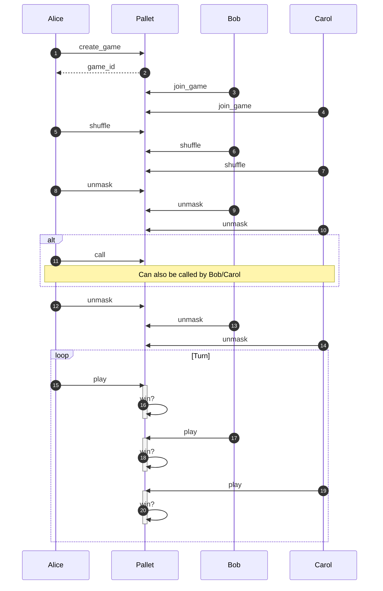

## 基本信息

- 官方链接：https://github.com/parity-asia/hackathon-2023-winter
- 项目定位：波卡上发一条专门的GameFi链，专用于信息不对称游戏的创建，示例游戏为扑克游戏。
- 技术路线：利用substrate框架，创建pallet实现ZK的验证器，开发扑克游戏的电路逻辑，利用前端页面进行ZK证明，并提交交易上链完成游戏。
- 截止日期：2023年12月22日

## 里程碑

- 2023年12月2日
  - 项目正式启动，团队成员了解各自工作分工
  - 开始解决技术要点
- 2023年12月10日
  - 主要技术要点、困难点已解决
  - 相关代码整合到统一的仓库中
  - 团队成员分别解决自己部分的细节问题
- 2023年12月17日
  - 整合代码，走通主要流程
  - 团队成员优化自己部分的代码
- 2023年12月22日
  - 完成细节优化，最终代码提交完成

## 游戏规则

**发牌**

| 欢乐斗地主 | zk斗地主 | 合约 |
| -- | -- | -- |
| 玩家准备游戏 | 各玩家生成私钥，并公开公钥 | 各玩家登记公钥 |
| 准备一副扑克54张 | 加密扑克，并轮流洗牌，并发布洗牌的ZK证明 | 合约验证ZK证明 |
| 发牌，每人17张 | 各玩家根据编号被分配17张牌 | - |
| 看牌 | 玩家协助解密，各玩家可以看到自己的牌 | 传递解密信息 |
| 叫地主，获得底牌 | 叫地主，地主玩家获得底牌 | 登记叫地主信息 |
| 公开底牌 | 玩家协助解密，所有人看到底牌 | 传递解密信息 |

**出牌**

| 欢乐斗地主 | zk斗地主 | 合约 |
| -- | -- | -- |
| 根据牌型牌面大小出牌 | 出牌，并证明出的牌属于自己的牌 | 验证出牌符合规则，并验证ZK证明，记录出牌 |
| 当无法出牌时，喊“过” | 喊“过” | 记录信息 |

**胜利**

| 欢乐斗地主 | zk斗地主 |
| -- | -- |
| 任意玩家出完手中牌 | 任意玩家出完手中牌 |

**牌型大小**

(单牌 / 对子 / 三张) < 炸弹（四张） < 王炸（大小王）

**牌面大小**

3 < 4 < 5 < 6 < 7 < 8 < 9 < 10 < J < Q < K < A < 2 < 小王 < 大王

## 工作分解：

- 节点：利用substrate框架，开发pallet，实现链上ZK的Verify
- 合约：扑克游戏的公开规则验证
- 前端：扑克游戏的交互界面，进行ZK证明
- 初始化：可验证秘密洗牌(Verifiable Secret Shuffling)
- 电路：开发ZK电路，实现扑克游戏的验证逻辑

## 功能列表

**接口：合约 \<-\> 前端**

- [ ] 启动游戏 `fn create_game(name: String, pub_key: String) -> uint`
- [ ] 登记公钥 `fn join_game(id: uint, pub_key: String)`
- [ ] 提交洗牌数据 `fn shuffle(id: uint, cards: uint[])`
- [ ] 传递解密信息 `fn unmask(id: uint, unmask: uint[])`
- [ ] 登记叫地主 `fn call(id: uint, pub_key: String)`
- [ ] 提交出牌数据 `fn play(id: uint, pub_key: String, cards: uint[])`

_说明：涉及密码学信息传递部分还需要再斟酌一下，可能会有改变_

**功能：节点+合约**

- [ ] 节点基础框架
- [ ] 随机源选取
- [ ] 出牌规则验证
- [ ] 集成ZK验证

**功能：前端**

- [ ] 基础扑克牌界面
- [ ] 开始/加入游戏交互
- [ ] 发牌交互
- [ ] 叫地主界面交互
- [ ] 出牌界面交互
- [ ] 胜利界面交互

**功能：密码学**

- [ ] 可验证秘密洗牌机制说明
- [ ] 洗牌ZK证明生成
- [ ] 出牌ZK证明生成
- [ ] 私牌解密
- [ ] 公牌解密
- [ ] ZK验证器

## 交互逻辑

**步骤**

- 1-4：开始游戏
- 5-7：玩家轮流洗牌
- 8-10：玩家互相协助解密，使得各玩家可以看到自己的牌
- 11：叫地主，根据简化规则，A/B/C都可以叫，以先叫的为判定依据
- 12-14：协助解密公牌
- 15-20：出牌轮次，出牌并做规则判定

**疑问：**

- unmask是否可以并行？
- play阶段直接公开的卡片是否可以不用unmask？（通过承诺/ZK的方式）

## 参考链接

- 节点和合约
    - https://docs.substrate.io/
    - https://www.bilibili.com/video/BV1RL411b7Nh/
    - https://github.com/Zkvers/substrate-zk
    - https://substrate-developer-hub.github.io/substrate-how-to-guides/docs/intro
- 密码学
    - https://www.youtube.com/watch?v=KGs3A3GMcuw
    - https://geometry.xyz/notebook/mental-poker-in-the-age-of-snarks-part-1
    - https://geometry.xyz/notebook/mental-poker-in-the-age-of-snarks-part-2
    - https://github.com/geometryresearch/mental-poker/
    - https://hackmd.io/@nmohnblatt/SJKJfVqzq
    - https://medium.com/coinmonks/zk-poker-a-simple-zk-snark-circuit-8ec8d0c5ee52
    - https://zkholdem.xyz/wp-content/themes/zkholdem-theme/zkshuffle.pdf
    - https://docs.manta.network/docs/guides/zkHoldem/About
- 前端
    - https://js-css-poker.sourceforge.io/
    - https://substrate-developer-hub.github.io/substrate-how-to-guides/docs/intro

## 问答

Q: 为什么要做？为什么值得做？

A: 在传统游戏环境中，服务器可能导致作弊行为，从而影响游戏的公平性。而借助于零知识证明这一技术，有效地确保了游戏的公平性。
