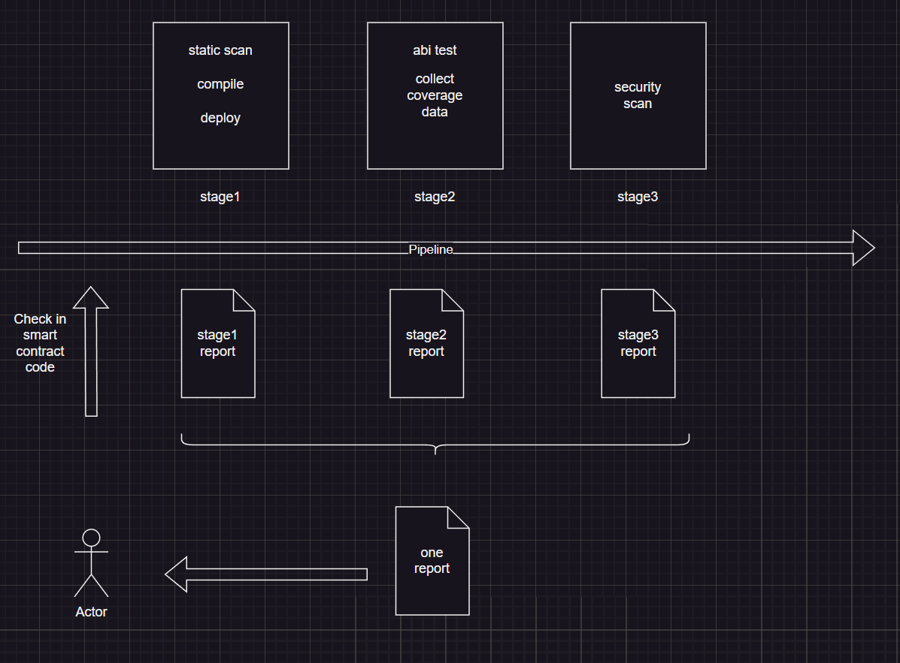
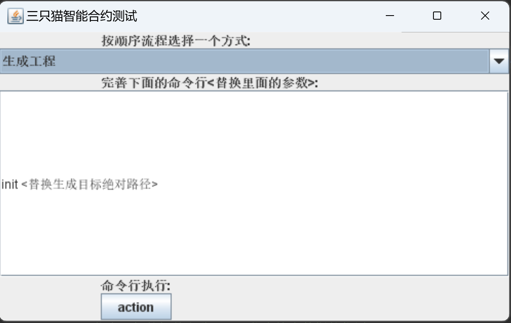
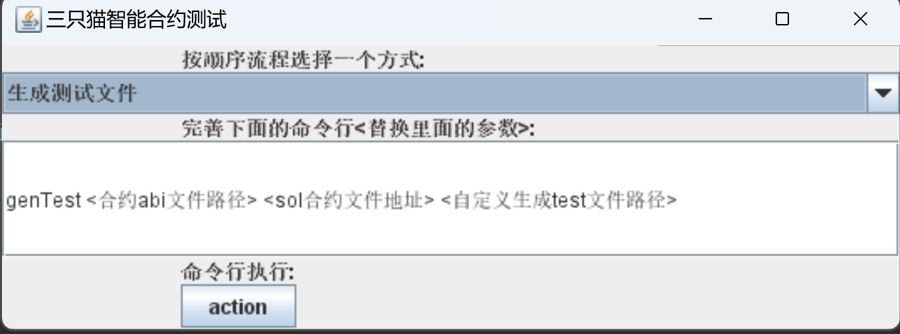

## Basic information
**Project Name**: ThreeCat (Three Cat Application Chain Testing Framework)

**Project Approval Date**: December 9, 2023

## Project Introduction

### Background
An automated tool for testing and debugging using three cats, as well as a testing framework for smart contracts for security auditing.

Generate through the configuration in base.yaml. Collect unit tests and test conclusions, and produce reports.

The current unit testing framework has the following issues:

1. Each step needs to be processed by typing commands yourself

Three cats configure the development framework, compilation method, and assertion method you have chosen in base.yaml, integrating multiple original command typing steps

And it can support initializing the development framework ->generating use cases ->executing use cases after adjustment ->collecting conclusions ->generating HTML reports.

2. Provides scalability capabilities that regular unit testing does not possess

Three cats can integrate multiple SDKs and their corresponding language assertion capabilities.

You can freely add plugins and necessary check items for the inspection phase in the unit testing environment.

By using a framework to record the execution time and whether it can continue in each environment, the user's operations are greatly simplified.
3. web3/HashUtil.java provides various data conversion capabilities.

## Flowchart of assembly line (follow-up plan)

In the assembly line, it will be processed through abstract methods in the process.

Construction of lower level (providing slots and the ability of lower level 2)

For example, when calling JenkinsJob, the parameter in Yaml will be a package that reads the local Jenkins construction.

2. Generate files that support assembly lines.

3. Combining version control management.

### Technical architecture  
**Backend**: A language that uses Java as the main body, with some logical relationships in base.yaml.

Other single test templates generated based on the Sdk framework of smart contracts currently include Jest from Js.

**Client**: Java swing

There are two stages in base.yaml, which read generateEngine and generateTestCaseFile, respectively.
  
  
  

### he completion items of this hacker loosening plan
**Command line generation**:
  Command line loading yaml configuration content to generate a test code directory for smart contracts.  
**Contract initialization**:
  Verify after loading the smart contract, select Sdk to compile and generate abi interface files.  
**Unit testing detection function**: Call Sdk to test the abi interface, return result assertions, and generate code coverage  
**Scan function after merging**: Configure allowed scan items, rules, mandatory scan items, and generate final report. 

##Team member information

Team Name: Three Cats

Because some members are relatively thin, some are overweight, and after calculation, there are still three cats

| Role                    | Name       | Wechat              | Github |
|-------------------------|------------|---------------------| --- |
| Product Manager/Captain | big cat    | lihaizhang2013      |  |
| Developer               | middle cat | xiaozhao129540      |  |
| Developer               | xin cat    | wxid_s598vo46kd8b22 |  |
| Developer               | small cat  | pinganmomod1989     |  |

## Logo

- **Demo**
  https://github.com/parity-asia/hackathon-2023-winter/tree/main/projects/24-ThreeCatNew

# 中文项目介绍

## 基本资料

项目名称：ThreeCat(三只猫应用链测试框架)
项目立项日期：2023-12-09

## 背景
   三只猫用于测试和调试的自动化工具以及用于安全审计的智能合约的测试框架。  
通过base.yaml里面的配置生成。单元测试和测试结论的收集，产出报告。
目前的单元测试框架存在以下问题：  
1. 每个步骤需要自己敲命令处理  
     三只猫在base.yaml配置你所选择的开发框架，编译方式，断言方式，集成了多个原有敲命令的步骤
     并且可以支持初始化开发框架->生成用例->调整后执行用例->收集结论->产生Html报告。
2. 提供了普通单元测试不具备的扩展能力  
     三只猫可以集成多个SDK和SDK对应语言的断言能力。  
     在单元测试环境可以自由添加检查环节的插件和必备检查项。 
     通过框架进行每个环境记录执行时间和是否可以继续的结论信息，大大简化了使用者的操作。
3. web3/HashUtil.java提供各种数据转换的能力。

## 流水线的流程图(后续计划)
  
在流水线里面，会通过process里面的抽象方法去处理。   
下层的建设(本次提供插槽和下面2的能力)  
1. 比如调起JenkinsJob，Yaml里面参数会是一个读取本地Jenkins建设的包。
2. 生成可以支持流水线的文件。
3. 结合版本控制管理。

## 技术架构

**后端**: 使用Java作为主体的语言，部分逻辑关系在base.yaml里面。  
          其他根据智能合约Sdk框架的语言生成单测模板，目前有Js的Jest的。
**客户端**: Java swing  
PS:base.yaml里面有2个阶段，分别读取generateEngine和generateTestCaseFile。
  
  

## 本次黑客松计划完成事项
### 功能1：命令行生成工程`  
  `命令行载入yaml配置内容生成一份智能合约的测试代码目录`
  - [ ] yaml逻辑 (`见resources/base.yaml`) @猫
  - [ ] 命令行载入yaml逻辑脚手架 (`ThreeCat.java下面有几个类别`) @猫
  - [ ] 生成前检查生成环境是否缺失。(`需要心那边告诉业务`)@心
  - [ ] 过程使用，智能合约的业务步骤文档，用于开发 @心
  - [ ] 生成后检查测试框架文件夹 (`需要做检查`)@猫或者心

### 功能2：合约初始化`  
  `命令行载入yaml配置内容生成一份智能合约的测试代码目录`
  - [ ] 智能合约载入合约后验证 (`合约类型`)@心
  - [ ] 通过参数载入使用编译工具 (`合约类型`)@心
  - [ ] 生成abi文件检查位置 (`目前只有abi`)@心
  - [ ] 读取abi生成结构化数据 (`Json拆分成方法和参数`)@转身离开(徐总)

### 功能3：单元测试生成
`调用Sdk测试abi接口，返回结果断言，生成代码覆盖率`
  - [ ] SDK和Yaml文件匹配 (`待定`)@猫
  - [ ] 发送数据到Sdk再到abi (`待定`)@心@转身离开(徐总)
  - [ ] 设计模板断言方案 (`需要最佳实践`)@心@转身离开(徐总)@猫
  - [ ] 读取abi结构化数据套入模板，生成后回收和任务绑定(``)@转身离开(徐总)@猫
  - [ ] 生成代码覆盖率数据记录到数据Result (`代码级别覆盖率`)@转身离开

### 展望功能：合入后进行扫描功能（未来版本）
`配置准出扫描项，规则，必须扫描项，生成最终报告`
  - [ ] 关联覆盖率准出指标 (`指定文件头代码覆盖率不能低于多少，低于不许合入`) @转身离开
  - [ ] 读取配置支持的扫描方案 (`根据业务支持，业务互相排斥性不考虑`)@心@猫
  - [ ] 配置支持扫描顺序和通过标准 (`通过pipeline文件决定`)@心@猫
  - [ ] 静态检测开发。@心
  - [ ] 扫描方案权重 (`扩展性功能，有必须包含哪些`)@猫
  - [ ] 流水线插件插槽(`可以被注册哪些，注册的顺序`)@猫
  - [ ] 版本控制软件插槽(`可以包含分支检测，JenkinsFile有的分支进行检测`)@猫
  - [ ] 生成报告数据结构和位置传递 (`报告类型可选择`)@猫

### 工具
~~- [ ] 基建脚手架。@猫~~
- [ ] 按任务分为多个步骤，把每个步骤数据汇总。(`每次执行生成关键节点的日志，用来查错`) @猫  
  com.hackathon.framework.process.PipelineProcess里面有案例未完成。
- [ ] 生成单次工具日志 (`每次执行生成关键节点的日志，用来查错`)@猫
- [ ] 支撑框架命令行模式 (`框架通过指令调用不同的步骤`)  @猫
       可见工程的ThreeCat.java里面
~~- [ ] 流水线文件生成(字符串模板)。(`常规shell和`)@猫@转身而去(徐总)~~
~~- [ ] 第二阶段-stages数据合并报告 (`多个stage阶段的报告合并成一份`)@猫~~
- [ ] 字符串模板使用工具类。@徐总
- [ ] 编译执行类 @猫

### MVP后-服务化
- [ ] 上云接口提供给客户端使用。@猫

### MVP后-客户端(Cat)
- [ ] 客户端界面开发 (`输入指令，产生日志，报告位置`)@猫
- [ ] 客户端环境检查和配置载入 (`使用客户端先决条件`)@猫
- [ ] 客户端界面插件插槽 (`第二阶段流水线环节`)@猫
- [ ] 客户端界面测试使用。@心@猫@转身而去(徐总)

  
## 队员信息
队伍名称：三只猫  
因为部分成员比较瘦，有的比较胖，算下来还是3只猫

| Role                    | Name       | Wechat              | Github |
|-------------------------|------------|---------------------| --- |
| Product Manager/Captain | big cat    | lihaizhang2013      |  |
| Developer               | middle cat | xiaozhao129540      |  |
| Developer               | xin cat    | wxid_s598vo46kd8b22 |  |
| Developer               | small cat  | pinganmomod1989     |  |
