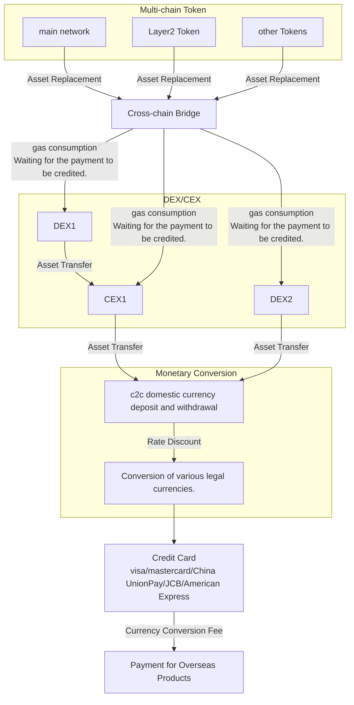
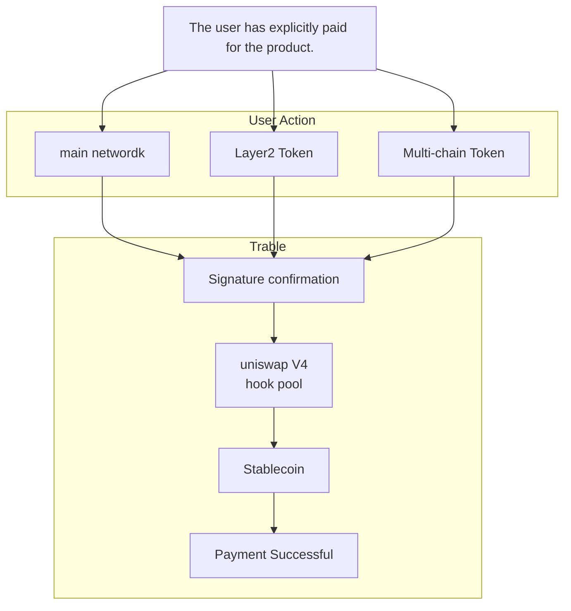

## Basic Info

### Project Name
Trable

### Date of project initiation:

2023/12/02

## Introduction

With the growing Web3 ecosystem, more and more people are entering the Web3 industry, leading to an increasing number of individuals using cryptocurrencies for payments of products and services. However, the process of completing a purchase has become cumbersome, especially when it involves overseas products, requiring multiple asset conversions. This process is time-consuming and incurs high costs.

Traditional crypto payment process for overseas travel products:

    Cryptocurrency - DEX - CEX - Fiat currency - Foreign fiat currency payment

### Flowchart Demo

### Drawbacks:
- ❌ DEX conversion friction costs
- ❌ CEX transaction fees
- ❌ Currency conversion loss during withdrawal
- ❌ Currency conversion fees for foreign money payments

Trable's Objective:
- ✅ One-step signing, minimal fees

To address these challenges, our project proposes a solution that optimizes the asset conversion process and enhances users' Web3 experience. In the post-pandemic era, the travel industry is thriving, and Trable aims to enter this vast market by offering unique value propositions.

### Project Introduction

Trable is an overseas travel product Dapp application for cryptocurrency payment.

This application integrates Uniswap V4 and other technologies and relies on the Acala and Moonbean platforms in the Polkadot ecosystem to effectively simplify the process for users to order overseas travel products using cryptocurrency, shorten the time required for consumers and reduce the cost of DEX/CEX currency conversion. .

Users only need to select the required payment password and complete the signature to easily book overseas travel products on this Dapp. We have solved the problems of personal foreign exchange limit limits and insufficient payment tools, and provided necessary legal currency payment support. At the same time, we monitor the flow of funds in real time on the chain to ensure the safety of funds. During the entire process, only one handling fee will be charged, providing comprehensive protection for users’ ordering experience.

  

### 在黑客马拉松期间完成的代码功能

#### Solidity

#### Acala

### Project logo

### Key Dapp Features

- Support for fiat currency payments（法币支付支持）

确保旅游产品跨境crypto直接支付的便利性

- Fast transactions anytime, anywhere（随时随地、快速交易）

简化虚拟货币转移过程（多链资产转换）

- Save time and effort, lower loss（省时省力、更低损耗）

结合Uniswap V4 降低多种token的swap成本，减少不必要的原始资产的转换和支付磨损

- No need to consider personal foreign exchange restrictions（无需考虑个人外汇限制）

不受传统银行外汇限额的影响，更流畅的旅行体验

### Project demo 

## 黑客松期间计划完成的事项

### 区块链端

### 客户端

front-end

### 后端

## 黑客松期间所完成的事项

### 最终完成的功能点

### 完成的开发工作及代码结构

### PPT等大文件链接地址

https://docs.google.com/presentation/d/1YajFYiBXxBr2Q0o1F3PbKhmQ7hMsGFVRvAOra6DJ3pg/edit?usp=sharing

## 使用方法

## 测试

项目包含了针对合约功能的测试用例，确保了各项功能的正确性和安全性。

## Member
### Yanbo
Introduction:

Yanbo is an experienced blockchain product manager with a deep understanding of technical challenges and project management in various areas of Web3.
Role: He possesses valuable expertise in public goods and leads the team's vision and overall strategy at Trable as an accomplished product manager.

GitHub:yanboishere
WeChat ID: YanboAtWeb3

### nuttt
#### Introduction
SEU EEer, building hacking with me!
#### GitHub
RbRe145
#### WeChat ID
zhj314816759

### Zijing
#### Introduction
BD Head of Go2Mars
#### Role
I am in charge of Trable business model 
#### GitHub
zijin79
#### WeChat ID
ZZJZZJ9248

### HH Tsang
#### Introduction

#### Role

#### GitHub

#### WeChat ID

