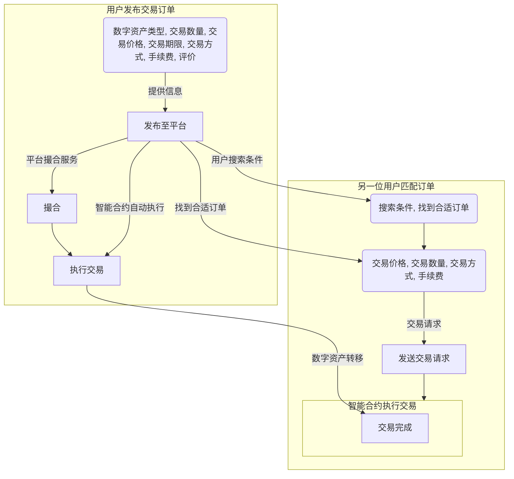
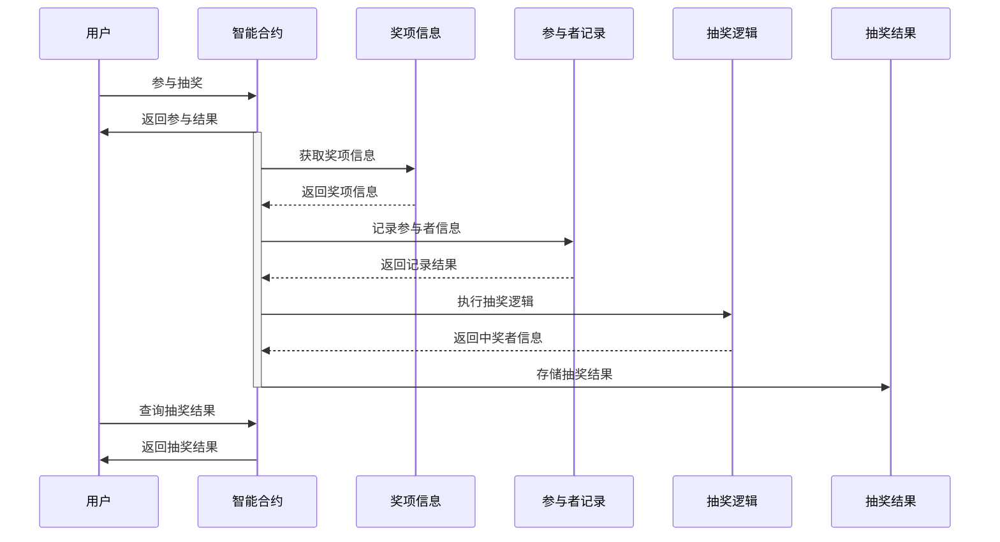
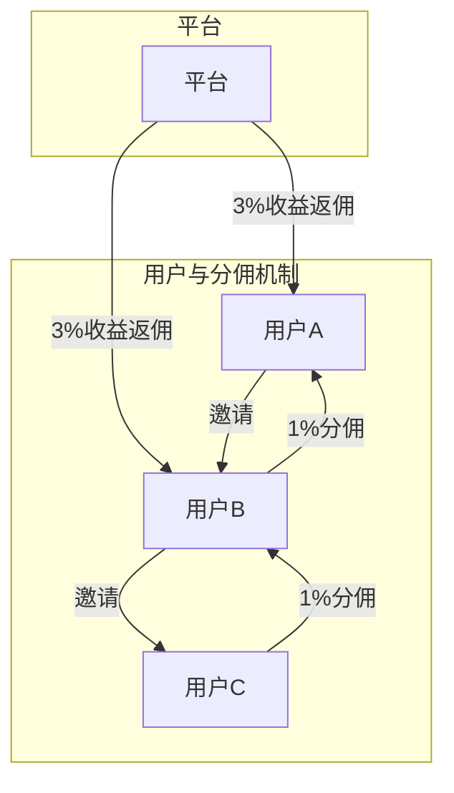

    
    
    

## Basic information	

### project name

NeMA

### Project initiation date

December 2023

## Overall Introduction of the Project

### Project logo

### Project Background

* Trust Relationships: The over-the-counter (OTC) market is decentralized, distinct from conventional exchanges, lacking the oversight of a central authority.If one party to a transaction chooses not to fulfill their obligations, the other party incurs significant losses, leading to a crisis of trust between the trading parties and potentially between the trading parties and their guarantors.
* The traditional over-the-counter (OTC) manual guarantee carries high risks and incurs expensive fees.
* The invitation platform is lacking: There is a lack of a suitable platform for purchasing genuine user invitations.
* KOLs (Key Opinion Leaders) often need to launch lucky draws on platforms to increase exposure, but there is also a credibility issue surrounding these drawings: (1) In the context of Web2, many lucky draws are conducted under the guise of "lucky draws" but are actually advertisements and marketing tactics, exploiting consumers' pockets and potentially extracting their personal information.  (2) Platforms manipulate the lucky draw process by making it opaque, allowing them to control the flow of traffic, followers, and the designated winners, raising suspicions of fraudulent behavior.  (3) The accounts that win the drawings are not necessarily real humans but bots, leaving genuine users in the dark and uninformed.

**The NeMA platform addresses the aforementioned trust crisis through blockchain technology, safeguarding the interests of both users and KOLs (Key Opinion Leaders).**

### Project Introduction

Our project belongs to the Dapp & Smart Contracts track and is a multi-functional integrated OTC trading platform.  It is committed to bridging offline transactions in Web3 to the chain, and providing blockchain-based stable guarantee services for buyers and sellers through blockchain technology, to achieve mutual trust, reciprocity and mutual benefit between users and the platform.The main services include c2c+otc mode of OTC support, chain lottery, invitation commission, etc.

### Technical Architecture

#### Hashlock

The hash lock mode refers to a mechanism in which users guess the original value of the hash value within a specified timeframe to make a payment.It allows users to lock a certain amount of tokens by providing a hash value, and to withdraw them upon satisfaction of specific conditions.When users lock tokens, they are required to provide a hash value, which is associated with specific conditions.When the conditions are met, users can provide the original data matching the hash value to unlock and withdraw the tokens.Simply put, on the basis of smart contracts, both parties first lock assets, and if they input the original value of the correct hash value within a limited time, the transaction can be completed.Under such a mechanism, rapid confirmation of small-value payments, as well as secure transactions and conditional payments, can be achieved, ensuring the credibility and reliability of the transaction.

### Main functions of the Dapp

#### OTC trading support

There are primarily two scenarios: 

1. Platform-hosted orders, where users engage in transactions through the matching mechanism of the platform.

2. Users reach a consensus in advance, and the platform merely provides contract support.

**Main Process:**

1. The user provides information such as the type of digital asset traded, the quantity traded, the price of the transaction, and the duration of the transaction, which is listed on the platform.

   Users can also choose from the following options: Trading Methods: Limit Order, Market Order, Stop-Loss Order, Take-Profit Order;Trading Evaluations, etc.

   After the user submits the order, it will be publicly displayed on the platform.

2. Another user can search for matching trading orders through the platform.If a suitable order is found, a trading request can be sent.The transaction request should include the following information: the transaction price and the transaction quantity.The user can also choose the transaction method ( limit order or market order).

   **Note:** The prerequisite for successfully sending a transaction request is for the buyer to stake the assets in advance to the smart contract.

3. After the seller confirms, the assets are transferred.  Upon receipt of the notification, the seller transfers the assets to the buyer's account, awaiting the buyer's confirmation.

2. Once the buyer confirms the assets have been successfully credited to their account, the smart contract automatically executes the transaction, transferring the digital assets from one party to another, with the transaction information being recorded on the chain.

#### Lottery whole process is on-chain

Award Information: Storing the descriptions and quantities of various awards.

Lottery results: The lottery results, including the winners and prizes, are stored on the blockchain to ensure verifiability and transparency.

Participant Record: The information of the participants (address, participation time, etc.) is recorded on the chain.

Lottery Logic (Contract Details): Implementing the lottery logic in a smart contract to determine the winners.

#### Invitational Commission Mechanism

The core concept of the invitation commission mechanism is first-level commission with permanent binding, providing users with a long-term stable source of income.Specifically, when a user successfully invites a new user to transact on the platform, that user will enjoy the benefits of first-level commission.Meanwhile, this binding relationship will remain permanently valid, ensuring that users can earn the corresponding commission revenue on every transaction made by their subordinates.

In our commission structure, users will receive 1% of the transaction amount of their subordinate users as their direct commission, while the platform enjoys a 3% revenue share from the transaction amount.This advantageous commission ratio not only reflects our recognition of user contributions to enhance user retention but also ensures the continuous operation of the platform with cash flow security.

#### NFT whitelist trading

General Process：

1. Release whitelisted transaction orders.

   Sellers post whitelisted transaction orders on the platform, typically requiring the provision of the following information: NFT project name, number of whitelisted spots, transaction price (supporting multiple cryptocurrency denomination), transaction method, transaction deadline, and other optional details.

2. Search for whitelisted transaction orders.

   Buyers can search for eligible whitelisted transaction orders through the platform.They can filter based on the following criteria: NFT project name, price range, transaction method, and seller reputation.

3. The contract automatically interacts with the front-end, executing asset transfers automatically to safeguard the transaction.

4. After the transaction is completed, buyers can participate in the creation or presale of NFT projects as usual, acquiring the NFT assets.The platform allows both parties to the transaction to evaluate each other, establishing a reputation system for the platform.

#### **The spot trading of Pol-20 is similar to the basic process described above.  It is worth mentioning that there is currently no platform that supports spot trading of Pol-20. **

The entire process is guaranteed by the platform to ensure secure transactions.Additionally, a friendly reminder is provided:The NFT whitelist trading is an emerging market, presenting certain risks.Before engaging in a transaction, buyers should carefully review the project information and select sellers with a reputable standing.The seller should ensure the authenticity and validity of the provided whitelist quotas.

### Project demo

link here

## The tasks planned to be completed during the hackathon.

### Front-end Development

UI development is a crucial aspect of the project, directly related to the user experience and the overall usability of the project.

1. **Requirements Analysis:** Clarify the functional and business requirements of the project.Determine the actions that users need to perform on the Web-side, such as registration, login, browsing information, initiating transactions, etc.
2. **Interface Design:** Develop a user interface (UI) design scheme, encompassing page layout, color scheme, and icon usage.With user friendliness in mind, ensure the interface is concise, clear, and easy to navigate.
3. **Responsive Design:** Ensure that the user interface (UI) can be properly displayed and operated on different screen sizes and devices, adopting the principles of responsive design for layout.
4. **Interaction Design:** Design a well-structured interaction flow to ensure users can smoothly complete various operations.This includes form validation, error notifications, and loading status, among others.
5. **Front-end Interaction with Chain-side:** Conduct data interactions with chain-side through APIs or other methods, ensuring that the front-end can retrieve and display data returned by the backend.
6. **Testing and Optimization:** This includes functional testing, performance testing, and compatibility testing.Optimization is conducted based on the test results to ensure the system operates stably.

### Contract Writing for On-chain Lottery Draws

The development of the on-chain lottery contract is based on the smart contract technology of blockchain, and the following aspects should be considered:

1. **Lottery Logic:** Design the logic of the lottery, including the participation conditions, prize setting, and winning rules.Ensure the logic's fairness and transparency.
2. **Safety Considerations:** To prevent security vulnerabilities in the contract, it is essential to adopt best practices to ensure the contract's safety.This can be achieved by importing third-party libraries.
3. **Event triggering:** Set up events within the contract, allowing users and the front-end to monitor the contract's state changes and promptly update the user interface (UI).
4. **Randomness Guarantee:** Introducing randomness into the lottery process, ensuring that each participant has an equal chance of winning.A random number generation algorithm on the chain can be employed.
5. **Gas Cost Optimization:** Considering the transaction costs, optimize the contract to reduce Gas expenses, enhancing the attractiveness of user participation.

### Contract Support for OTC Transactions

OTC trading contracts must meet the transaction needs of both parties, ensuring security, transparency, and enforceability.The following are the key points for contract drafting:

1. **Capital Locking Mechanism:** The contract is designed to ensure the security of funds for both trading parties, employing a locking and releasing mechanism to prevent fraudulent activities.
2. **Transaction Parameters:** Define the relevant parameters of the transaction, including the transaction quantity, price, and transaction party authentication, among others.
3. **Transaction Status:** Various transaction statuses are defined in the contract to ensure the smooth progress of transactions, including order creation, payment, confirmation, and other states.
4. **Front-end Integration:** Collaborate closely with front-end developers to ensure the front end can properly interact with the contract, implementing the display and handling of transactions.

### The Introduction of Hashlock Technology

The primary steps involve:

1. **Contract Design:** Implement Hashlock logic in smart contracts, including asset locking, verifying hash conditions, and unlocking assets.
2. **Atomicity of Transactions:** Ensuring the atomicity of transactions, meaning that prior to the completion of the transaction, the asset is either locked or unlocked, preventing the emergence of intermediate states.
3. **Contract Security:** Consider the security of smart contracts to prevent reentrancy attacks and other potential vulnerabilities.
4. **Event Notifications:** Events are set up within the contract, allowing users and the front-end to monitor changes in the contract's status and promptly update the user interface.
5. **Testing and Optimization:** This includes functional testing, security testing, and more.The contract is optimized based on the test results.

### **Document Writing**

Prepare clear and detailed introductory documents and user manuals.

## The accomplishments made during the hackathon.

* UI Development of the primary functionalities.
* The user interface (UI) display on the mobile platform (a demo, primarily used to present the project's logic in advance).
* The contract writing for on-chain lottery.
* Contract drafting supported by OTC trading.
* The open-source technology of hashlock is replicated.

### Link to large files such as PowerPoint presentations

Demo YouTube show:

https://www.youtube.com/watch?v=yNmXrcWoBhc

## API介绍

The following is an API introduction from the project's .sol file:

| function                                             | description                                                  |
| ---------------------------------------------------- | ------------------------------------------------------------ |
| `addNFTToWhitelist(address nftContract)`             | Add the specified NFT contract address to the whitelist.     |
| `removeNFTFromWhitelist(address nftContract)`        | Remove the specified NFT contract address from the whitelist. |
| `depositTokens(uint256 amount)`                      | Deposit a specified amount of tokens into the contract.      |
| `withdrawTokens(uint256 amount)`                     | Extract a specified quantity of tokens from the contract.    |
| `lockTokens(uint256 amount, bytes32 hash)`           | Locking using a specified number of tokens and hash values.  |
| `unlockTokens(uint256 amount, bytes32 originalData)` | Based on the original data, unlock and extract a specified number of tokens. |

## Instructions for Use

## Test

The project encompasses test cases specific to contract functionality, ensuring the correctness and security of various features.

## builder information

|  Name  | Role                  | GitHub ID        | Wechat ID      |
| :----: | --------------------- | ---------------- | -------------- |
|   TK   | pm                    | Richard tsang202 | tk_nom         |
|        |                       |                  |                |
|  探姬  | CTFer                 | ProbiusOfficial  | ProbiusProtoss |
| V1cent | builder, UI developer | L011apa100za     | SWS18312967544 |