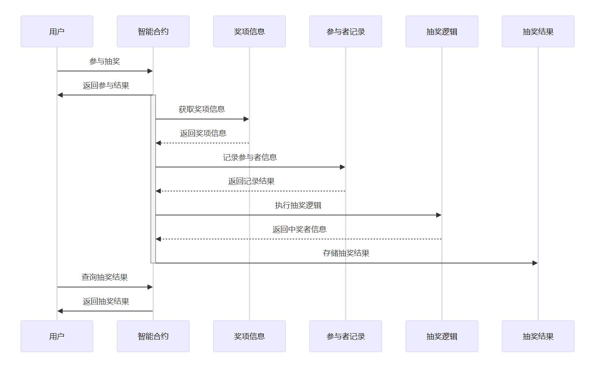

## 基本资料	

### 项目名称

NeMA

### 项目立项日期

2023年12月

## 项目整体简介

### Project background

* 信任关系：场外交易市场是去中心化的，与常规交易所不同，没有中央机构的监督。如果交易一方选择不履行义务，另一方就会遭受重大损失，于是就出现了交易双方以及交易双方对担保人的信任危机。
* 传统OTC人工担保风险高，手续费昂贵。

* 邀请平台缺失：缺乏合适的平台以购买真实用户邀请。

* KOL经常需要在平台发布抽奖活动，增加曝光，但这其中同样存在抽奖的信任危机：（1）Web2中大量抽奖活动都是打着“抽奖”的名义，实为广告营销，“套路”消费者腰包，并有套取个人信息之嫌（2）平台利用开奖过程的不透明而操纵开奖过程，后台完全自己操控，可以控制流量、粉丝以及指定中奖人，涉嫌欺诈（3）中奖的账户并不一定是真人而是机器人，真实用户不明真相，被蒙在鼓里。

  **NeMA平台通过区块链技术解决上述信任危机，保护用户以及KOL的利益。**
  
  * Trust relationship: The OTC market is decentralized, unlike conventional exchanges, without the supervision of a central authority.If one party chooses not to fulfill its obligations, the other party will suffer significant losses, leading to a trust crisis between the two parties and the guarantor.
  * Traditional OTC manual guarantee has high risks and expensive handling fees.
  *  Lack of invitation platform: There is a lack of suitable platforms to purchase real user invitations.
  *  KOLs often need to launch sweepstakes on platforms to increase exposure, but there is also a trust crisis in sweepstakes: (1) In Web2, a large number of sweepstakes are in the name of "sweepstakes", but in fact they are advertising marketing, "tricks" consumers' pockets, and there is suspicion of obtaining personal information.  (2) Platforms manipulate the process of awarding prizes by using the opacity of the process, and the background is completely controlled by themselves, which can control traffic, fans, and designated winners, which is suspected of fraud.  (3) The account that wins the prize is not necessarily a real person but a robot, and the real user is not aware of the truth and is kept in the dark.
  
  **The NeMA platform uses blockchain technology to solve the above trust crisis and protect the interests of users and KOLs.**

### Project Introduction

该项目是一个多功能集成的OTC交易平台，致力于将 Web3 的线下交易桥接到链上，同时通过区块链技术为买卖双方提供基于区块链的稳定担保服务，实现用户于平台之间的互信互惠互利。主要服务包括c2c+otc模式的场外交易支持、链上抽奖、邀请分佣等。

This project is a multifunctional integrated OTC trading platform, committed to bridging Web3 offline transactions onto the chain, and providing stable guarantee services based on blockchain for buyers and sellers through blockchain technology, achieving mutual trust and mutual benefit between users and the platform. The main services include over-the-counter trading support in the c2c+otc mode, on chain lottery, invitation commission sharing, etc.

### Technical highlights

#### hash lock

哈希锁定模式是指用户在规定的时间段对于哈希值的原值进行猜测来支付的一种机制。它允许用户通过提供一个哈希值来锁定一定数量的代币，并在满足特定条件时进行提取。用户在锁定代币时需要提供一个哈希值，该哈希值与特定条件相关联。当满足条件时，用户可以提供与哈希值相匹配的原始数据来解锁并提取代币。简单讲，就是在智能合约的基础上，双方先锁定资产，如果都在有限的时间内输入正确哈希值的原值，即可完成交易。在这样的机制下可以实现小额支付的快速确认以及安全的交易和条件付款，确保交易的可信性和可靠性。

Hash Lock Mode refers to a mechanism in which users guess the original value of the hash value within a specified time period to pay for it. It allows users to lock a certain amount of tokens by providing a hash value, and withdraw them when specific conditions are met.Users need to provide a hash value when locking the tokens, which is associated with specific conditions.When the conditions are met, users can provide the original data that matches the hash value to unlock and withdraw the tokens.In simple terms, on the basis of smart contracts, both parties first lock assets, and if they enter the correct original value of the hash value within a limited time, the transaction can be completed.Under such a mechanism, fast confirmation of small payments and secure transactions and conditional payments can be achieved, ensuring the credibility and reliability of transactions.

### Project logo

### Key Dapp Features

#### NFT白名单服务

NFT白名单服务允许将特定的NFT合约地址添加到白名单中或从白名单中移除。白名单是一个存储了被授权的NFT合约地址的列表。只有在白名单中的NFT合约才能与链上钱包合约进行交互。这样做的好处是可以限制只有特定的NFT合约能够与链上钱包合约进行交互，增加了安全性和控制性。

"The NFT whitelist service allows the addition or removal of specific NFT contract addresses from the whitelist. The whitelist is a list that stores authorized NFT contract addresses. Only NFT contracts listed in the whitelist are permitted to interact with the on-chain wallet contract. This approach serves to restrict interactions with the on-chain wallet contract to specific NFT contracts, thereby enhancing security and control."

#### 场外交易支持

主要存在两种情况：1.平台挂单，用户通过平台撮合进行交易。2.用户事先达成共识，平台提供合约支持。

**主要流程：**

1. 用户提供交易的数字资产类型、交易的数量、交易的价格、交易的期限等信息在平台挂单。

用户还可以选择以下选项：交易方式：限价单、市价单、止损单、止盈单；交易评价等。
用户在发布订单后，订单将在平台上公开展示。

2. 另一位用户可以通过平台搜索符合条件的交易订单。如果找到合适的订单，可以发送交易请求。

交易请求中需要包含以下信息：交易的价格、交易的数量。
该用户同样可以选择交易方式（限价单、市价单）

3. 双方确认交易信息

交易双方收到交易请求后，需要确认交易信息是否正确，确保理解合约条款。

4. 智能合约自动执行交易，将数字资产从一方转移到另一方，交易信息上链。

There are mainly two situations: 1. The platform places orders, and users engage in transactions through platform matchmaking. 2. Users reach a consensus in advance, and the platform provides contract support.

**Main process:**

1. The user provides information such as the type of digital asset being traded, the quantity of transactions, the price of transactions, and the duration of transactions to be listed on the platform.Users can also choose the following options: trading method: limit order, market order, stop loss order, stop profit order; Transaction evaluation, etc.After the user posts the order, the order will be publicly displayed on the platform.
2. Another user can search for eligible transaction orders through the platform. If a suitable order is found, a transaction request can be sent.The transaction request needs to include the following information: price and quantity of transactions.The user can also choose the transaction method (limit order, market order)
3. Both parties confirm transaction informationAfter receiving the transaction request, both parties need to confirm whether the transaction information is correct and ensure understanding of the contract terms.
4. Smart contracts automatically execute transactions, transferring digital assets from one party to another, and uploading transaction information on the chain.

#### 抽奖全流程上链

奖项信息： 存储各个奖项的描述和数量。

抽奖结果： 将抽奖结果（包括中奖者和奖项）存储在区块链上，确保可验证和透明。
参与者记录： 将参与者的信息（地址、参与时间等）记录上链。

抽奖逻辑（合约细节）： 在智能合约中执行抽奖逻辑，确定中奖者。

Award information: Stores the description and quantity of each award.

Lottery results: Storing the lottery results (including winners and prizes) on the blockchain ensures verifiability and transparency.

Participant record: Record the participant's information (address, participation time, etc.) on the blockchain.

Lottery logic (contract details): Implement the lottery logic in the smart contract to determine the winners.

#### 邀请分佣机制

邀请分佣机制的核心理念是一级分佣且永久绑定，为用户提供长期稳定的收益来源。具体而言，当用户成功邀请新用户在平台进行交易时，该用户将享有一级分佣的权益。与此同时，此绑定关系将永久有效，确保用户在下级用户的每一笔交易中都能够获得相应的分佣收益。

在我们的分佣结构中，用户将获得下级用户交易额的1%作为他的直接分佣，同时平台享有交易额3%的收益。这个优越的分佣比例不仅体现了我们对用户贡献的认可，以增加用户粘性，同时确保平台有现金流的保障持续运行。

The core concept of the invitation commission mechanism is first-level commission and permanent binding, providing users with a long-term stable source of income.Specifically, when a user successfully invites a new user to trade on the platform, the user will enjoy the benefits of first-level commission.At the same time, this binding relationship will be permanently effective, ensuring that users will receive corresponding commission benefits from each transaction of their subordinates.

In our commission structure, users will receive 1% of the transaction amount of their subordinate users as their direct commission, while the platform will enjoy a 3% revenue share.This advantageous commission ratio not only reflects our recognition of user contributions to increase user stickiness, but also ensures the continuous operation of the platform with cash flow guarantees.

### Project demo

video here

## 黑客松期间计划完成的事项

### 链端

OTC交易功能的支持

抽奖行为上链的逻辑，确保数据的可信上链

分佣机制的合约设计

#### web端（Front-End）

前端UI设计，更直观展示项目功能及逻辑

## 黑客松期间所完成的事项

### 最终完成的功能点

### 完成的开发工作及代码结构

### PPT等大文件链接地址

## API介绍

以下是项目.sol文件中的API介绍：

| 函数名 | 描述 |
| ------ | ---- |
| `addNFTToWhitelist(address nftContract)` | 将指定的NFT合约地址添加到白名单中 |
| `removeNFTFromWhitelist(address nftContract)` | 从白名单中移除指定的NFT合约地址 |
| `depositTokens(uint256 amount)` | 存入指定数量的代币到合约中 |
| `withdrawTokens(uint256 amount)` | 从合约中提取指定数量的代币 |
| `lockTokens(uint256 amount, bytes32 hash)` | 使用指定数量的代币和哈希值进行锁定 |
| `unlockTokens(uint256 amount, bytes32 originalData)` | 根据原始数据解锁并提取指定数量的代币 |

## 使用方法

使用合约提供的接口进行代币存款、提款、NFT白名单管理和哈希锁定操作

## 测试

项目包含了针对合约功能的测试用例，确保了各项功能的正确性和安全性。

## 队员信息

包含参赛者名称及介绍 在团队中担任的角色 GitHub 帐号 微信账号（如有请留下，方便及时联系）

