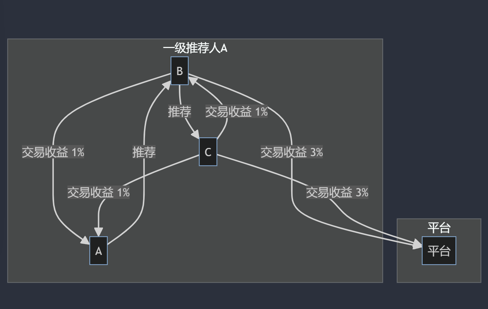

## 基本资料	

### 项目名称

NeMA

### 项目立项日期

2023年12月

## 项目整体简介

### Project background

* 信任关系：场外交易市场是去中心化的，与常规交易所不同，没有中央机构的监督。如果交易一方选择不履行义务，另一方就会遭受重大损失，于是就出现了交易双方以及交易双方对担保人的信任危机。
* 传统OTC人工担保风险高，手续费昂贵。。

* 邀请平台缺失：缺乏合适的平台以购买真实用户邀请。

* KOL经常需要在平台发布抽奖活动，增加曝光，但这其中同样存在抽奖的信任危机：（1）Web2中大量抽奖活动都是打着“抽奖”的名义，实为广告营销，“套路”消费者腰包，并有套取个人信息之嫌（2）平台利用开奖过程的不透明而操纵开奖过程，后台完全自己操控，可以控制流量、粉丝以及指定中奖人，涉嫌欺诈（3）中奖的账户并不一定是真人而是机器人，真实用户不明真相，被蒙在鼓里。

  **NeMA平台通过区块链技术解决上述信任危机，保护用户以及KOL的利益。**

### Proect Introduction

该项目是一个基于Solidity的链上钱包合约，集成了多项功能，包括ERC-20代币管理、NFT白名单服务、场外交易支持和哈希锁定功能。

"The project is an on-chain wallet contract based on Solidity, incorporating various features such as ERC-20 token management, NFT whitelist service, over-the-counter (OTC) trading support, and hash locking functionality."

### Basic technical architecture

#### hash lock

哈希锁定是通过哈希锁定合约实现的一项功能，它允许用户通过提供一个哈希值来锁定一定数量的代币，并在满足特定条件时进行提取。用户在锁定代币时需要提供一个哈希值，该哈希值与特定条件相关联。当满足条件时，用户可以提供与哈希值相匹配的原始数据来解锁并提取代币。这种哈希锁定的机制可以用于实现安全的交易和条件付款，确保交易的可信性和可靠性。

"Hash locking is a feature implemented through a hash locking contract, allowing users to lock a specified amount of tokens by providing a hash value, with the ability to withdraw them under specific conditions. Users are required to provide a hash value associated with particular conditions when locking the tokens. Upon meeting these conditions, users can unlock and withdraw the tokens by presenting the original data matching the hash value. This mechanism of hash locking can be employed to achieve secure transactions and conditional payments, ensuring the credibility and reliability of the transactions."

### Project logo

### Key Dapp Features

#### NFT白名单服务

NFT白名单服务允许将特定的NFT合约地址添加到白名单中或从白名单中移除。白名单是一个存储了被授权的NFT合约地址的列表。只有在白名单中的NFT合约才能与链上钱包合约进行交互。这样做的好处是可以限制只有特定的NFT合约能够与链上钱包合约进行交互，增加了安全性和控制性。

"The NFT whitelist service allows the addition or removal of specific NFT contract addresses from the whitelist. The whitelist is a list that stores authorized NFT contract addresses. Only NFT contracts listed in the whitelist are permitted to interact with the on-chain wallet contract. This approach serves to restrict interactions with the on-chain wallet contract to specific NFT contracts, thereby enhancing security and control."

#### 场外交易支持

场外交易支持允许用户将代币存入合约并在需要时提取。用户可以将代币存入合约，类似于将代币存入一个安全的钱包中，以备将来使用。当用户需要提取代币时，可以通过合约提供的接口进行提取操作。这种场外交易支持使得用户之间的代币转移更加方便和安全。

"Over-the-counter (OTC) trading support enables users to deposit tokens into the contract and withdraw them when needed. Users can deposit tokens into the contract, akin to storing tokens in a secure wallet for future use. When users need to withdraw tokens, they can perform withdrawal operations through the interfaces provided by the contract. This OTC trading support facilitates more convenient and secure token transfers among users."

#### 抽奖全流程上链

奖项信息： 存储各个奖项的描述和数量。

抽奖结果： 将抽奖结果（包括中奖者和奖项）存储在区块链上，确保可验证和透明。
参与者记录： 将参与者的信息（地址、参与时间等）记录上链。

抽奖逻辑（合约细节）： 在智能合约中执行抽奖逻辑，确定中奖者。

#### 邀请分佣机制

一级分佣，永久绑定。暂定分下级收益1%+平台收益3%

#### 

### Project demo

todo

## 黑客松期间计划完成的事项

### 链端

### 客户端

#### web端（Front-End）

## 黑客松期间所完成的事项

### 最终完成的功能点

### 完成的开发工作及代码结构

### PPT等大文件链接地址

## API介绍

以下是项目.sol文件中的API介绍：

| 函数名 | 描述 |
| ------ | ---- |
| `addNFTToWhitelist(address nftContract)` | 将指定的NFT合约地址添加到白名单中 |
| `removeNFTFromWhitelist(address nftContract)` | 从白名单中移除指定的NFT合约地址 |
| `depositTokens(uint256 amount)` | 存入指定数量的代币到合约中 |
| `withdrawTokens(uint256 amount)` | 从合约中提取指定数量的代币 |
| `lockTokens(uint256 amount, bytes32 hash)` | 使用指定数量的代币和哈希值进行锁定 |
| `unlockTokens(uint256 amount, bytes32 originalData)` | 根据原始数据解锁并提取指定数量的代币 |

## 使用方法

1. 使用合约提供的接口进行代币存款、提款、NFT白名单管理和哈希锁定操作

## 测试

项目包含了针对合约功能的测试用例，确保了各项功能的正确性和安全性。

## 队员信息

包含参赛者名称及介绍 在团队中担任的角色 GitHub 帐号 微信账号（如有请留下，方便及时联系）

