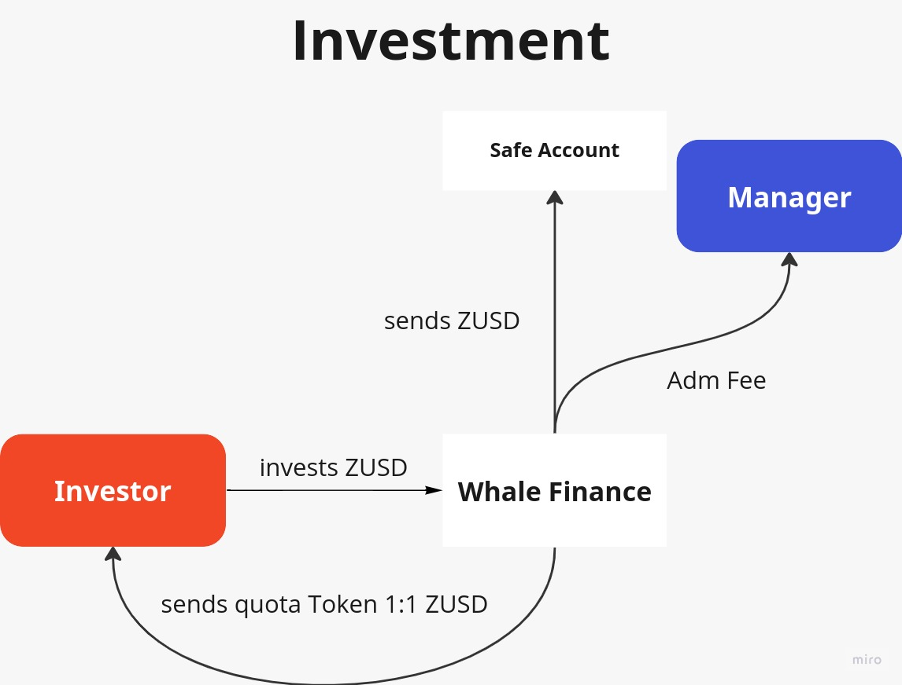
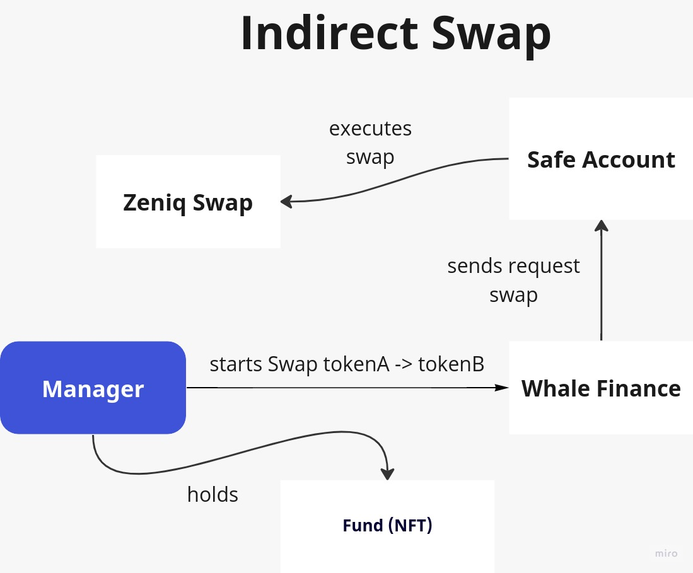
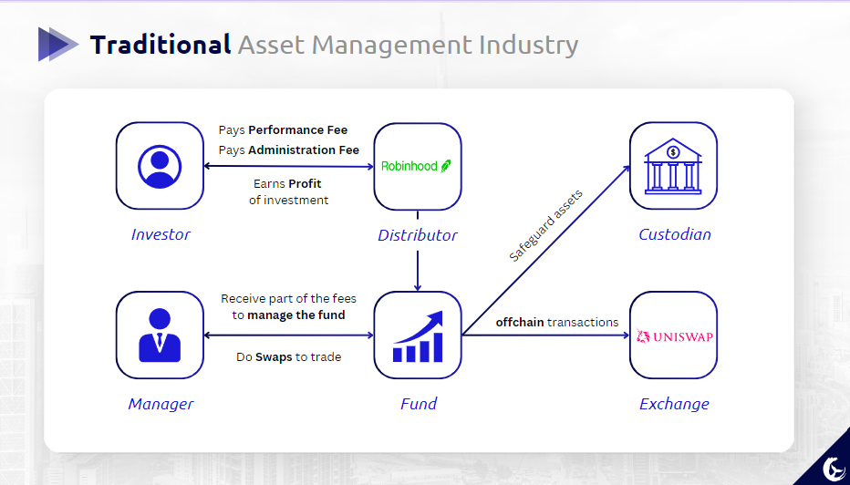

# Project Submission for Hackathon

## Basic Information
- *Project Name:* whale.finance

- *Project Establishment Date:* 2023, October

_

## Overall Project Introduction
- *Project Background:*

   > "The idea came from our own experience with the fund industry, both of us on the team have already/still interned at investment funds, in the normal asset analysis part. Crypto is not yet so widespread in Brazil, despite the growing expansion, and we saw the potential to decentralize the entire investment process in funds using smart contract technologies, like the ERC 6551. Thus arose whale.finance."

- *Project Introduction:*

  - Whale Finance uses ERC 6551 to allow managers to hold assets from investors priorizing *security*. In this way, we can basically make a descentralized asset management using EVM. The platform is designed for the two publics: The investors, who will be able to invest their tokens in really great funds around the work in a safe way, and the managers, who will be able to manage and hold investor tokens and can have a profit to themselves.

- *Project Explanation:*

  - First of all, it it's necessary, there is an attachment section below in this ReadMe file to explane more about financial market, specifically hedge funds. The essence of Whale Finance is basically safety first in transactions, highlighting its innovative approach to asset management.

  - *Decentralized Management of Tokenized Assets:* Whale Finance is a protocol for the decentralized management of a variety of tokenized assets in the future, including native crypto assets and tokenized Real World Assets (RWA). The management of these assets is facilitated by integration with various asset issuance and trading protocols, such as Centrifuge, Kona Finance, Uniswap, Aave, OpenSea, Acala, and Bifrost.

  - *Investment Mechanisms and Security:* The platform uses NFTs representing investment funds in a unique way (using ERC 6551), SafeAccounts for asset management, and quotaTokens linked to the NFT. The fund managers, who (in the future) must be approved using a decentralized identity protocol like KILT, manage the assets in a limited way, providing security for investors. The fund strategies are publicly recorded on the blockchain, and the quotaTokens allow for internal voting on important decisions, like the fund’s closing date.

  - *Difficulty of Technology and Innovation:* The innovative way to perform swap priorizing safety is implemented using ERC 6551 (a very recent improvement protocol - May 2023) and extended for other chains using the appchain/multichain approach learned in the Polkadot philosophy and ecossystem, benefiting the transaction over various blockchains.

  - *Flexibility and Use Cases:* Whale Finance offers flexibility in the investment flow, allowing investments at various stages and using oracles for continuous fund pricing. Besides investment funds that resemble traditional funds, the platform can also be used for managing DAO treasuries, where decisions are made through votes by quotaToken holders.

- *Project Demo and Presentation:*

[Demo Link](https://whale-finance.vercel.app/)
[Presentation Link](https://www.canva.com/design/DAF2W5AB2pI/RrVv85wJooo511YwWUQsbw/edit)

- *Technical Architecture:*

The main parameters to create a fund:

  - *Name:* The official title of the fund, used for recognition and branding.
  - *Ticker:* A unique series of letters representing the fund in the stock market, used for quick identification.
  - *Account:* The designated account for managing the fund's financial transactions and maintaining records.
  - *Tokens:* Digital assets within the fund that can represent shares or other assets, facilitating flexible transactions.
  - *Administration Fee:* A charge levied to cover the fund's operational costs, maintaining its viability.
  - *Performance Fee:* A fee charged based on the fund's performance, serving as an incentive for fund managers.
  - *Open Investment:* The time frame during which investments can be made into the fund, helping to manage the inflow of capital.
  - *Close Investment:* The period indicating when the fund stops accepting new investments, assisting in portfolio stability.
  - *Maturation Time:* The projected time frame for the fund to reach its investment goals, guiding investors on expected returns.

This ERC allows an nft owner to have control over an account, but with customizable features, such as limitations to the possible transactions made. The WhaleFinance contract implements the ERC721 tokens (NFT) and creates the controllable addresses, which we call Safe Accounts. Also, every fund has a quota (or share), which is an ERC20 token, also deployed when the NFT is created. With these features, the investors are able to invest with a stablecoin (say ZUSD) and get 1:1 quotas in exchange.

When the fund is open to trades, the manager can interact with UniSwap to make profits, using the assets available in the Safe Account. After maturation time, the investor can redeem their yields, with profits or loss.

- *Project Logo:* 

_

## Items Planned to be Completed During the Hackathon

  - *Blockchain Side:*
      - [ERC6551Registry](./whale-finance/src/ERC6551Registry.sol): It's the contract that creates the SafeAccounts of the funds, registering the funds (NFTs) bounded to the accounts.
      - [MockERC20](./whale-finance/src/MockERC20.sol): It's an ERC20 implementation to be used by Whale Finance as currency.
      - [QuotaBeacon](./whale-finance/src/QuotaBeacon.sol): It's the contract that creates the QuotaTokens using the QuotaToken interface.
      - [QuotaToken](./whale-finance/src/QuotaToken.sol): It's the address that keeps the implementation of the QuotaToken logic.
      - [SafeAccount](./whale-finance/src/SafeAccount.sol): It's the account that holds all assets of the fund. It protects the assets and can be controlled (indirectly) by the fund manager.
      - [WhaleFinance](./whale-finance/src/WhaleFinance.sol): It's the main contract, which implements the creation of the funds and uses all other contracts. It's a NFT contract, in a way that each NFT represents a fund, creates a QuotaToken and a SafeAccount using the ERC6551Registry.

      -[MultiChainToken](multichain-token/src/MultiChainToken.sol): It's the implementation based on LayerZero to have an ERC20 token multichain.
  - *Client Side:*
    - *Web Investor Features:*
      - [Funds List Page](./frontend/src/pages/FundsList/FundsList.tsx): Can choose a fund in a list of funds to make an investment (/fundslist route)
      - [Invest Page](./frontend/src/pages/FundId/FundId.tsx): Can see stats about the fund chosen, like a performance chart, and then invest in the favorite ones (/funds/id route)
      - [Dashboard Page](./frontend/src/pages/Investor/Investor.tsx): Can see stats and metrics about your investments (/investor route) + (pivoted: not implement in the hackathon)
    - *Web Manager Features:*
      - [Create Fund Page](./frontend/src/pages/CreateFund/CreateFund.tsx): Can create a fund based on the parameters listed below in the Fund section (/create-fund route)
      - [Funds List Page](./frontend/src/pages/Manager/Manager.tsx): Can choose a fund in a list of funds to see stats about the managed fund (/manager route)
      - [Dashboard Page](./frontend/src/pages/DashboardId/DashboardId.tsx): Can see stats about the fund chosen and then swap tokens to operate the fund (/manager/id route)

### Tokens Addresses

  - WhaleChain Endpoint: 0x7205f8Eff210D8E7e5261a9C4C75a269d94C9E04
  - Acala Endpoint: 0x392b247C4835Ac76fC737fa4c887020469AAdDFc
  - WHALE Acala: 0x22dfF2272A92e9Bc6cc960aE92373987a10Bddf2
  - WHALE WhaleChain: 0x392b247C4835Ac76fC737fa4c887020469AAdDFc
  - WhaleChain:
    -  WHALE Token address: 0x392b247C4835Ac76fC737fa4c887020469AAdDFc
    -  WhaleFinance address: 0x96CF54891609c73CaEedd2D6B6A5838BA3CCc73C
    -  QuotaToken address: 0x22dfF2272A92e9Bc6cc960aE92373987a10Bddf2
    -  SafeAccount address: 0xc854C0f9942176506Ef5c98A3caAf916827fC1CE
    -  Beacon address: 0x0E2552a62056919b30A1700a2D5Ca3Af1B46C513
    -  Registry address: 0x7F54715eB5d4188BE6E5B5266585A9aeb15DdfEE

## Items Completed During the Hackathon (Submission before 11:59 AM, July 4, 2023)

  All functionalities related to the created smart contracts are working and the pages/parts not implemented are marked above as pivoted ones. The integration with charts and tables were not done (need premium version of CoinMarketCap API to get historical data of tokens), so all these parts in the website are static and will be corrected before finals if the project advances the preliminar phase. 

## Attachment Information

### Traditional

Before that, to give some context, the stakeholders of the financial market explained:

  - Distributor: Markets and sells financial products to investors.
  
  - Exchange: Platform for buying and selling financial assets.
  
  - Custodian: Safeguards and manages financial assets.
  
  - Fund: Pooled investment vehicle managed professionally.
  
  These bullet points below describes the flow over a fund invesment in the traditional financial market, with 6 main stakeholders:
  
  - *Investor & Fund:* To have a share in the fund, the investor must pay a management fee to the manager, and a performance fee equivalent to a percentage above the market benchmark. In this way, the manager aligns with the investment by earning these fees for managing the fund.
  
  - *Distributor & Fund:* The distributor acts as a bridge between the fund and potential investors, marketing and selling the fund's financial products. Through collaborations and agreements, distributors help expand the fund's reach and increase its assets under management, enhancing the fund's visibility and accessibility.
  
  - *Exchange & Fund:* Exchanges serve as vital platforms where funds can actively participate in trading activities, acquiring or disposing of assets as per their investment strategies. They facilitate a transparent environment where funds can execute trades based on real-time market conditions, thus helping in the price discovery process and achieving investment objectives.
  
  - *Custodian & Fund:* Custodians play a pivotal role in safeguarding the assets of the fund, ensuring that they are held securely and are not susceptible to theft or loss. Apart from asset safekeeping, they also assist in transaction settlements and administrative services, thus ensuring smooth operational flow and compliance with regulatory requirements.

_

### Decentralized

Benefits to decentralize the asset management industry and differences from the traditional flow:

  - *Innovation:* There are no solutions (or few) that implements a full decentralized flow in the asset management industry (only crypto funds represents more than 1 billion dollars, but the solution can be extended to other markets), primordialy because the recent creation of ERC 6551 that can allow better the action of hold assets
  
  - *Autonomy and Control:* Investors and managers have more control over their assets and investments, without the influence or interference of centralized entities (that is one of the strongest principles to buy crypto today).
  
  - *Cost-Effectiveness:* By eliminating intermediaries (like the custodian), the platform can potentially reduce the costs associated with asset management, including fees that would normally be paid to distributors and custodians.
  
  - *Transparency:* Utilizing a decentralized platform ensures that all transactions and fund performances are recorded on a transparent and immutable ledger, which can increase trust among investors.
  
  - *Security:* Our main idead behind whale.finance, the use of ERC 6551 secures the way that manager can hold and manage assets from investors.
  
  - *Profit Opportunities for Managers:* The platform creates opportunities for managers to profit by offering their expertise to a wider audience, the performance is transparent and the mechanism to hold assets is secure.
  
  - *Regulatory Compliance:* The use of smart contracts can automate compliance with regulatory requirements.
  
  - *Integration and Potential:* The whale.finance is integrated with *Unis Swap*, and can be integrated in the future with other products, like Aave. Besides that, there is a lot of potential to explore 

_

## Team Member Information
*Bryan Borck*

 - Frontend developer and designer in Whale Finance
 - Computer Engineering student at ITA (Brazil), PBA student cohort HK 2024, 2 years experience in Equity Research and involved (as participant and winner) in many web3 hackathons
 - [Github](https://github.com/BryanBorck)
 - Email: bryanborck@gmail.com

*Luiz Vasconcelos *

 - Blockchain developer in Whale Finance
 - Computer Engineering student at ITA (Brazil), PBA student cohort HK 2024, 1 year experience in blockchain development in a leadership area of innovation (brazilian startup), 2 years experience in Equity Research and involved (as participant and winner) in many web3 hackathons
 - [Github](https://github.com/luiz-lvj)
 - Email: luiz-lvj@gmail.com