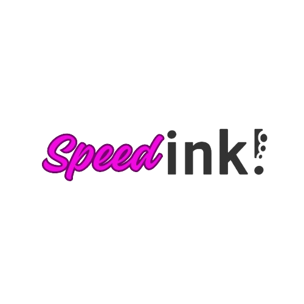

## Basic information

project name: SpeedInk

Project establishment date: 12/2023

## Overall introduction to the project

### Problem statement
SpeedInk: Fastest way to go live with Ink Smart Contracts using GenAI.

### What is SpeedInk?

It is a developer tool that uses fine-tuned model of OpenAI to write ink smart contract code with just 2 parameters:
- **Intent**: It is the purpose of the contract like Airdrop ERC-721 NFT contract, or locking balances, etc.
- **Psuedo Code**: It is auto-generated but can be modified that represents how the contract should function, it is written in basic english language.

### Demo

https://youtube.com/watch?v=E_POXY5Gzhs

### Logo

Inside the docs directory.

## Tasks Planned for the Hackathon

- Complete the code for the substrate chain part, and the website will be completed by recruiting personnel in the second phase.

## Things accomplished during the hackathon (submitted before preliminary review at 11:59 am on December 22, 2023)

TBD

## Team information

- Tushar Ojha, ex- DexEx, Subsocial, [Github](https://github.com/tusharojha).
