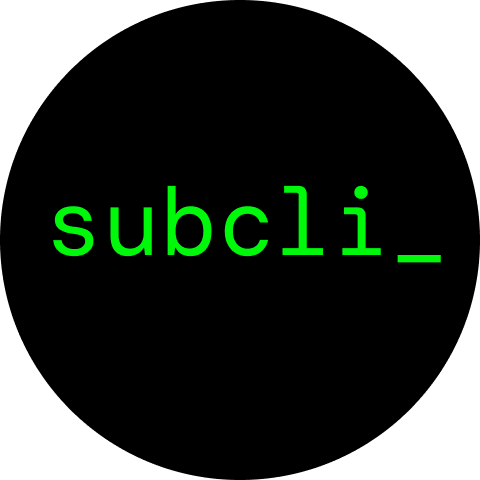

## Basic Info

Project Name: Subcli

### Logo

## Problem 

Due to complexity and insufficient documentation, beginners encountering Substrate have difficulties in the Rust programming language and the Substrate framework. Beside, building a Substrate Node involves numerous intricate manual steps from creating a new project, generating pallet's components, and modifying chain spec configurations,...

## Solution
Subcli emerges to automatically generate code for the Substrate Node Template, simplifying and expediting Substrate accessibility and development.

## Description
**Subcli is a powerful tool that simplifies Substrate development by automatically generating components for the FRAME within the Substrate Framework**. 
It offers two main functions: **automatic code generation** and **a low-code platform**.

The first function automatically generates code on the Substrate framework, making it easy for beginners to build chains with simple logic using just 2-3 lines of code. Instead of manual development, Subcli automatically generates code of all of Substrate components to the project.This also enables simplifying the development of large-scale projects and developers to focus solely on the project's business logic. Some tasks automated by Subcli include:

- Creating a new project
- Creating or renaming pallets.
- Generating components within pallets such asvarious storage types (value, map, etc.) along with creation, update, deletion functions; custom data types (struct); extrinsic, ..
- Other Substrate Components: chain spec,...
- Generating a full-stack Substrate + Frontend project template.

Based on the code generation tool, Subcli becomes a low-code platform by offering a store to buy pre-packaged components like NFT marketplace, DeFi applications, etc. This optimizes time and resources, allowing developers to purchase and integrate these components into projects without starting from scratch.

In summary, Subcli is a powerful tool that automates the creation of comprehensive Substrate code, facilitating swift accessibility and development for Substrate Nodes

## Other document
- Slide pitching: https://www.canva.com/design/DAF2cvl4X9A/hlDDfzf3ka5X235fWcbXQA/view?utm_content=DAF2cvl4X9A&utm_campaign=designshare&utm_medium=link&utm_source=editor

- Video Pitching: https://youtu.be/qhlxVb56j_U

## Plan to do during hackathon

### Command line interface 
- [x] Create new chain with token info (symbol, decimal)
- [x] Create structs which properity has simple data types (primitive Rust type,...)
- [x] Create new storage with type: value, map and create create, update, delete method
- [ ] Add new pallet
- [ ] Rename Pallet
- [ ] Create new storage with double map, nmap and create create, update, delete method
- [ ] Update chainspec 

### Website interface
- [ ] Create new chain
- [ ] Add pre-defined pallet to project
- [ ] Create full stack project includes Substrate and Frontend

## Team information
- Le Quang Lien: Project Manager, Founder Subcli, least at 10 years experience in Web2 (Product Manager, Software developer) and least 2 years in Web3 developer.
- Ho Dinh Dung: Rust and Substrate Developer, Co-founder Subcli, least at 3 years experience in Substrate Developer.
- Nguyen Minh Hai: Rust and Backend Developer, least at 10 years experience in Web2 developer.
- Nguyen Thanh Tung: Javascript developer, Frontend Developer, least at 1 years experience in ReactJs.
