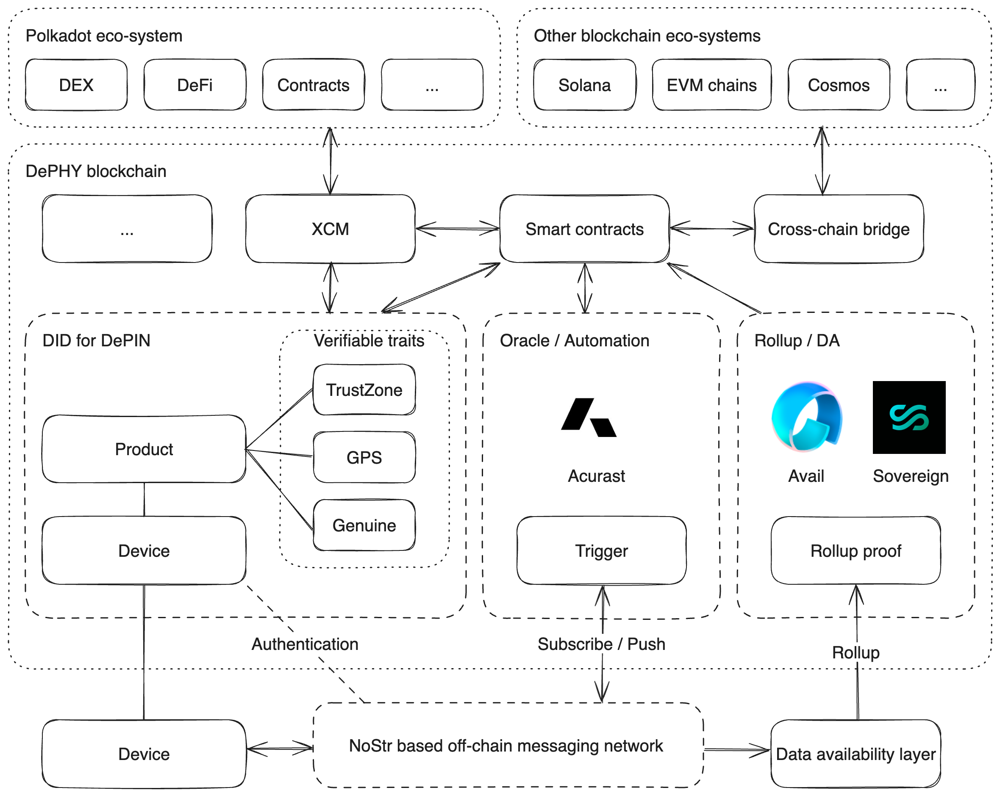

# DePHY Blockchain

The project started in Nov. 2023 as a critical part of DePHY.

---
>
> ⚠️ Codes are included as git submodule in `src/dephy-blockchain`
>

DePIN projects have been making waves as a groundbreaking innovation in the Web3 landscape while DePIN is considered a vital infrastructure for Web3 to gain mainstream acceptance. We, the DePHY team, have been working on simplifying the process of DePIN project development, and gathered a set of insights regarding it. After months of effort, we had made a **Verifiable** solution based on NoStr which allows low-latency messaging for devices connected to DePIN networks.

Here we introduce the DePHY Blockchain addressing to:

- Provision of verifiable on-chain DID services for DePIN devices, involving the recording of device-specific metadata such as serial numbers, SKU, owner details, and authorities.
- Ensuring traceability of significant operation records and vital device actions.
- Provision of oracles and roll-up services for messages dispatched by DePIN devices.
- Provision of sophisticated smart contracts based on ink! that efficiently harness the functionalities of the above modules for DePIN projects to operate assets and build dApps.

The whole infrastructure will not work without the Polkadot/Substrate ecosystem, it facilitates the abilities required by DePIN projects while we have been taking advantage of XCM, Avail and other resources from the ecosystem.

## Technical

The DePHY blockchain is built on Substrate. Besides some common pallets providing XCM, governence, and utilities, we provide these modules:

The `DeviceIds` pallet provides DID services for providing authentication ability and recording metadata for DePIN devices. It is inspired by the NFT concept. In the pallet a `Product` is like a NFT collection, and the manufacturer can create `Device`s for the `Product` as we mint NFTs in a collection.

The `Contract` pallet controls how `Trait`s work for the `DeviceId` pallet. A `Trait` is a feature or a set of features for a `Device` that can be verified automatically on the blockchain. `Device`s can be trusted when their `Trait`s are verified in contracts based on `ink!`.

Also, the `Asset` pallet allows DePIN projects to issue assets on the blockchain.

## Demo

[Watch on Youtube](https://www.youtube.com/watch?v=fluoQXJLof4)

## Who are we?

- WANG Zhe - Team leader
- ZHANG Jiacheng - Fullstack developer
- Nicholas DENG - Product manager
- JIANG Jun - Tech advisor