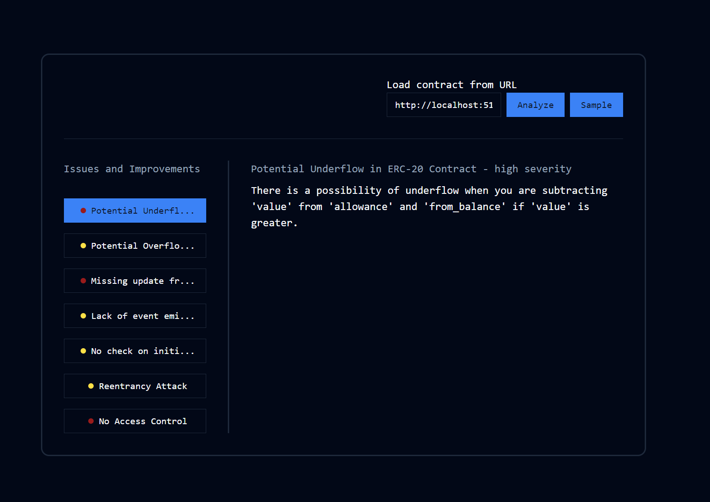

# PolkaGuardian - Automating smart contract audits with the power of AI

## Overview
PolkaGuardian is a smart contract auditing tool specifically tailored for the Polkadot blockchain. This tool automates the auditing process for smart contracts written in Rust using the Dot framework, utilizing artificial intelligence to enhance efficiency and reduce costs.

Smart Contract auditing is usually a lengthy and extremely expensive process. The development of tools such as PolkaGuardian aims to minimize these expenses so that teams can move towards production release swiftly and confidently.  

## Features
Automated Auditing: PolkaGuardian automates the analysis of Dot language contracts, streamlining the auditing process.

Cost-Effective Solution: Traditional smart contract audits are often expensive. PolkaGuardian provides a cost-effective alternative without compromising on security.

Comprehensive Insights: The tool systematically assesses smart contracts, identifying potential vulnerabilities and security risks, offering developers and stakeholders valuable insights.

## How to  

Install dependencies with npm install, then create a .env file at the root of the project to set your OpenAI API key (OPENAI_API_KEY="sk-xxxxxx").  
Then you can run the app using npm run dev. 

Using PolkaGuardian is simple: provide the URL to the smart contract file, and our AI will analyze it and provide selected points which can be improved.  

Each point of interest will be given a severity level, as well as a description of the problem and how to solve it

## Future Improvements  

- Larger library of vulnerabilities  
- Better analysis  
- Fine-tuning of AI models 
- Automated tracking of branches and updates to repository