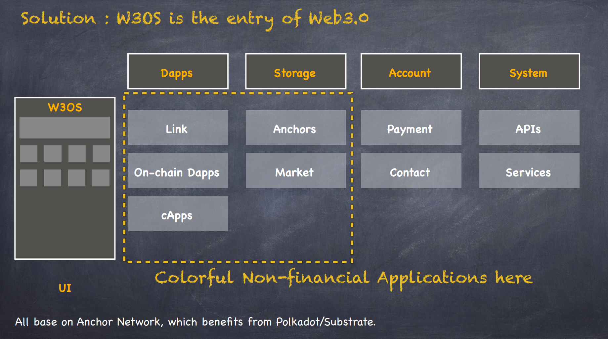

## Basic Info

Project Name：W3OS

Date of project initiation: 2023/11

## Project Introduction
W3OS: Web3.0 Operating System Based on Anchor Network

### Background
**What Problems Does W3OS Solve?**
- Users without any cryptocurrency cannot use Web3.0, which poses a significant barrier to Web3.0 adoption.
- On W3OS, there is no token requirement for users to access Dapps. 

**What Is Anchor Network?**
- Anchor Network is a blockchain network based on Polkadot/Substrate, designed to facilitate developers in creating Dapps and enable regular users to seamlessly enter the Web3.0 ecosystem.
- Essentially, it operates as a Key-Value decentralized storage system. Developers can easily build Dapps on the network with just one day of learning.
- Anchor Network has received a W3F Grant; you can find more details [here](https://github.com/w3f/Grants-Program/pull/1528).
- For a comprehensive understanding, you can refer to the [Anchor Network whitepaper](https://github.com/ff13dfly/EasyPolka/blob/main/anchor%20network/Anchor_Network_White_Paper_EN.md).

### Overview
- W3OS is a Dapp store and an on-chain operating system. Similar to WeChat Mini Programs, which are hosted on Tencent's servers, W3OS operates on Anchor Network, backed by the Polkadot blockchain.
- W3OS is built upon Anchor Network, storing all Dapp code and data on-chain. Even W3OS itself is stored on the blockchain.
- Importantly, you can benefit from Web3.0 even without any cryptocurrency. Web3.0 accounts can be likened to mobile numbers, allowing you to connect with other users with just their SS58 account information.

For more detailed information, please visit the [W3OS PPT](docs/W3OS_Overview.pdf).

### Demo
Live on: https://android.im/os/

### Architecture
W3OS comprises four main components: **System**, **Account**, **Storage**, and **Dapps**.

1. The **System** of W3OS serves as the fundamental part for managing all functions, including APIs and services. APIs play a crucial role by providing stable version APIs for various networks.

2. **Account** is the cornerstone of the blockchain network on W3OS, and it offers some interesting features. Users can maintain anonymity through their SS58 accounts, and they can also manage their accounts as usual.

3. **Storage** functions are designed to assist both developers and customers in saving data on the Anchor network.

4. **Dapps**, or decentralized applications, are the end result. With the support of the components mentioned above, there are numerous ways to develop your fully on-chain applications, particularly colorful non-financial applications.

Thanks to the immutable features of blockchain, the entire W3OS can be deployed on the Anchor Network, even in a private setting.

### Logo
TODO

### Initial Commit
https://github.com/ff13dfly/W3OS/ Starting from the first commit

## Tasks Planned for the Hackathon
**Frontend React**
- Implement UI for group chat functionality.
- Add social login options like Twitter and Google, enabling users to generate and bind a Polkadot account.
- Integrate Dapps from other hackathon projects.

**Backend Node.js**
- Implement backend interfaces for the group chat feature.
- Develop backend interfaces for social login functionality.
- Enable Dapps from other hackathon projects.

## 黑客松期间所完成的事项 (2023年12月22日上午11:59初审前提交)

- 2023年12月22日上午11:59前，在本栏列出黑客松期间最终完成的功能点。
- 把相关代码放在 `src` 目录里，并在本栏列出在黑客松期间完成的开发工作及代码结构。我们将对这些目录/档案作重点技术评审。
- Demo 视频，ppt等大文件不要提交。可以在readme中存放它们的链接地址

## Team Info
傅忠强 (Fu Zhongqiang):
= Leader & Full-stack Developer, experienced in blockchain development.
- Author of Anchor Network.
- https://github.com/ff13dfly

Backdoor:
- Full-stack Developer with expertise in substrate and frontend development.
- https://github.com/doutv

